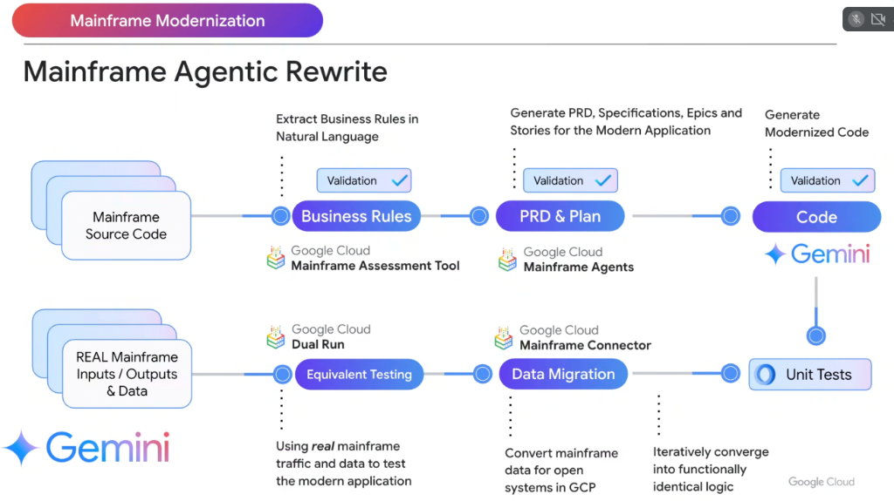

# Mainframe Modernization: The Agentic Rewrite & Convergence Loop



## Overview

Legacy mainframe migrations historically failed due to two fatal extremes: **black-box transpilation** (which produces unmaintainable, low-quality "JOBOL" code) or **manual multi-year rewrites** (which collapse under undocumented business logic and scope creep).

Google Cloud's **Mainframe Agentic Rewrite** establishes a verified, bidirectional software engineering lifecycle: extracting natural-language business rules, compiling modern cloud-native specifications, generating idiomatic code, and validating parity against **real live production mainframe traffic** via **Google Dual Run**.

---

## The Mainframe Agentic Rewrite & Convergence Loop

```mermaid
graph TD
    subgraph 🚀 1. Forward Specification & Generation Pipeline
        M_Src["📁 <b>Mainframe Source Code</b><br/>COBOL, PL/I, JCL, CICS, BMS"]
        
        BR["📋 <b>Business Rules</b><br/><i>Extract rules in Natural Language</i><br/>Google Cloud MAT · ✅ <i>Validation</i>"]
        
        PRD["🗺️ <b>PRD & Plan</b><br/><i>Generate PRD, Specs, Epics & Stories</i><br/>Mainframe Agents · ✅ <i>Validation</i>"]
        
        Code["💻 <b>Modernized Code</b><br/><i>Generate Java 21 / Go Microservices</i><br/><b>Gemini 3.1</b> · ✅ <i>Validation</i>"]
        
        M_Src ==> BR ==> PRD ==> Code
    end

    subgraph 🔄 2. Verification, Shadowing & Parity Convergence
        UT["🧪 <b>Unit Tests</b><br/>Automated TDD suites & mocks"]
        
        DM["📊 <b>Data Migration</b><br/><i>Convert mainframe data for GCP open systems</i><br/>Mainframe Connector · Iterative Convergence"]
        
        ET["🛡️ <b>Equivalent Testing</b><br/><i>Test modern app against real traffic</i><br/><b>Google Dual Run</b>"]
        
        Real_IO["⚡ <b>REAL Mainframe I/O & Data</b><br/>Live production inputs & outputs"]
        
        Code ==> UT ==> DM
        Real_IO ==> ET
        ET <== "Shadow & Compare Byte-for-Byte" ==> DM
    end
```

---

## Detailed Step-by-Step Breakdown

### 1. Extract Business Rules in Natural Language
* **Tool**: **Google Cloud Mainframe Assessment Tool (MAT)**
* **Mechanism**: Ingests millions of lines of COBOL and JCL, stripping away hardware-specific memory management and file pointers to isolate core domain calculations, validation criteria, and business logic into human-readable Markdown.
* **Validation Gate**: Architects and business analysts review and validate the extracted rule catalog (`Validation [x]`).

---

### 2. Generate PRD, Specifications, Epics & Stories
* **Tool**: **Google Cloud Mainframe Agents**
* **Mechanism**: Ingests the natural-language business rules to author high-fidelity specifications (`PRD.md`, `SPEC.md`, and Jira-ready epics/stories).
* **Validation Gate**: Validates target cloud architecture, API schemas (OpenAPI/gRPC), and domain entity models (`Validation [x]`).

---

### 3. Generate Modernized Cloud Code
* **Powered by**: **Gemini 3.1 / Antigravity Harness**
* **Mechanism**: Consumes the formal `SPEC.md` and generates clean, idiomatic **Java 21 (Spring Boot 3 / Quarkus)** or **Go** microservices packaged for **GKE** and **Cloud Run**.
* **Validation Gate**: Automated static analysis, linting, and compiler verification (`Validation [x]`).

---

### 4. Synthesize Automated Unit Tests
* **Mechanism**: Generates comprehensive unit and integration test fixtures covering all extracted business rule edge cases, establishing high test coverage before runtime deployment.

---

### 5. Data Migration & Transcoding
* **Tool**: **Google Cloud Mainframe Connector**
* **Mechanism**: Converts legacy EBCDIC datasets, packed decimals, and VSAM/QSAM files into open formats (JSON, Parquet, Avro) for **BigQuery**, **Cloud Storage**, and **AlloyDB**. Iteratively refines data transformations to converge on functionally identical output state.

---

### 6. Equivalent Testing with Live Traffic Shadowing
* **Tool**: **Google Cloud Dual Run**
* **Mechanism**: Ingests **REAL Mainframe Inputs, Outputs & Data**. Dual Run shadows live production transaction streams to both the legacy mainframe and the newly modernized Google Cloud application simultaneously.
* **Result**: Compares response payloads, database state mutations, and financial rounding calculations side-by-side to guarantee 100% functional equivalence before decommissioning the mainframe.

---

## Mainframe Agentic Rewrite Reference Matrix

| Stage | Primary Tool / Engine | Input Artifact | Output Artifact | Verification Gate |
| :--- | :--- | :--- | :--- | :--- |
| **1. Business Rules** | Mainframe Assessment Tool (MAT) | COBOL, PL/I, JCL | Natural-language rule catalog | Analyst / SME Signoff |
| **2. PRD & Plan** | Mainframe Agents | Rule catalog | `PRD.md`, `SPEC.md`, Epics | Architecture Review |
| **3. Code Generation** | Gemini 3.1 / Antigravity | `SPEC.md` & Data Contracts | Java 21 / Go microservices | Compiler & Lint Gates |
| **4. Unit Tests** | Gemini Test Generator | Code & acceptance criteria | JUnit 5 / Pytest suites | Automated Test Pass |
| **5. Data Migration** | Mainframe Connector | VSAM, QSAM, DB2 z/OS | BigQuery, AlloyDB datasets | Schema & Value Parity |
| **6. Parity Testing** | Google Dual Run | Real production traffic | Side-by-side diff reports | 100% Dual Run Parity |
