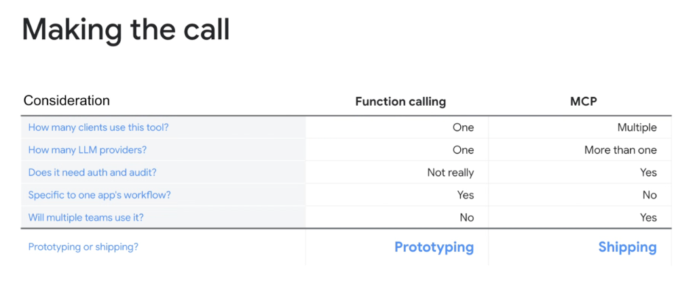
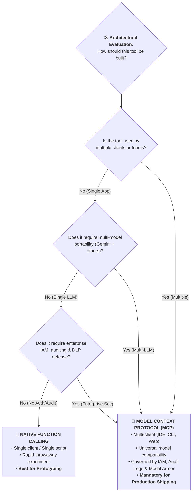

# Making the Call: Native Function Calling vs. Model Context Protocol (MCP)

## Overview

A foundational design decision in agent architecture is selecting between **Native Provider Function Calling** (direct in-process SDK declarations) and the **Model Context Protocol (MCP)** (client-server standardized protocol over JSON-RPC/SSE).

While native function calling is fast and effective for local experiments, **MCP is the definitive standard for shipping secure, multi-surface enterprise applications**.

---

## Architectural Decision Framework

---

## The 5 Core Decision Dimensions

### 1. Client Distribution: How many clients use this tool?
* **Native Function Calling (One Client)**: The tool definition is hardcoded inside a single application codebase or Python script. Reusing it elsewhere requires copy-pasting code and duplicating dependencies.
* **MCP (Multiple Clients)**: A single MCP server endpoint instantly exposes tools across **IDE extensions**, **terminal CLIs (`agy`)**, **web frontends**, and **autonomous background workers**.

---

### 2. LLM Portability: How many LLM providers?
* **Native Function Calling (One Provider)**: Tightly bound to a proprietary model provider's schema (e.g. Gemini `FunctionDeclaration` vs. OpenAI `tools` format). Switching models requires rewriting schema definitions.
* **MCP (Universal / Multi-Provider)**: Standardized JSON-RPC protocol decouples the tool from the underlying model. The same MCP server seamlessly serves Gemini 3.1 Pro, Flash, Claude, or open-source models without modification.

---

### 3. Security & Compliance: Does it need auth and audit?
* **Native Function Calling (Ad-Hoc / Not Really)**: Security, credential negotiation, and logging must be manually coded by the developer. High risk of credential leakage and unmonitored execution.
* **MCP (Built-In Enterprise Governance)**: Natively enforces **Google Cloud IAM (Dual Gates)**, **OAuth 2.1 with PKCE**, **Cloud Audit Logs**, **VPC Service Controls**, and **Google Model Armor** sanitization.

---

### 4. Workflow Scope: Specific to one app's workflow?
* **Native Function Calling (Yes)**: Ideal for hyper-specific, tightly coupled local UI widgets or transient in-memory helper functions.
* **MCP (No / Shared Enterprise Capability)**: Designed for reusable business and infrastructure services (e.g. BigQuery querying, GKE cluster management, AlloyDB inspection, Slack/Jira integration).

---

### 5. Organizational Scale: Will multiple teams use it?
* **Native Function Calling (No)**: Siloed within a single project repository.
* **MCP (Yes)**: Registered in a central **Agent Registry / MCP Directory**, allowing independent teams and multi-agent swarms to discover and invoke verified tools dynamically.

---

## The Core Verdict: Prototyping vs. Production Shipping

| Architectural Dimension | 🧪 Native Function Calling | 🚀 Model Context Protocol (MCP) |
| :--- | :--- | :--- |
| **Primary Lifecycle Stage** | **Prototyping** | **Production Shipping** |
| **Number of Clients** | Single client / application | Multiple clients (CLI, IDE, Web, Swarms) |
| **LLM Provider Coupling** | Single provider SDK lock-in | Universal / Multi-LLM provider |
| **Auth & Audit Readiness** | Manual / Bespoke code | Built-in IAM, OAuth 2.1 & Cloud Audit Logs |
| **Workflow Specificity** | Tightly coupled to one app | Decoupled reusable enterprise capability |
| **Team Reach** | Single developer / team silo | Organization-wide shared tool catalog |
| **Maintenance Burden** | Scales quadratically ($O(N \times M)$) | Scales additively ($O(N + M)$ hub-and-spoke) |
