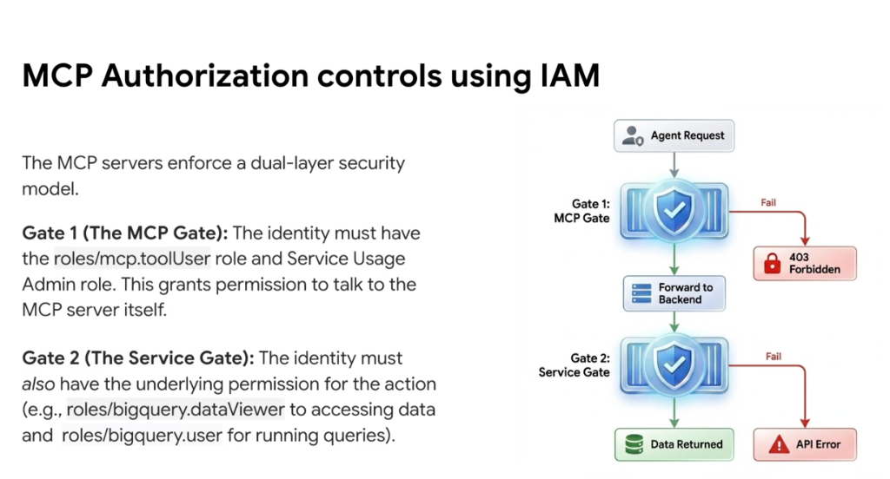
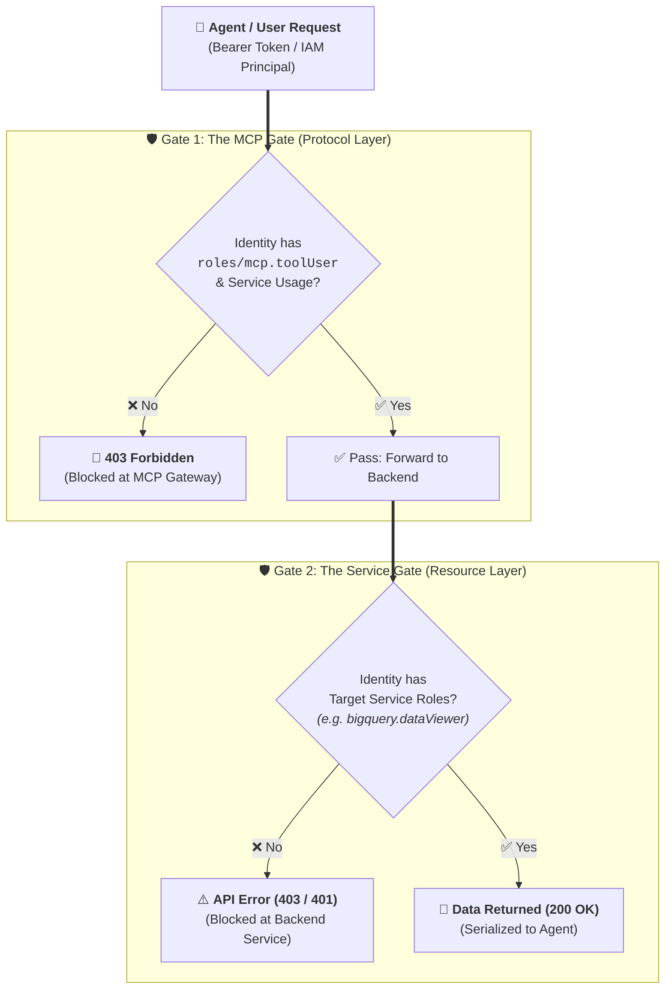

# MCP Authorization Controls: The Dual-Layer Security Model via Cloud IAM

## Overview

A critical challenge in enterprise agent engineering is preventing **privilege escalation** and the **confused deputy problem**—where an AI agent inadvertently gains broader access to backend resources than the human user or service account invoking it.

Google MCP Servers enforce a **Dual-Layer Security Model** governed by **Google Cloud IAM**, requiring every agent request to clear two independent authorization gates: **Gate 1 (The MCP Gate)** and **Gate 2 (The Service Gate)**.

---

## The Dual-Layer Security Pipeline

---

## Detailed Breakdown of the Dual Gates

### 1. Gate 1: The MCP Gate (Protocol & Endpoint Authorization)
* **Purpose**: Authorizes the caller to communicate with the Google MCP Server platform itself, list available tool schemas (`tools/list`), and dispatch tool execution envelopes (`tools/call`).
* **Required IAM Roles**:
  * **`roles/mcp.toolUser` (MCP Tool User)**: Grants permission to invoke the MCP Server endpoint.
  * **`roles/serviceusage.serviceUsageAdmin`** (or `serviceusage.services.use`): Authorizes the project to consume the Google Cloud API.
* **Enforcement Point**: Evaluated at the **Google MCP Gateway** before any request is dispatched to downstream cloud services.
* **Failure Outcome**: Returns **`403 Forbidden`** immediately, preventing unauthenticated agents from consuming compute or probing internal API schemas.

---

### 2. Gate 2: The Service Gate (Target Resource Authorization)
* **Purpose**: Authorizes the principal to execute the *specific action* on the *specific target resource* (e.g. reading a table, creating a Cloud Run revision, querying Spanner).
* **Required IAM Roles**:
  * **BigQuery Example**: The principal must possess `roles/bigquery.dataViewer` (to read table data) and `roles/bigquery.user` (to allocate query job slots).
  * **Cloud Run Example**: The principal must possess `roles/run.invoker` or `roles/run.developer`.
  * **AlloyDB Example**: The principal must possess `roles/alloydb.client`.
* **Enforcement Point**: Evaluated natively by the **Target Google Cloud Service** using standard IAM policies, VPC Service Controls, and dataset-level ACLs.
* **Failure Outcome**: Returns a native backend **`API Error (Permission Denied)`**, ensuring the agent cannot access unauthorized data even if it has valid MCP tool access.

---

## Why the Dual-Layer Model Protects Enterprises

1. **Elimination of Confused Deputy Hazards**:
   * The MCP Server does not act as an all-powerful super-user. It passes the caller's authenticated identity (via OAuth 2.1 token delegation or Workload Identity) directly to the target service.
2. **Granular Least-Privilege Governance**:
   * A developer can be granted broad access to the BigQuery MCP Tool (`roles/mcp.toolUser`) across an organization, but can only query specific datasets where they hold explicit `roles/bigquery.dataViewer` grants.
3. **Decoupled Security Administration**:
   * Cloud Platform teams manage MCP endpoint access (Gate 1), while Data Stewards and Service Owners retain full autonomy over their individual resource IAM policies (Gate 2).

---

## Dual-Gate Comparison Matrix

| Security Dimension | 🛡️ Gate 1: The MCP Gate | 🛡️ Gate 2: The Service Gate |
| :--- | :--- | :--- |
| **Layer** | Protocol / Gateway Layer | Resource / Backend Service Layer |
| **IAM Roles Checked** | `roles/mcp.toolUser` + Service Usage | `roles/bigquery.dataViewer`, `roles/run.invoker`, etc. |
| **Evaluated By** | Google MCP Platform | Native Target Service (BigQuery, Cloud Run, Spanner) |
| **What It Protects** | The MCP endpoint & schema catalog | The underlying enterprise data & infrastructure |
| **Failure Response** | `403 Forbidden` | `403 Permission Denied` (Native API Error) |
| **Success Outcome** | Request forwarded to backend service | Data returned to agent context |
