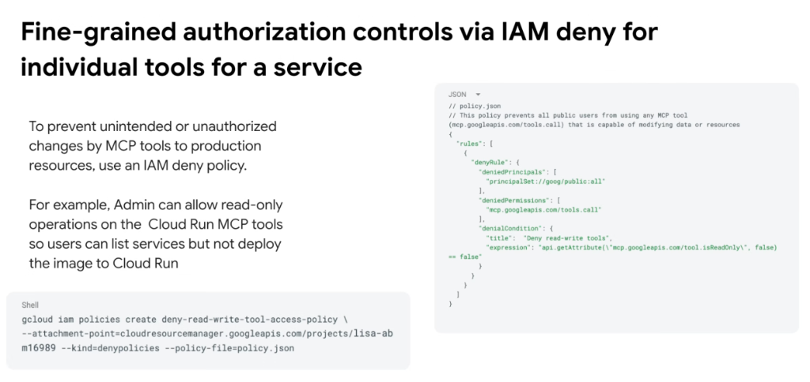
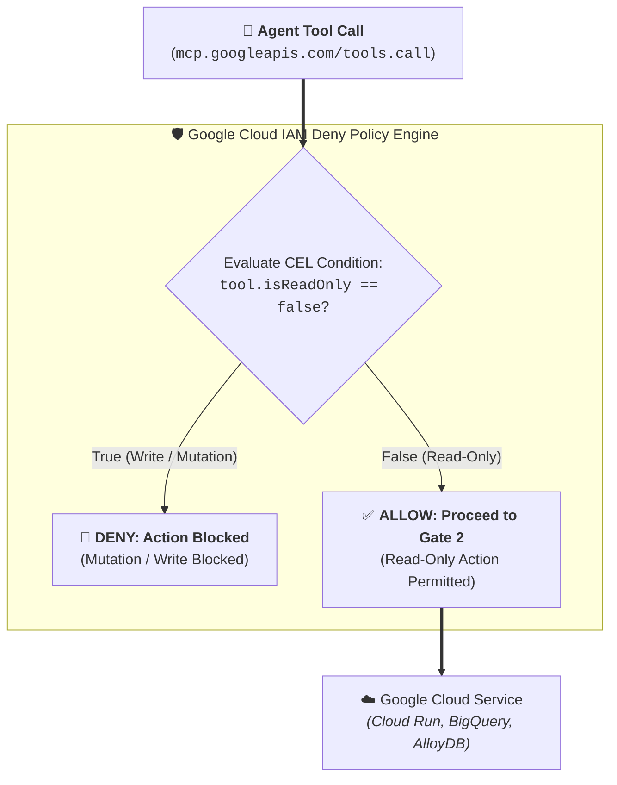

# Fine-Grained MCP Authorization: IAM Deny Policies for Tool Modification Guardrails



## Overview

When deploying autonomous agents with access to production Google Cloud environments, engineering teams need absolute certainty that agents cannot inadvertently modify, overwrite, or delete infrastructure and data.

Google Cloud enables **Fine-Grained Authorization Controls via IAM Deny Policies**, allowing platform administrators to restrict write/mutation actions across MCP tools at scale while preserving safe, read-only inspection capabilities.

---

## The IAM Deny Evaluation Flow



---

## Technical Mechanics & Configuration

### 1. Attribute-Based Access Control (CEL Expression)
Google Managed MCP Servers expose tool operational metadata directly to Google Cloud's Common Expression Language (CEL) policy evaluator. The key attribute evaluated is:
* `mcp.googleapis.com/tool.isReadOnly`: A boolean flag identifying whether an MCP tool is strictly read-only (`true`) or capable of state mutation (`false`).

---

### 2. Defining the IAM Deny Policy (`policy.json`)

To prevent all users and autonomous agents from calling any MCP tool that modifies data or cloud infrastructure:

```json
{
  "rules": [
    {
      "denyRule": {
        "deniedPrincipals": [
          "principalSet://goog/public:all"
        ],
        "deniedPermissions": [
          "mcp.googleapis.com/tools.call"
        ],
        "denialCondition": {
          "title": "Deny read-write tools",
          "expression": "api.getAttribute('mcp.googleapis.com/tool.isReadOnly', false) == false"
        }
      }
    }
  ]
}
```

---

### 3. Deploying the Policy via `gcloud` CLI

Attach the deny policy to the target Google Cloud project, folder, or organization:

```bash
gcloud iam policies create deny-read-write-tool-access-policy \
  --attachment-point=cloudresourcemanager.googleapis.com/projects/PROJECT_ID \
  --kind=denypolicies \
  --policy-file=policy.json
```

---

## Practical Enterprise Scenarios

### Scenario A: Cloud Run MCP Tools Guardrail
* **Allowed Actions**: Developers and AI agents can execute `list_services`, `get_service_status`, and `describe_revisions` to debug application states.
* **Blocked Actions**: Any attempt to call `deploy_image`, `update_traffic_split`, or `delete_service` is intercepted and denied immediately by IAM before reaching Cloud Run.

---

### Scenario B: BigQuery MCP Tools Guardrail
* **Allowed Actions**: Agents can run `list_tables`, `get_table_schema`, and analytical `SELECT` queries to generate business insights.
* **Blocked Actions**: Mutation queries (`INSERT`, `UPDATE`, `DELETE`, `DROP TABLE`) are blocked at the MCP gateway, ensuring zero risk of accidental data destruction.

---

## IAM Allow Grants vs. IAM Deny Policies

| Governance Feature | 🟢 IAM Allow Policies | 🔴 IAM Deny Policies |
| :--- | :--- | :--- |
| **Primary Function** | Grants specific permissions to principals | Enforces non-negotiable guardrails |
| **Evaluation Precedence**| Evaluated only if no Deny matches | **Overrides all Allow grants immediately** |
| **Condition Syntax** | Basic IAM Conditions | Rich Common Expression Language (CEL) |
| **Granularity** | Service or resource level | Tool-attribute level (`tool.isReadOnly`) |
| **Best Used For** | Assigning day-to-day team access | Preventing destructive actions in production |
