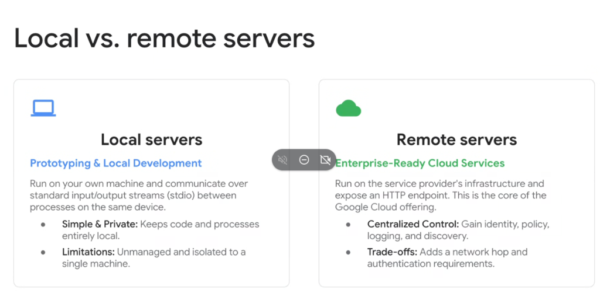
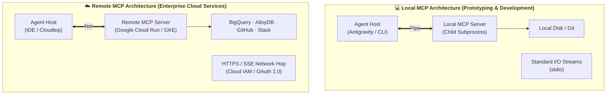

# Model Context Protocol: Local vs. Remote Servers

## Overview

When designing and deploying **Model Context Protocol (MCP)** architectures, engineering teams must choose between two distinct runtime topologies: **Local Servers** (running as on-device subprocesses over `stdio`) and **Remote Servers** (running as managed cloud endpoints over HTTP/SSE).

Understanding the trade-offs between local development agility and enterprise cloud governance is critical for transitioning prototype agents into production systems.

---

## Architectural Comparison: Local vs. Remote MCP Servers

---

## Detailed Comparison

### 1. Local MCP Servers (Prototyping & Local Development)
* **Execution Model**: Runs directly on the developer's local workstation as a child subprocess spawned by the MCP Host.
* **Transport**: Communicates via standard input/output streams (`stdio`).
* **Key Benefits**:
  * **Simple & Private**: Code, data, and tool execution remain entirely on the local device with zero external data egress.
  * **Zero Network Latency**: Instant inter-process communication (IPC) with microsecond response times.
  * **Rapid Prototyping**: Ideal for fast iteration, local file inspection, and offline experimentation.
* **Limitations**:
  * **Unmanaged & Isolated**: Tied to a single developer machine; requires local runtimes (Python, Node.js, Go) and dependencies.
  * **Zero Centralized Governance**: No unified audit trails, centralized secrets, or enterprise policy enforcement.

---

### 2. Remote MCP Servers (Enterprise-Ready Cloud Services)
* **Execution Model**: Runs on cloud infrastructure (e.g. **Google Cloud Run**, **GKE**, or managed cloud APIs) exposing standard HTTPS endpoints.
* **Transport**: Communicates via **Server-Sent Events (SSE)** for streaming responses and HTTP POST for tool invocations.
* **Key Benefits**:
  * **Centralized Control & Identity**: Enforces organizational security policies, Cloud IAM access boundaries, and role-based permissions (RBAC).
  * **Enterprise Observability**: Integrated with Google Cloud Logging and Cloud Audit Logs for compliance tracking.
  * **Shared Multi-Tenant Fleet**: A single remote MCP server can serve hundreds of developers, CI/CD runners, and autonomous agents simultaneously.
  * **Serverless Autoscaling**: Scales automatically to zero when idle and bursts to handle massive parallel agent requests.
* **Trade-offs**:
  * **Network Hop**: Introduces minor network latency ($10\text{--}50\text{ms}$).
  * **Authentication Requirements**: Requires secure credential negotiation (OAuth 2.0, Bearer Tokens, Application Default Credentials).

---

## Decision Matrix: Local vs. Remote MCP Deployment

| Dimension | 💻 Local Servers (`stdio`) | ☁️ Remote Servers (HTTP / SSE) |
| :--- | :--- | :--- |
| **Primary Use Case** | Rapid prototyping, local file edits, offline dev | Production agent fleets, enterprise APIs, shared data |
| **Transport Layer** | Standard Streams (`stdio`) | HTTPS / Server-Sent Events (`SSE`) |
| **Data Residency** | Strictly on-device / workstation | Cloud VPC / Enterprise data boundary |
| **Authentication** | Local process permissions | Cloud IAM, OAuth 2.0, Workload Identity |
| **Scaling Capability** | Single machine (constrained by local CPU/RAM) | Serverless elastic scaling (Google Cloud Run / GKE) |
| **Audit & Logging** | Local file logs | Cloud Logging & Cloud Audit Trails |
| **Maintenance Burden**| Distributed per developer machine | Centralized CI/CD container deployment |
