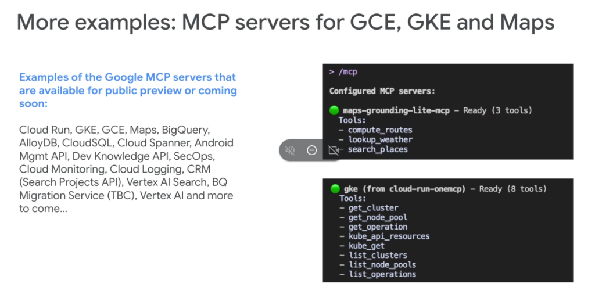

# Google MCP Server Catalog: GKE, GCE, Maps & Enterprise Cloud Services



## Overview

Google Cloud's **Model Context Protocol (MCP)** ecosystem extends far beyond data warehouses. Managed MCP servers span the full spectrum of Google Cloud services—including container orchestration (**GKE**), serverless compute (**Cloud Run**), virtual machines (**GCE**), physical-world grounding (**Google Maps**), observability (**Cloud Logging & Monitoring**), security operations (**Google SecOps**), and generative intelligence (**Vertex AI & Search**).

---

## Ecosystem Catalog Overview

```mermaid
graph TD
    subgraph ☁️ Google Managed MCP Server Ecosystem
        direction TB
        
        subgraph Compute["🚀 Compute & Orchestration"]
            C1["<b>GKE MCP</b><br/>(8 tools: cluster, node pools, kube_get)"]
            C2["<b>Cloud Run MCP</b><br/>(deploy, revisions, traffic)"]
            C3["<b>GCE MCP</b><br/>(instances, disks, networks)"]
        end

        subgraph Geo["🗺️ Geospatial & Grounding"]
            G1["<b>Maps Grounding MCP</b><br/>(search_places, compute_routes, lookup_weather)"]
        end

        subgraph Data["💾 Databases & Analytics"]
            D1["<b>BigQuery MCP</b>"]
            D2["<b>AlloyDB MCP</b>"]
            D3["<b>Cloud SQL MCP</b>"]
            D4["<b>Cloud Spanner MCP</b>"]
        end

        subgraph Ops["🛡️ Operations & AI"]
            O1["<b>Google SecOps MCP</b>"]
            O2["<b>Cloud Monitoring & Logging</b>"]
            O3["<b>Vertex AI & Search MCP</b>"]
            O4["<b>Dev Knowledge API</b>"]
        end
    end
```

---

## Highlighted MCP Server Implementations

### 1. Maps Grounding MCP (`maps-grounding-lite-mcp`)
* **Role**: Provides real-time physical world context and location grounding for autonomous agents.
* **Exposed Tools (3 tools)**:
  * `search_places`: Searches points of interest, business listings, addresses, and geographical coordinates.
  * `compute_routes`: Calculates optimal driving/transit routes, turn-by-turn steps, distance, and ETAs.
  * `lookup_weather`: Fetches live atmospheric observations and forecast data for any location.
* **Primary Use Cases**: Logistics planning, delivery route optimization, automated itinerary synthesis, and real-time location-aware customer support.

```text
> /mcp

Configured MCP servers:
🟢 maps-grounding-lite-mcp - Ready (3 tools)
   Tools:
   - compute_routes
   - lookup_weather
   - search_places
```

---

### 2. GKE MCP Server (`gke` via `cloud-run-onemcp`)
* **Role**: Equips SRE and DevOps agents with autonomous Kubernetes cluster management and declarative resource inspection capabilities.
* **Exposed Tools (8 tools)**:
  * `list_clusters` / `get_cluster`: Enumerate clusters and inspect control plane status, versioning, and networking.
  * `list_node_pools` / `get_node_pool`: Inspect worker node capacity, auto-scaling thresholds, and machine types.
  * `list_operations` / `get_operation`: Monitor long-running async Kubernetes mutations.
  * `kube_api_resources`: Discover available Kubernetes API groups and Custom Resource Definitions (CRDs).
  * `kube_get`: Inspect live Kubernetes pods, deployments, configmaps, and service specs directly.
* **Primary Use Cases**: Autonomous incident triage, pod crash-loop debugging, infrastructure Drift analysis, and multi-cluster capacity reviews.

```text
🟢 gke (from cloud-run-onemcp) - Ready (8 tools)
   Tools:
   - get_cluster
   - get_node_pool
   - get_operation
   - kube_api_resources
   - kube_get
   - list_clusters
   - list_node_pools
   - list_operations
```

---

## Complete Google MCP Services Availability Directory

| Service Category | Available & Upcoming Google MCP Servers | Key Agent Affordances |
| :--- | :--- | :--- |
| **Compute & Containers** | Cloud Run, GKE, Compute Engine (GCE) | Container lifecycle, pod triage, VM management |
| **Geospatial & Search** | Google Maps, Places, Routes, Weather | Physical world grounding, navigation, climate |
| **Databases & Storage** | BigQuery, AlloyDB, Cloud SQL, Cloud Spanner | Schema discovery, SQL execution, zero-copy analytics |
| **Security & Identity** | Google SecOps (Chronicle), IAM, Android Mgmt API | Threat investigation, device policy enforcement |
| **Observability** | Cloud Monitoring, Cloud Logging | Querying metrics, log analytics, alert triage |
| **Enterprise Knowledge**| Vertex AI Search, Dev Knowledge API, CRM Search | Enterprise semantic search, project discovery |
| **Migration & Modernization**| BigQuery Migration Service (TBC), DMS | Schema conversion, legacy estate refactoring |
