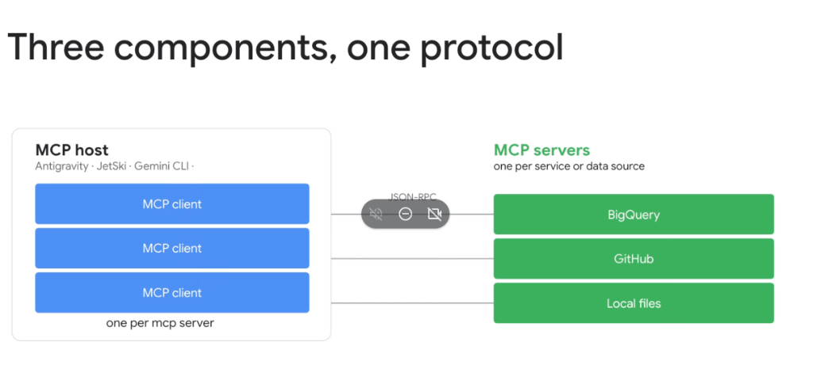
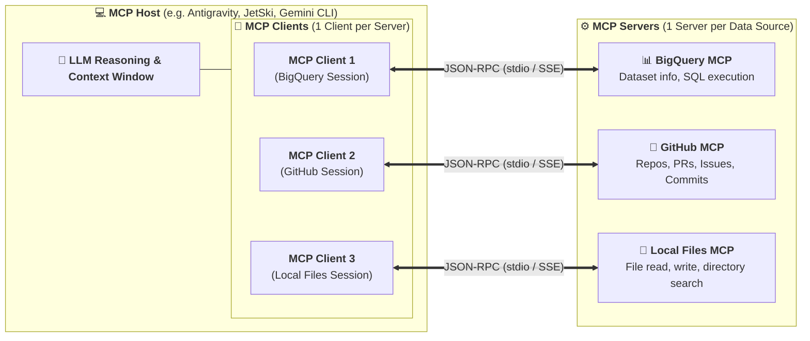

# Model Context Protocol (MCP) Topology: Three Components, One Protocol

## Overview

The **Model Context Protocol (MCP)** standardizes how AI applications interact with data sources and tools by defining a precise 3-tier topology: **MCP Host**, **MCP Client**, and **MCP Server**, all communicating over a unified **JSON-RPC 2.0 protocol**.

Understanding the separation of responsibilities across these three components is essential for building scalable, secure, and multi-tenant agent systems.

---

## The 3-Component MCP Topology

---

## Detailed Breakdown of the Three Components

### 1. MCP Host (The Orchestration Environment)
* **Definition**: The primary user-facing application, IDE extension, or agent runtime that coordinates the LLM reasoning process.
* **Responsibilities**:
  * Manages the active context window, system prompt, and conversation history.
  * Enforces user security policies, permission checks (`ask_permission`), and human-in-the-loop confirmations.
  * Spawns, monitors, and orchestrates multiple internal **MCP Clients**.
* **Examples**: **Google Antigravity**, **JetSki**, **Gemini CLI**, VS Code Antigravity Extension.

---

### 2. MCP Client (The 1:1 Protocol Session Manager)
* **Definition**: The internal connection adapter running *inside* the MCP Host that manages a dedicated, stateful protocol session with a specific MCP server.
* **Responsibilities**:
  * Negotiates capabilities and protocol versions during initialization (`initialize`).
  * Queries and aggregates tool catalogs (`tools/list`), resources (`resources/list`), and prompts (`prompts/list`).
  * Dispatches tool execution requests (`tools/call`) and deserializes JSON-RPC responses.
* **Key Invariant**: **One MCP Client instance per active MCP Server connection**.

---

### 3. MCP Server (The Specialized Service Adapter)
* **Definition**: A lightweight, standalone server process or microservice that exposes data and actions from a single domain or backend service.
* **Responsibilities**:
  * Implements domain logic for executing tools and reading resources.
  * Encapsulates authentication (API keys, OAuth tokens, Google Application Default Credentials) away from the Host.
  * Executes in isolated subprocesses (`stdio`) or remote containers (`SSE` over HTTP).
* **Examples**: BigQuery MCP Server, GitHub MCP Server, Local Filesystem MCP Server, Cloud SQL MCP Server.

---

## The JSON-RPC Communication Layer

The three components communicate through standardized **JSON-RPC 2.0 messages** over two primary transport bindings:

1. **`stdio` Transport (Local Process)**:
   * The MCP Host spawns the MCP Server as a local child process (e.g. `npx @modelcontextprotocol/server-filesystem` or `python3 server.py`).
   * Communication occurs via standard input (`stdin`) and standard output (`stdout`).
2. **`SSE` / HTTP Transport (Remote Services)**:
   * The MCP Client connects to a remote MCP Server running on Cloud Run or GKE via **Server-Sent Events (SSE)** for server-to-client streaming and HTTP POST for client requests.

---

## Component Responsibility Matrix

| Architectural Dimension | 💻 MCP Host | 🔌 MCP Client | ⚙️ MCP Server |
| :--- | :--- | :--- | :--- |
| **Primary Location** | User workstation / Cloudtop | Inside the MCP Host process | Local subprocess / Cloud Run |
| **Cardinally Ratio** | 1 Host per user session | $1\text{ Client} : 1\text{ Server}$ | 1 Server per service / API |
| **Handles LLM Inference**| ✅ Yes (Gemini foundation models) | ❌ No | ❌ No |
| **Handles Protocol Serialization**| ❌ No (Delegates to Client) | ✅ Yes (JSON-RPC envelopes) | ✅ Yes (JSON-RPC endpoints) |
| **Direct Backend Service Access**| ❌ No (Decoupled) | ❌ No | ✅ Yes (Direct API / DB driver calls) |
| **Security Enforcement** | Approvals & Sandbox bounds | Transport encryption & session state | Secret encapsulation & IAM |
