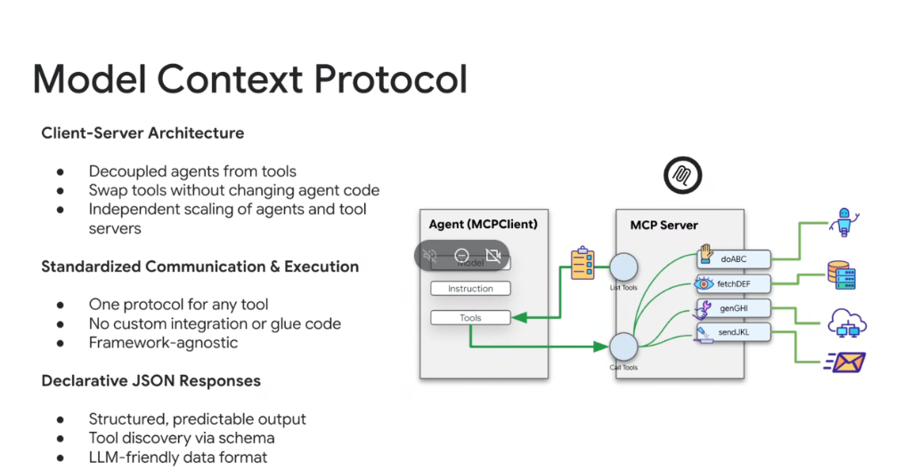
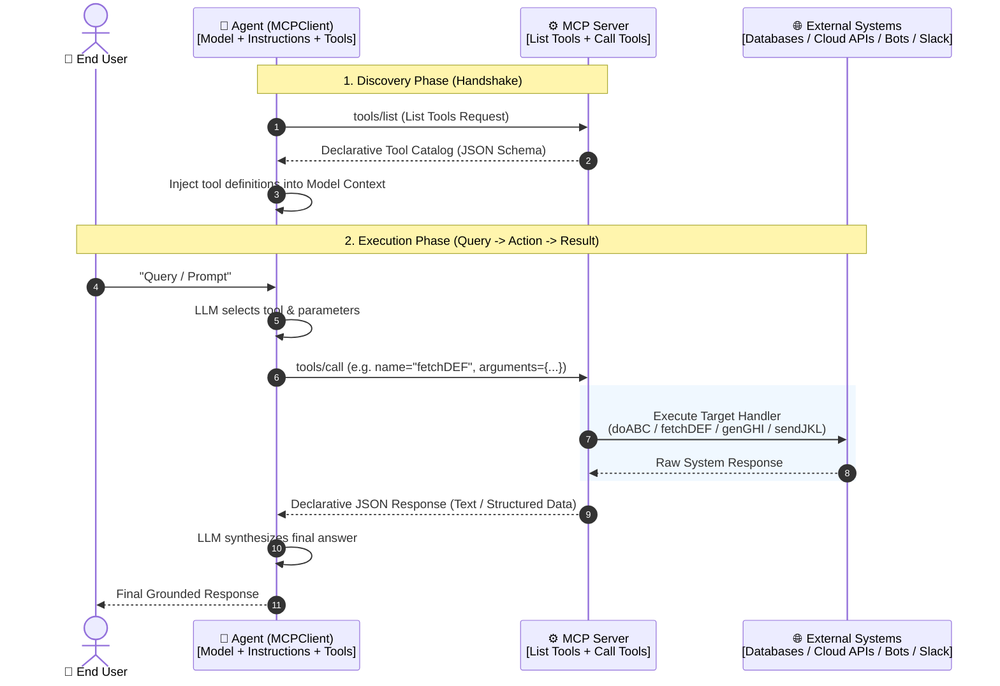

# Model Context Protocol (MCP): Client-Server Architecture & Standardized Tool Execution



## Overview

The **Model Context Protocol (MCP)** is an open, standardized specification that solves tool fragmentation by establishing a clean **Client-Server Architecture** between AI agents and external capabilities.

Rather than embedding bespoke SDK integrations and API wrappers directly inside agent codebases, MCP decouples the **Agent (`MCPClient`)** from the **Tool Execution Layer (`MCPServer`)**, replacing custom glue code with declarative JSON-RPC communication.

---

## The 3 Architectural Pillars of MCP

```mermaid
graph TD
    subgraph 🏛️ Pillar 1: Client-Server Architecture
        P1_1["• Decoupled agents from tools"]
        P1_2["• Swap tools without changing agent code"]
        P1_3["• Independent scaling of agents & tool servers"]
    end

    subgraph ⚡ Pillar 2: Standardized Communication
        P2_1["• One unified protocol for any tool"]
        P2_2["• Zero custom integration or glue code"]
        P2_3["• Completely framework-agnostic"]
    end

    subgraph 📑 Pillar 3: Declarative JSON Schemas
        P3_1["• Structured, predictable output"]
        P3_2["• Dynamic tool discovery via JSON Schema"]
        P3_3["• LLM-friendly serialization format"]
    end
```

---

## The MCP Interaction & Execution Lifecycle



---

## Detailed Architectural Mechanisms

### 1. Dynamic Tool Discovery (`tools/list`)
* The `MCPClient` does not hardcode tool capabilities. Upon initialization, it queries the `MCPServer` for available tools.
* The server responds with standardized **JSON Schema** definitions describing function signatures, required parameters, and descriptions.
* The client passes these schemas directly to the LLM (e.g. Gemini Function Calling schema).

---

### 2. Standardized Tool Invocation (`tools/call`)
* When the model triggers a function call, the `MCPClient` serializes the invocation into a standard `tools/call` JSON-RPC message.
* The `MCPServer` maps the call to specialized backend adapters:
  * `doABC`: Delegated bot/agent tasks.
  * `fetchDEF`: Relational/vector database queries (Cloud SQL, AlloyDB, BigQuery).
  * `genGHI`: Cloud infrastructure mutations (Cloud Run, GKE, Terraform).
  * `sendJKL`: External notifications and messaging (Slack, Email, Webhooks).

---

### 3. Declarative JSON Responses
* Tool execution results are returned in structured, predictable payloads that prevent observation flooding and format ambiguity.
* The standardized format ensures immediate compatibility with any LLM reasoning engine without custom parsers.

---

## Architectural Value Matrix

| Capability | Without MCP (Bespoke Wrappers) | With Model Context Protocol (MCP) |
| :--- | :--- | :--- |
| **Agent Decoupling** | Tools tightly coupled to agent runtime | Agent and tools operate as independent microservices |
| **Tool Swapping** | Requires editing prompts, code, and tests | Zero code changes; update MCP server endpoint |
| **Scaling & Security**| Tool code runs inside agent memory space | Tool servers run in isolated sandboxes / Cloud Run |
| **Framework Lock-In**| Code locked to specific agent framework | Universal reuse across Antigravity, Gemini CLI, ADK |
| **Tool Discovery** | Static configuration | Dynamic runtime schema discovery via `tools/list` |
