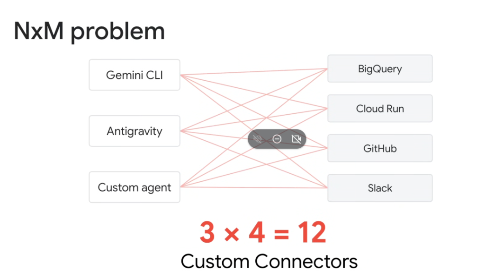

# The $N \times M$ Integration Problem: Tool Fragmentation vs. Standardized Protocols (MCP)



## Overview

As enterprises scale their generative AI adoption, they inevitably encounter the **$N \times M$ Integration Problem**—the combinatorial explosion of point-to-point custom connectors required to connect multiple agent clients with diverse enterprise services and data sources.

When every agent surface (**Gemini CLI**, **Google Antigravity**, **Custom SDK Agents**) requires a bespoke integration wrapper for every enterprise tool (**BigQuery**, **Cloud Run**, **GitHub**, **Slack**), maintenance overhead grows quadratically:

$$\text{Connectors Required} = N \times M$$

For just $3\text{ clients}$ and $4\text{ tools}$, developers must build and maintain **12 custom connectors**.

---

## Visualizing the $N \times M$ Combinatorial Explosion

```mermaid
graph LR
    subgraph 🤖 N Agent Surfaces (Clients)
        C1["<b>Gemini CLI</b>"]
        C2["<b>Antigravity</b>"]
        C3["<b>Custom Agent</b>"]
    end

    subgraph 🛠️ M Enterprise Services (Tools)
        T1["<b>BigQuery</b>"]
        T2["<b>Cloud Run</b>"]
        T3["<b>GitHub</b>"]
        T4["<b>Slack</b>"]
    end

    C1 -. "Custom Connector 1" .-> T1
    C1 -. "Custom Connector 2" .-> T2
    C1 -. "Custom Connector 3" .-> T3
    C1 -. "Custom Connector 4" .-> T4

    C2 -. "Custom Connector 5" .-> T1
    C2 -. "Custom Connector 6" .-> T2
    C2 -. "Custom Connector 7" .-> T3
    C2 -. "Custom Connector 8" .-> T4

    C3 -. "Custom Connector 9" .-> T1
    C3 -. "Custom Connector 10" .-> T2
    C3 -. "Custom Connector 11" .-> T3
    C3 -. "Custom Connector 12" .-> T4
```

---

## Why Point-to-Point Integration Collapses at Scale

1. **Quadratic Maintenance Overhead ($O(N \times M)$)**:
   * Adding a single new tool (e.g. Jira) requires writing $N$ separate client wrappers.
   * Adding a new agent surface (e.g. VS Code Extension) requires re-implementing $M$ service connectors.
   * At enterprise scale ($10\text{ agent clients} \times 50\text{ internal APIs}$), teams must maintain **500 bespoke connectors**.
2. **Schema Drift & Fragility**:
   * Any API version update in an upstream service (e.g. BigQuery client library update) breaks multiple client connectors simultaneously.
3. **Inconsistent Security & Auth**:
   * Each custom connector implements its own OAuth, API key handling, rate-limiting, and error-handling logic, creating security vulnerabilities and audit blindspots.

---

## The Solution: $O(N + M)$ Standardization via Model Context Protocol (MCP)

The **Model Context Protocol (MCP)** replaces the $N \times M$ point-to-point mesh with a standardized, open-protocol bus:

$$\text{Integrations Required with MCP} = N + M$$

```mermaid
graph LR
    subgraph 🤖 N Agent Clients
        C1["<b>Gemini CLI</b>"]
        C2["<b>Antigravity</b>"]
        C3["<b>Custom Agent</b>"]
    end

    subgraph 🔌 Universal Protocol Bus
        MCP["🌐 <b>Model Context Protocol (MCP)</b><br/>JSON-RPC 2.0 Standard Specification"]
    end

    subgraph 🛠️ M MCP Servers
        S1["<b>BigQuery MCP</b>"]
        S2["<b>Cloud Run MCP</b>"]
        S3["<b>GitHub MCP</b>"]
        S4["<b>Slack MCP</b>"]
    end

    C1 & C2 & C3 ==>|"1 Standard MCP Client"| MCP
    MCP ==>|"1 Standard MCP Server"| S1 & S2 & S3 & S4
```

* **For $N$ Clients**: Each agent surface implements the MCP client specification **once** ($3\text{ implementations}$).
* **For $M$ Tools**: Each enterprise service exposes an MCP server **once** ($4\text{ implementations}$).
* **Total Work**: Reduced from **12 custom connectors** to **$3 + 4 = 7$ standardized endpoints** ($42\%$ reduction immediately, compounding exponentially as $N$ and $M$ grow).

---

## Point-to-Point vs. MCP Architectural Comparison

| Dimension | Point-to-Point Custom Connectors | Model Context Protocol (MCP) Standard |
| :--- | :--- | :--- |
| **Complexity Scaling** | Multiplicative: **$O(N \times M)$** | Additive: **$O(N + M)$** |
| **$10\text{ Clients} \times 50\text{ Tools}$** | **500 custom connectors** | **60 standard interfaces** ($88\%$ reduction) |
| **New Tool Onboarding** | Must update all $N$ client codebases | Build 1 MCP server; available to all clients instantly |
| **New Surface Onboarding** | Must re-write all $M$ tool integrations | Implement 1 MCP client; gains instant access to all tools |
| **Schema Governance** | Fragmented JSON schemas per agent | Unified JSON Schema definitions for tools & resources |
| **Security & Auth** | Ad-hoc token passing across clients | Centralized OAuth 2.0 / ADC / Transport encapsulation |
