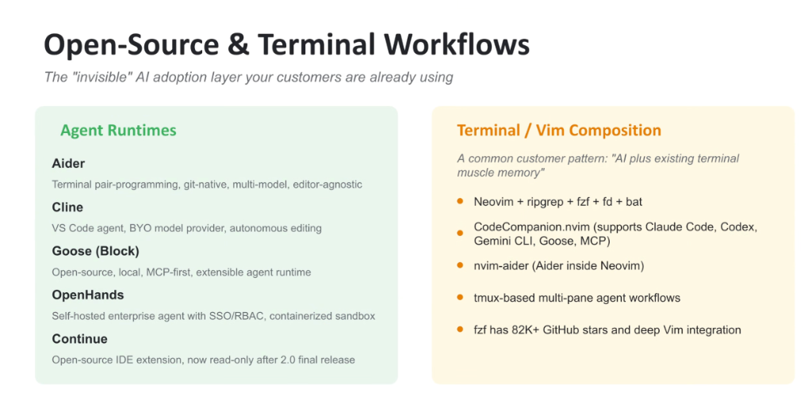
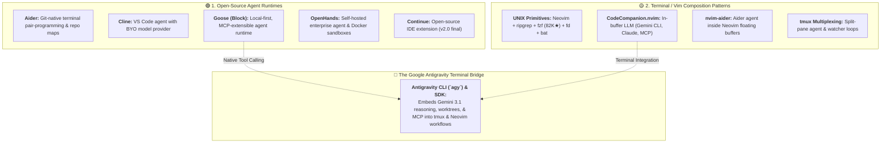

# Open-Source & Terminal Workflows: The Invisible AI Adoption Layer

## Overview

A significant portion of enterprise developers and power users operate within the **"Invisible" AI Adoption Layer**—a grassroots ecosystem of open-source agent runtimes and terminal-centric compositions that developers are already using on their local machines.

Rather than adopting heavy commercial GUI IDE forks, these developers compose AI agents with their existing **terminal muscle memory**, leveraging fast UNIX utilities (`ripgrep`, `fzf`, `fd`, `tmux`) and extensible modal editors (`Neovim`).

---

## Architecture: The Two Pillars of Open-Source & Terminal AI

---

## 1. Open-Source Agent Runtimes

* **Aider**:
  * **Core Concept**: Git-native, terminal-based pair programming tool.
  * **Key Features**: Automatically constructs repository AST maps using Tree-sitter, edits local files across multiple programming languages, and auto-commits changes with formatted git messages. Multi-model and editor-agnostic.
* **Cline**:
  * **Core Concept**: Open-source autonomous coding agent for VS Code.
  * **Key Features**: "Bring Your Own Model" (BYOK) architecture supporting Claude, OpenAI, Gemini, and local Ollama models; executes shell commands and file diffs with human-in-the-loop approvals.
* **Goose (by Block)**:
  * **Core Concept**: Open-source, local-first autonomous agent framework.
  * **Key Features**: Built from the ground up on the **Model Context Protocol (MCP)**, allowing dynamic tool injection and automated desktop/terminal scripting.
* **OpenHands (formerly OpenDevin)**:
  * **Core Concept**: Self-hosted, enterprise-grade open-source software development agent.
  * **Key Features**: Isolated Docker container execution sandboxes, web browsing agent, SAML SSO, and role-based access control (RBAC).
* **Continue**:
  * **Core Concept**: Pioneering open-source IDE extension for VS Code and JetBrains (transitioned to read-only following its v2.0 release).

---

## 2. Terminal & Vim Composition Patterns

Enterprise developers increasingly build custom AI toolchains on top of standard UNIX utilities:

* **The Core Modern UNIX Stack**:
  * **Neovim**: Blazing fast modal editing with Lua extensibility.
  * **ripgrep (`rg`) & `fd`**: Sub-millisecond text searching and file path traversal.
  * **`fzf` (82K+ GitHub Stars)**: Universal interactive fuzzy finder integrated deeply into shell history and Vim file pickers.
  * **`bat`**: Syntax-highlighted cat pager.
* **Modal Editor LLM Plugins**:
  * **`CodeCompanion.nvim`**: Integrates conversational and in-buffer transformation prompts directly into Neovim buffers, supporting Gemini CLI, Claude Code, OpenAI Codex, Goose, and custom MCP servers.
  * **`nvim-aider`**: Bridges Aider's terminal agent directly into Neovim floating windows.
* **`tmux` Multi-Pane Agent Orchestration**:
  * Splitting terminal windows into concurrent panes: Code Editor (Pane 1), Autonomous Agent CLI / `agy` (Pane 2), Continuous Test Watcher (Pane 3), and Server Logs (Pane 4).

---

## How Google Antigravity Supports Terminal-First Engineers

To capture the "Invisible" terminal developer demographic, Google provides **Antigravity CLI (`agy`)** and headless SDKs:
1. **Zero GUI Requirement**: Run full multi-step reasoning, git worktree branching, and test verification directly in terminal shells and `tmux` sessions.
2. **Standard Stream Interoperability**: Pipe outputs from `ripgrep`, `fzf`, and `git` directly into `agy` sessions.
3. **Enterprise Compliance in the Shell**: Access Gemini 3.1 2M+ token horizons with Google Cloud IAM, syncless WIF, and Model Armor without leaving the terminal.

---

## Open-Source & Terminal Tooling Matrix

| Tool / Framework | Ecosystem Tier | Architecture Type | Key Strengths | Integration Point |
| :--- | :--- | :--- | :--- | :--- |
| **Aider** | Runtime | Git-Native CLI | Repo mapping, auto git commits | Any terminal / Neovim |
| **Cline** | Runtime | VS Code Extension | BYO Model keys, autonomous edits | VS Code / VSCodium |
| **Goose** | Runtime | Local Agent CLI/GUI | Native MCP tool architecture | Shell / MCP servers |
| **OpenHands** | Runtime | Dockerized Platform | Isolated sandboxes, enterprise SSO | Web UI / API |
| **CodeCompanion** | Composition | Neovim Plugin | In-buffer prompts, MCP support | Neovim Lua ecosystem |
| **Antigravity CLI** | Enterprise Bridge| Terminal CLI (`agy`) | Multi-surface, worktrees, Gemini 3.1 | **tmux, Neovim, Shell scripts** |
