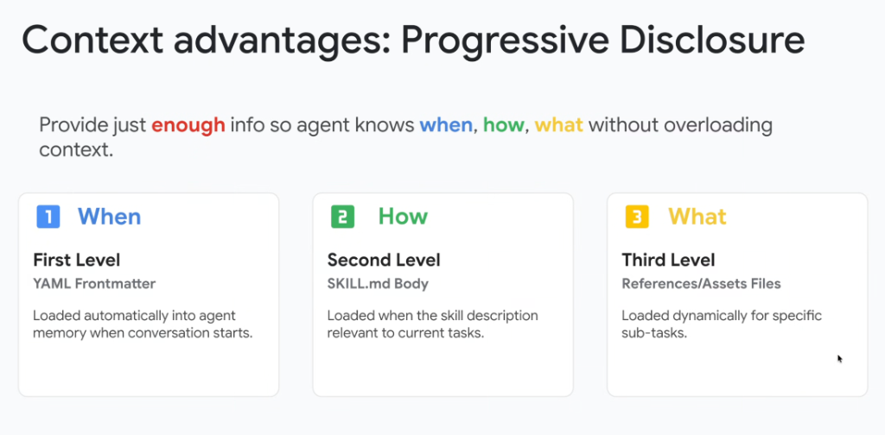

# Context Economics: The 3 Levels of Progressive Disclosure (When, How, What)



## Overview

A central challenge in engineering production-grade agents is managing the context window efficiently. Cramming all instructions, API schemas, and runbooks into a single monolithic system prompt causes token bloat, increases inference latency, degrades reasoning attention, and escalates API costs.

The **Progressive Disclosure** pattern solves this by structuring capability loading into **three distinct architectural levels**, ensuring the system provides **just enough info so the agent knows WHEN, HOW, and WHAT without overloading context**.

---

## The 3 Levels of Progressive Disclosure

```mermaid
graph TD
    subgraph Level 1: WHEN (Startup)
        L1["🔵 <b>1. When — First Level (YAML Frontmatter)</b><br/>• <i>Loaded automatically into agent memory when conversation starts</i><br/>• Answers: 'When should I trigger this capability?'<br/>• Token Cost: ~30 tokens"]
    end

    subgraph Level 2: HOW (Activation)
        L2["🟢 <b>2. How — Second Level (SKILL.md Body)</b><br/>• <i>Loaded when skill description is relevant to current tasks</i><br/>• Answers: 'How do I execute this workflow step-by-step?'<br/>• Token Cost: ~1,000 tokens"]
    end

    subgraph Level 3: WHAT (Execution)
        L3["🟡 <b>3. What — Third Level (References / Assets / Scripts)</b><br/>• <i>Loaded dynamically for specific sub-tasks</i><br/>• Answers: 'What specific schema, script, or template do I need?'<br/>• Token Cost: 0 baseline (On-Demand)"]
    end

    UserPrompt["User Prompt"] --> L1
    L1 -.->|Intent Matches| L2
    L2 -.->|Specific Action Requires Asset| L3
```

---

## Detailed Breakdown of the 3 Levels

### 1. Level 1: "WHEN" (YAML Frontmatter)
* **File Source**: Top frontmatter block of `SKILL.md` (`name`, `description`).
* **Loading Lifecycle**: Ingested automatically into the agent's baseline context at conversation startup.
* **Core Question Answered**: **"When is this skill applicable?"**
* **Token Footprint**: Minimal (~20–50 tokens per skill).
* **Role**: Acts as a lightweight directory or routing menu, allowing the agent to index dozens of domain skills without context penalty.

---

### 2. Level 2: "HOW" (`SKILL.md` Body)
* **File Source**: The main Markdown body of `SKILL.md`.
* **Loading Lifecycle**: Hydrated into the prompt *only* when the agent identifies that the user's intent matches the skill's description.
* **Core Question Answered**: **"How do I accomplish this goal step-by-step?"**
* **Token Footprint**: Moderate (~500–2,000 tokens).
* **Role**: Provides explicit operating rules, decision trees, API tool call guidelines, and safety boundaries.

---

### 3. Level 3: "WHAT" (References, Assets & Scripts)
* **File Source**: Supporting subdirectories (`references/`, `assets/`, `scripts/`, `resources/`).
* **Loading Lifecycle**: Loaded or executed selectively *only* when an active workflow step specifically calls for that exact resource.
* **Core Question Answered**: **"What exact data, script, template, or schema do I need for this step?"**
* **Token Footprint**: Zero baseline token consumption (0 tokens until read/executed).
* **Role**: Provides deep domain artifacts (e.g. database schema DDLs, Python calculation scripts, report Markdown templates).

---

## Context Economics: Monolithic Prompt vs. Progressive Disclosure

```mermaid
graph LR
    subgraph Monolithic System Prompt (Anti-Pattern)
        M1["All Tools (50+)"] --- M2["All Runbooks (100+)"] --- M3["All Schemas"]
        M1 & M2 & M3 --> M_Cost["⚠️ 50,000+ Tokens on Every Turn<br/>⚠️ High Time-to-First-Token (TTFT)<br/>⚠️ High Attention Dilution & Confusion"]
    end

    subgraph Progressive Disclosure (Elevate Best Practice)
        P1["L1: Metadata (~30 tokens)"] -.-> P2["L2: Active Skill (~1k tokens)"]
        P2 -.-> P3["L3: Active Asset (0 baseline)"]
        P1 & P2 & P3 --> P_Cost["✅ Minimal Baseline Context<br/>✅ Sub-Second TTFT Latency<br/>✅ Sharp Attention & Deterministic Execution"]
    end
```

---

## Architecture & Level Comparison Matrix

| Level | Dimension | Source Artifact | Ingestion Timing | Primary Responsibility | Token Cost |
| :---: | :--- | :--- | :--- | :--- | :--- |
| **1** | **WHEN** | YAML Frontmatter | Conversation Startup | Skill discovery & semantic intent routing | ~20–50 tokens |
| **2** | **HOW** | `SKILL.md` Body | Intent Match / Activation | Step-by-step workflow & tool-calling rules | ~500–2k tokens |
| **3** | **WHAT** | `references/`, `assets/`, `scripts/` | Execution Sub-Task | Executable scripts, templates & schema lookups | 0 baseline (On Demand) |
