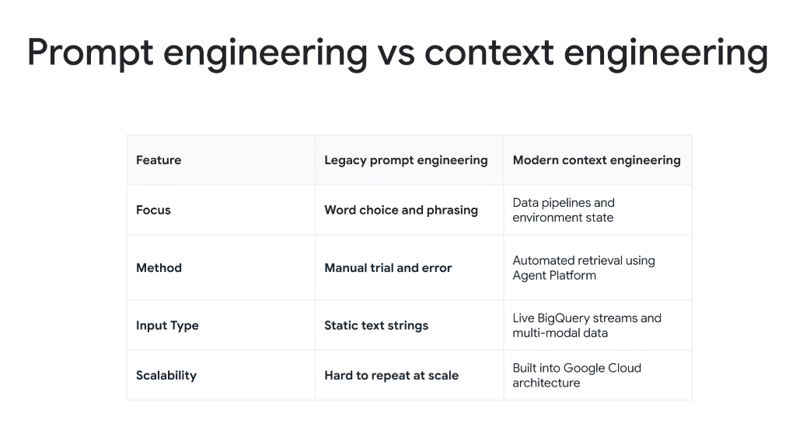

# Architectural Evolution: Legacy Prompt Engineering vs. Modern Context Engineering



## Overview

As AI development matures from experimental prototypes to mission-critical enterprise systems, the industry has transitioned from **Legacy Prompt Engineering** to **Modern Context Engineering**.

Reliability, security, and scalability in enterprise agents are not achieved through clever phrasing or "magic prompt words." They are achieved by engineering automated data pipelines, state machines, and dynamic cloud runtime platforms.

---

## The Architectural Paradigm Shift

```mermaid
graph TD
    subgraph ❌ Legacy Prompt Engineering (Fragile)
        L1["🔤 <b>Word Choice & Phrasing</b><br/>Manual prompt tweaking & cajoling"] --> L2["🎲 <b>Manual Trial & Error</b><br/>Ad-hoc chat UI experimentation"]
        L2 --> L3["📄 <b>Static Text Strings</b><br/>Hardcoded text blobs in prompts"]
        L3 --> L4["📉 <b>Hard to Repeat at Scale</b><br/>Breaks on model updates"]
    end

    subgraph ✅ Modern Context Engineering (Enterprise-Grade)
        M1["🚰 <b>Data Pipelines & State</b><br/>Dynamic working memory hydration"] --> M2["🤖 <b>Automated Retrieval</b><br/>Gemini Enterprise Agent Platform"]
        M2 --> M3["📊 <b>Live Streams & Multimodal</b><br/>BigQuery telemetry, audio & video"]
        M3 --> M4["☁️ <b>Google Cloud Infrastructure</b><br/>Built-in scaling, IAM & CI/CD evals"]
    end
```

---

## Deep Breakdown across the 4 Dimensions

### 1. Focus: Word Choice vs. Data Pipelines & Environment State
* **Legacy Prompt Engineering**: Focuses on micro-optimizing prompt wording, adding sycophantic preambles (*"Think step-by-step"*, *"You are a world-class principal architect"*), and superstitious punctuation hacks.
* **Modern Context Engineering**: Focuses on the **data plumbing**: assembling real-time environment state, Git diffs, database table schemas, and active skill playbooks into a clean, budgeted context window.

---

### 2. Method: Manual Trial and Error vs. Automated Agent Platform Retrieval
* **Legacy Prompt Engineering**: Engineers iteratively copy-paste prompts into playground UIs, relying on subjective "eyeball verification" until an output looks acceptable.
* **Modern Context Engineering**: Leverages the **Gemini Enterprise Agent Platform** and **Progressive Disclosure Skills** to automatically retrieve, filter, and ground context using deterministic tooling and automated Golden Dataset evals.

---

### 3. Input Type: Static Text Strings vs. Live BigQuery Streams & Multimodal Data
* **Legacy Prompt Engineering**: Constrained to static, brittle strings that quickly become stale as backend data evolves.
* **Modern Context Engineering**: Dynamically ingests **live BigQuery data streams**, vector embeddings, structured JSON API payloads, and native multimodal inputs (audio, video, and image frames).

---

### 4. Scalability: Hard to Repeat at Scale vs. Built into Google Cloud Architecture
* **Legacy Prompt Engineering**: Fails at enterprise scale; a prompt tuned for one specific model version often breaks when the underlying model checkpoint updates.
* **Modern Context Engineering**: Architected directly on **Google Cloud enterprise infrastructure** (Cloud Run, GKE, Spanner state persistence, OpenTelemetry tracing), ensuring robust reproducibility, governance, and CI/CD testing with Pytest.

---

## Detailed Comparison Matrix

| Architectural Feature | Legacy Prompt Engineering | Modern Context Engineering |
| :--- | :--- | :--- |
| **Primary Focus** | Word choice, phrasing, and rhetorical cajoling | Data pipelines, state machines, and environment state |
| **Engineering Method** | Manual trial-and-error in chat interfaces | Automated JIT retrieval using Agent Platform |
| **Input Type** | Static, hardcoded text strings | Live BigQuery streams, APIs, and multimodal data |
| **Scalability & CI/CD** | Hard to repeat at scale; fragile to model updates | Built natively into Google Cloud enterprise architecture |
| **Verification Strategy** | Eyeballing completions (*"looks fine"*) | Automated evaluation benchmarks (`EVAL.txtpb` & Pytest) |
| **Failure Recovery** | Manual re-prompting | Deterministic tool retries, backoffs, and reviewer gates |
