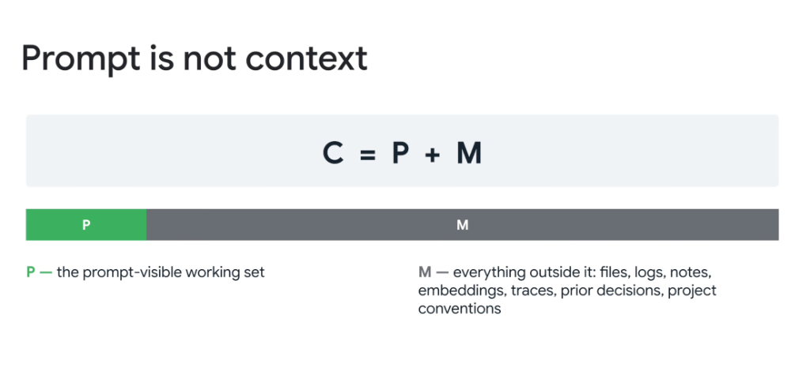
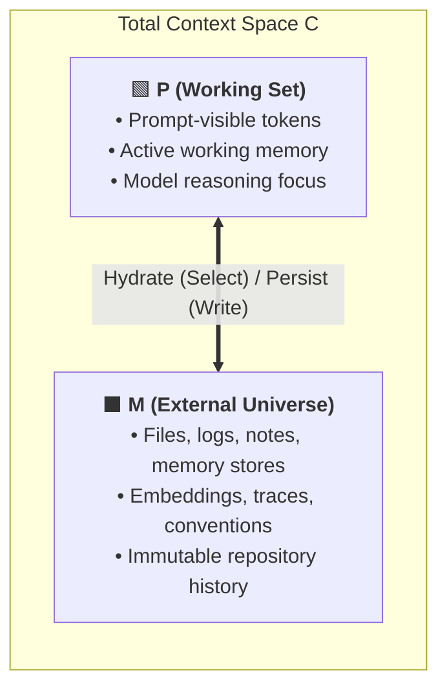
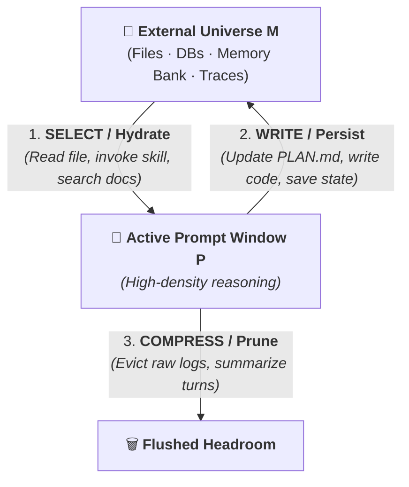

# The Context Equation: Prompt Is Not Context ($C = P + M$)

## Overview

A common novice misconception in AI engineering is assuming that the **Prompt** equals the entire **Context**. In production agent architecture, this is fundamentally false:

> **"Prompt is not context. The prompt is merely the active working set of a much larger context universe."**

---

## The Fundamental Context Equation

$$\mathbf{C = P + M}$$

### The Equation Components Defined
* **$C$ (Total System Context)**: The complete universe of knowledge, state, data, and constraints governing the project.
* **$P$ (Prompt-Visible Working Set)**: The precise slice of tokens currently loaded into the LLM's active context window on the current turn.
* **$M$ (External Context Universe)**: Everything that exists outside the active prompt window—files, disk artifacts, memory banks, embeddings, traces, prior decisions, and repository conventions.

---

## Breakdown: Working Set ($P$) vs. External Universe ($M$)

### 1. The $P$ Component (Prompt-Visible Working Set)
* **Analogy**: The CPU L1/L2 Cache and active RAM.
* **Characteristics**:
  * Highly volatile and ephemeral.
  * Direct fuel for the model's self-attention mechanism.
  * Subject to token costs, prefill latency, and attention saturation.
* **Engineering Imperative**: Keep $P$ as lean, focused, and high-density as possible.

---

### 2. The $M$ Component (The External Universe)
* **Analogy**: Persistent NVMe SSD storage and external cloud databases.
* **Characteristics**:
  * Virtually infinite capacity at near-zero token cost.
  * Stores all source code, `PLAN.md` roadmaps, historical test runs, and OKF concept registries.
  * Durable across reboots, sessions, and agent restarts.
* **Engineering Imperative**: Build deterministic indexing and retrieval tools so the agent can query $M$ effortlessly.

---

## The $M \leftrightarrow P$ Orchestration Cycle

The primary job of an agent harness (e.g. Antigravity / Jetski) is managing the continuous, bidirectional flow of information between $M$ and $P$:

1. **Hydration ($M \rightarrow P$)**: When the agent encounters a specific sub-task, it uses tools (`view_file`, `grep_search`, `call_mcp_tool`) to load only the relevant slice of $M$ into $P$.
2. **Persistence ($P \rightarrow M$)**: When the agent derives an insight or creates a plan, it writes the result back into $M$ (`write_to_file`, `PLAN.md`, memory bank) rather than letting it linger in chat transcripts.
3. **Pruning & Eviction ($P \rightarrow \emptyset$)**: Once a transient tool output or raw compiler log is acted upon, it is evicted from $P$ to reclaim generation headroom.

---

## Comparison Matrix: $P$ vs. $M$

| Dimension | Working Set ($P$) | External Universe ($M$) |
| :--- | :--- | :--- |
| **Visibility to LLM** | Direct (in current attention window) | Indirect (retrieved via tools & APIs) |
| **Token Cost** | Incurred on every turn | Zero baseline cost until loaded |
| **Persistence Horizon** | Single turn / active conversation | Permanent across sessions & projects |
| **Capacity Scale** | Thousands of tokens | Millions to Billions of tokens |
| **Primary Examples** | Active instructions, immediate diffs, prompt text | `PLAN.md`, disk logs, Git history, BigQuery tables |
| **Governing Principle** | **SELECT & COMPRESS** | **WRITE & ISOLATE** |
