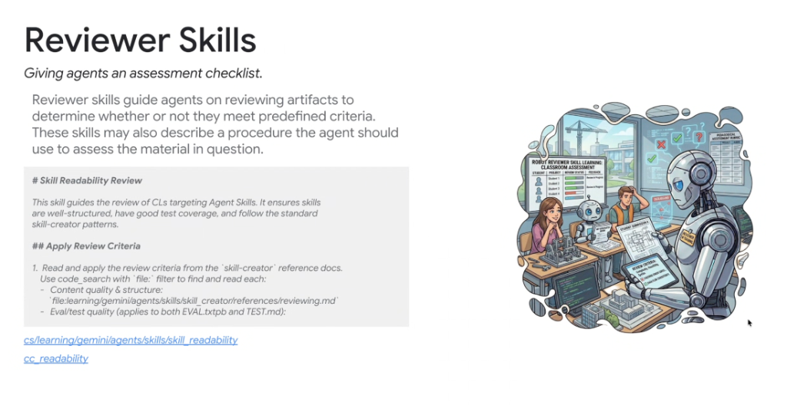
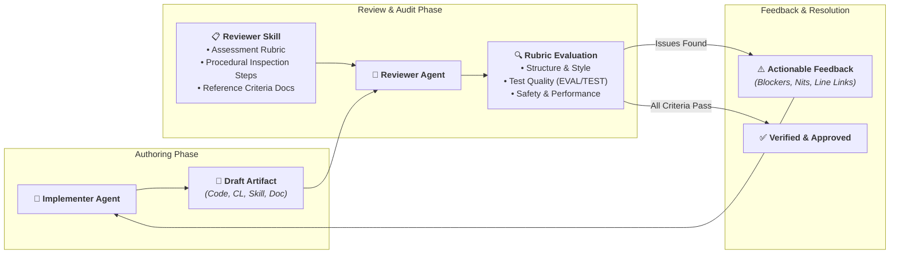

# Skill Pattern Deep Dive: Reviewer Skills



## Overview

**Reviewer Skills** equip agents with structured assessment checklists, evaluation rubrics, and systematic inspection procedures to audit artifacts (code changes, skill packages, design docs, pull requests) authored by humans or other autonomous agents.

> **"Reviewer skills guide agents on reviewing artifacts to determine whether or not they meet predefined criteria. These skills may also describe a procedure the agent should use to assess the material in question."**

In multi-agent architectures, Reviewer Skills provide the critical **adversarial quality gate**, separating artifact generation from rigorous critique to catch defects, style deviations, and missing tests before code reaches production.

---

## Multi-Agent Review Architecture



---

## Key Responsibilities of Reviewer Skills

### 1. Defining Clear, Objective Rubrics
* Translates subjective review norms into explicit, binary criteria (e.g. *"Does the skill define a description with trigger phrases?"*, *"Are all public functions covered by unit tests?"*).

### 2. Prescribing Procedural Inspection Steps
* Details the exact sequence of steps the reviewer should take:
  1. Retrieve reference criteria files (e.g. `references/reviewing.md`).
  2. Inspect modified files using symbol searches and diff analysis.
  3. Validate test files and coverage definitions (`EVAL.txtpb`, `TEST.MD`).

### 3. Formatting Actionable, Categorized Feedback
* Instructs the agent to categorize review comments clearly:
  * **[BLOCKER]**: Architectural flaws, broken tests, security vulnerabilities, or policy violations.
  * **[SUGGESTION]**: Idiomatic improvements or minor performance optimizations.
  * **[NIT]**: Minor whitespace, comment grammar, or formatting preferences.

---

## Canonical Internal Examples

### 1. `skill_readability`
* **Location**: `cs/learning/gemini/agents/skills/skill_readability`
* **Role**: Reviews changelists (CLs) targeting Agent Skills to verify that skills are well-structured, have complete test coverage (`EVAL.txtpb`, `TEST.MD`), and follow standard `skill_creator` patterns.
* **Review Criteria**:
  * Content quality & structure (`references/reviewing.md`)
  * Evaluation & test quality (`EVAL.txtpb` datasets)

### 2. `cc_readability`
* **Role**: Automates Google Readability reviews across languages (C++, Go, Python, Java), validating code against style guides, memory management safety, and naming conventions.

---

## Anatomy of a Production Reviewer Skill

```markdown
---
name: skill-readability
description: Guides the review of changelists targeting Agent Skills. Use when reviewing skill packages, validating SKILL.md structure, or checking eval test coverage.
---

# Skill Readability Review

## Overview
This skill guides the review of CLs targeting Agent Skills. It ensures skills are well-structured, have good test coverage, and follow the standard skill-creator patterns.

## Apply Review Criteria

1. Read and apply the review criteria from the `skill-creator` reference docs:
   - Content quality & structure: `references/reviewing.md`
   - Eval/test quality: Check both `EVAL.txtpb` and `TEST.MD`
2. Validate that YAML frontmatter includes both `name` and actionable `description`.
3. Ensure all deterministic bash/python scripts reside in `scripts/`.
4. Verify that error handling and negative constraints are documented.

## Feedback Output Format
```markdown
### Review Summary: [APPROVED | CHANGES REQUESTED]

#### Critical Findings
* **[BLOCKER]** `skills/foo/SKILL.md#L12`: Description lacks trigger phrases ("Use when...").

#### Minor Suggestions
* **[SUGGESTION]** `skills/foo/scripts/run.py#L45`: Add `--format=json` flag support.
```
```

---

## Best Practices for Authoring Reviewer Skills

| Best Practice | Rationale | Anti-Pattern |
| :--- | :--- | :--- |
| **Separation of Concerns** | Keeps the reviewer adversarial and unbiased from authoring biases | Allowing the authoring agent to review its own work |
| **Reference-Driven Rubrics** | Anchors rules in external reference docs that can be updated independently | Hardcoding massive subjective rubrics directly in prompt strings |
| **Actionable Suggestions** | Helps the implementer fix issues immediately by providing concrete diffs | Vague feedback like *"Make this cleaner"* |
| **Severity Tagging** | Distinguishes between blocking security flaws and cosmetic nits | Flat comment lists where everything is treated as equal severity |
