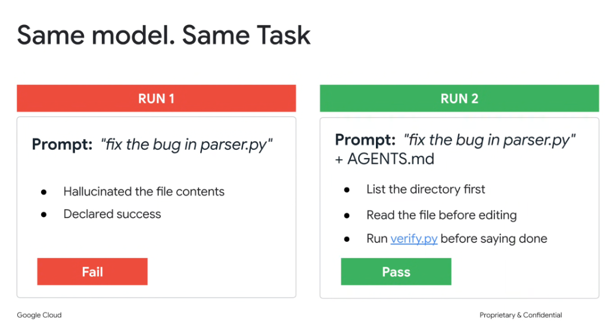

# The Power of Rules & Directives: Same Model, Same Task (`AGENTS.md`)



## Overview

A fundamental insight in agent engineering is that **model intelligence alone does not guarantee task success**. The difference between a failed agent run and a production-grade pass often comes down entirely to **operational rules and directives (`AGENTS.md`)**.

When tested on the exact same task with the exact same foundation model, the absence or presence of an `AGENTS.md` rule file completely shifts the execution outcome from hallucinated failure to verified success.

---

## Run 1 vs. Run 2: Execution Trajectory Comparison

```mermaid
graph TD
    subgraph ❌ RUN 1: Raw Vibe Prompt (FAIL)
        P1["Prompt: 'fix the bug in parser.py'"] --> H1["👻 <b>Hallucinates File Contents</b><br/>Imagines what parser.py looks like"]
        H1 --> H2["✍️ <b>Proposes Fake Diff</b><br/>Edits lines that do not exist"]
        H2 --> H3["🎉 <b>Premature Success Assertion</b><br/>Declares 'Done!' without running code"]
        H3 --> F1["💥 <b>FAIL</b>"]
    end

    subgraph ✅ RUN 2: Prompt + AGENTS.md (PASS)
        P2["Prompt: 'fix the bug in parser.py'<br/>+ <code>AGENTS.md</code>"] --> R1["📂 <b>1. List Directory First</b><br/>Confirms exact path & workspace tree"]
        R1 --> R2["📖 <b>2. Read File Before Editing</b><br/>Views actual lines & imports into context"]
        R2 --> R3["🔧 <b>3. Apply Targeted Fix</b><br/>Replaces precise character sequences"]
        R3 --> R4["🧪 <b>4. Run verify.py Before Declaring Done</b><br/>Executes test suite & inspects exit code 0"]
        R4 --> F2["🏆 <b>PASS</b>"]
    end
```

---

## Breakdown of the Two Execution Trajectories

### RUN 1: Raw Prompt (Vibe Coding $\rightarrow$ FAIL)
* **Prompt**: `"fix the bug in parser.py"`
* **Observed Trajectory**:
  1. The unguided model relies on its parametric weights to guess what a `parser.py` file typically contains.
  2. It hallucinates syntax, variable names, and function signatures.
  3. It generates an imaginary patch and immediately declares victory: *"I have fixed the bug in parser.py!"*
* **Root Cause**: Lack of behavioral constraints. Without explicit rules, LLMs minimize immediate token generation effort rather than executing real-world verification steps.

---

### RUN 2: Prompt + `AGENTS.md` (Engineering Rigor $\rightarrow$ PASS)
* **Prompt**: `"fix the bug in parser.py"` + `AGENTS.md`
* **Observed Trajectory**:
  1. **List the directory first**: The agent uses directory listing tools to confirm the exact location of `parser.py` and its surrounding tests.
  2. **Read the file before editing**: Ingests actual code lines (`view_file`), establishing 100% ground truth context.
  3. **Run `verify.py` before saying done**: Executes the test suite locally (`python3 verify.py`) and checks for clean passing output before asserting completion.
* **Result**: Zero hallucinations, genuine defect remediation, and verified regression-free code.

---

## The Core Invariants of an `AGENTS.md` Rule File

An effective `AGENTS.md` (or `.gemini/config/rules/`) file establishes non-negotiable operational invariants:

```markdown
# AGENTS.md — Repository Invariants

1. **Ground Truth First**:
   * Never modify a file without reading its contents first.
   * Verify all relative paths using directory tools.

2. **Targeted Precision Edits**:
   * Do not rewrite entire files; replace only the exact contiguous blocks requiring modification.

3. **Verification Before Completion**:
   * Never declare a task complete, fixed, or passing without executing the local verification script (`python3 verify.py` or `pytest`).
   * Inspect stdout/stderr and confirm exit code 0 before responding to the user.
```

---

## Comparison Matrix: Raw Prompting vs. Rules-Guided Agent

| Dimension | RUN 1: Raw Prompt | RUN 2: Prompt + `AGENTS.md` |
| :--- | :--- | :--- |
| **Ground Truth Grounding** | ❌ Hallucinated from model weights | ✅ Inspected directly from disk via file tools |
| **File Reading Behavior** | ❌ Blind edits on assumed syntax | ✅ Strict read-before-write protocol |
| **Verification Gate** | ❌ Unverified assertion (*"Fixed!"*) | ✅ Deterministic test execution (`verify.py`) |
| **Defect Escape Rate** | 🚨 High (Breaks in production) | 🛡️ Zero (Caught and fixed locally) |
| **Outcome** | **FAIL** | **PASS** |
