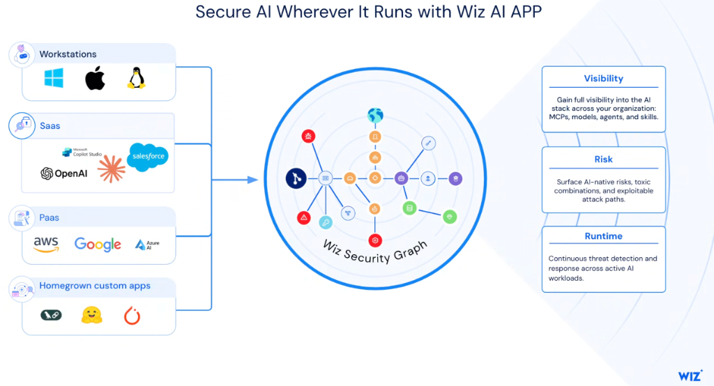
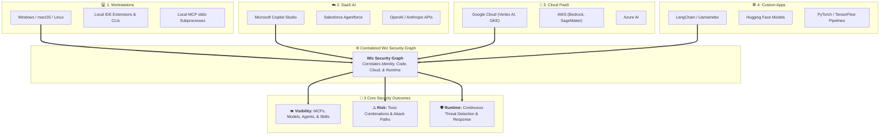
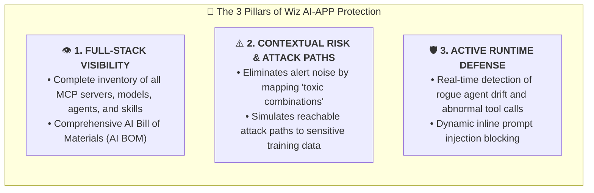

# Secure AI Wherever It Runs: Multi-Environment Protection with Wiz AI-APP

## Overview

Modern enterprise AI deployments do not reside in a single siloed environment. AI workloads execute across local developer laptops, third-party SaaS ecosystems, hyperscaler cloud platforms, and custom in-house agent frameworks.

**Wiz AI-APP** delivers ubiquitous, environment-agnostic security by aggregating, analyzing, and correlating signals from all four operational tiers into the centralized **Wiz Security Graph**.

---

## Architecture: The 4 Ingestion Environments & The Security Graph

---

## The 4 Monitored AI Environments

### 1. Workstations (Developer & Local Endpoints)
* **Scope**: Developer endpoints across Windows, macOS, and Linux running local IDE extensions (Antigravity 2.0, VS Code), terminal CLIs (`agy`), and local MCP `stdio` servers.
* **Security Focus**: Hardcoded API secrets in `.env` files, unverified local MCP server binaries, and unconstrained local shell access granted to autonomous agents.

---

### 2. SaaS AI Ecosystems
* **Scope**: Third-party enterprise AI products including **Microsoft Copilot Studio**, **Salesforce Agentforce**, **OpenAI**, and **Anthropic**.
* **Security Focus**: Shadow AI SaaS discovery, excessive data sharing permissions, unmonitored API token consumption, and third-party data retention compliance.

---

### 3. Hyperscaler Cloud PaaS
* **Scope**: Managed cloud AI infrastructure across **Google Cloud (Vertex AI, Cloud Run, GKE)**, **AWS (Bedrock, SageMaker)**, and **Azure AI**.
* **Security Focus**: Public model endpoint exposure, overly permissive Cloud IAM service account bindings, missing VPC Service Controls (VPC-SC), and unencrypted vector databases.

---

### 4. Homegrown Custom AI Applications
* **Scope**: In-house agent frameworks, model training scripts, and custom inference microservices built with **LangChain**, **Hugging Face**, **PyTorch**, and Google ADK.
* **Security Focus**: Insecure model weight deserialization (pickle vulnerabilities), prompt injection vulnerabilities in custom tools, and open supply chain dependencies.

---

## The 3 Core Security Outcomes

---

## Multi-Environment Protection Matrix

| Environment Tier | Typical Workloads | Key Security Capabilities | Mitigated Risks |
| :--- | :--- | :--- | :--- |
| **Workstations** | Antigravity CLI, IDE extensions, local MCP | Endpoint secret scanning, binary vetting | Local privilege escalation, leaked API tokens |
| **SaaS AI** | Copilot, Salesforce, ChatGPT Enterprise | SaaS posture management, OAuth auditing | Shadow AI adoption, sensitive data leakage |
| **Cloud PaaS** | Vertex AI, GKE, BigQuery, AWS Bedrock | Toxic combination analysis, IAM posture | Public endpoint exposure, confused deputy attacks |
| **Custom Apps** | LangChain, PyTorch, Hugging Face | Supply chain scanning, model weight audits | Deserialization exploits, poisoned model weights |
