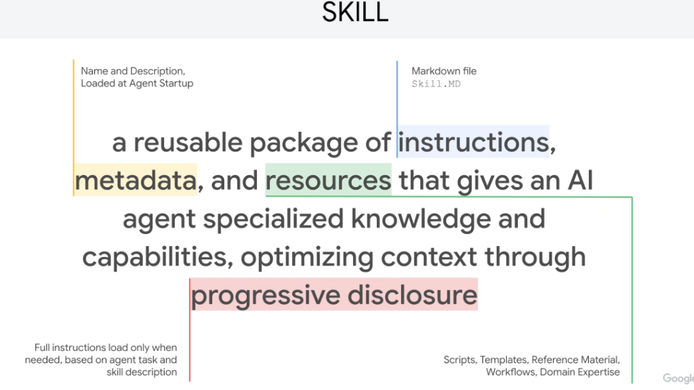

# Skill Architecture: The Canonical Definition & Progressive Disclosure



## The Canonical Definition

> **"A Skill is a reusable package of instructions, metadata, and resources that gives an AI agent specialized knowledge and capabilities, optimizing context through progressive disclosure."**

---

## Anatomical Breakdown of a Skill

```mermaid
graph TD
    subgraph 1. Metadata (Startup)
        Meta["🏷️ <b>Metadata</b><br/>• Name & Description (YAML frontmatter)<br/>• <i>Loaded at Agent Startup</i><br/>• Token Cost: ~30 tokens"]
    end

    subgraph 2. Instructions (On Activation)
        Inst["📜 <b>Instructions</b><br/>• Markdown file (<code>SKILL.md</code>)<br/>• Operating rules & decision trees<br/>• <i>Loaded only when intent matches</i>"]
    end

    subgraph 3. Resources (On Demand)
        Res["🧰 <b>Resources</b><br/>• Deterministic scripts (<code>scripts/</code>)<br/>• Templates & schemas (<code>resources/</code>)<br/>• Reference runbooks (<code>references/</code>)<br/>• <i>Loaded individually during active steps</i>"]
    end

    subgraph 4. Mechanism
        PD["⚡ <b>Progressive Disclosure</b><br/>Context optimization engine loading content tier-by-tier"]
    end

    PD --> Meta
    Meta -.->|Matches User Task| Inst
    Inst -.->|Step Requires Asset| Res
```

---

## The 4 Core Elements Detailed

### 1. Metadata (The Discovery Menu)
* **Definition**: The identity and capability summary of the skill, authored in standard YAML frontmatter.
* **When It Loads**: Ingested automatically into the agent's context at session startup.
* **Role**: Acts as a lightweight "menu" or routing index, allowing the agent to evaluate dozens or hundreds of available skills without blowing its token budget.
* **Example**:
  ```yaml
  ---
  name: bigquery-optimizer
  description: Audits SQL queries, recommends table partitioning/clustering, and estimates slot costs using BigQuery dry-runs.
  ---
  ```

---

### 2. Instructions (The Core Playbook)
* **Definition**: The structured Markdown body inside `SKILL.md`.
* **When It Loads**: Dynamically ingested into the working context *only* when the agent matches an incoming user prompt to the skill's description.
* **Role**: Guides the model through domain-specific workflows, error-recovery logic, tool-calling constraints, and edge-case handling.
* **Content**: Step-by-step procedures, tool usage guidelines, and behavioral boundaries.

---

### 3. Resources (Domain Assets & Execution Code)
* **Definition**: Deep supporting assets and executable code packaged alongside the instructions.
* **When It Loads**: Fetched selectively on demand during execution when a specific step requires that exact file.
* **Key Categories**:
  * **Deterministic Scripts (`scripts/`)**: Python, Bash, or Go helper utilities that execute complex transformations without delegating math/parsing to LLMs.
  * **Templates & Exemplars (`resources/`)**: Schema files, golden input/output few-shot exemplars, and prompt templates.
  * **Reference Material (`references/`)**: Comprehensive enterprise manuals, API documentation, and troubleshooting runbooks.

---

### 4. Progressive Disclosure (Context Optimization)
* **Core Principle**: **"Full instructions load only when needed, based on agent task and skill description."**
* **The Problem It Solves**: Monolithic system prompts cram every tool, runbook, and rule into the prompt, resulting in prompt bloat, high TTFT latency, and attention dilution.
* **The Solution**: Progressive disclosure structures loading into three distinct tiers:
  1. **Tier 1 (Startup)**: Lightweight Metadata (~30 tokens).
  2. **Tier 2 (Activation)**: Core Instructions (~1,000 tokens).
  3. **Tier 3 (Execution)**: Targeted Resources (0 baseline tokens, loaded per file).

---

## Canonical Skill Directory Layout

```text
skills/cloud-sql-diagnostics/
├── SKILL.md                 # Metadata (frontmatter) + Core Instructions (Markdown body)
├── scripts/
│   ├── connection_pool_check.py  # Deterministic script to audit pool saturation
│   └── replication_lag_audit.py  # Read replica lag calculation
├── resources/
│   └── pg_stat_statements.sql    # Golden query templates for query analysis
└── references/
    ├── flags_allowlist.md        # Supported Cloud SQL database flags
    └── maintenance_runbook.md    # Failover and maintenance window SOPs
```

---

## Summary Matrix

| Element | Artifact / File | Loading Trigger | Token Footprint | Primary Responsibility |
| :--- | :--- | :--- | :--- | :--- |
| **Metadata** | YAML Frontmatter in `SKILL.md` | Session Startup | Minimal (~20–50 tokens) | High-speed skill discovery and intent matching |
| **Instructions** | Markdown Body of `SKILL.md` | Skill Activation | Moderate (~500–2,000 tokens) | Domain reasoning, operational rules & decision trees |
| **Resources** | `scripts/`, `resources/`, `references/` | Step Execution | Zero baseline (On-Demand) | Executable automation, templates & deep documentation |
| **Progressive Disclosure** | Multi-tiered loading architecture | Continuous runtime | Maximum efficiency | Prevents context bloat and eliminates tool confusion |
