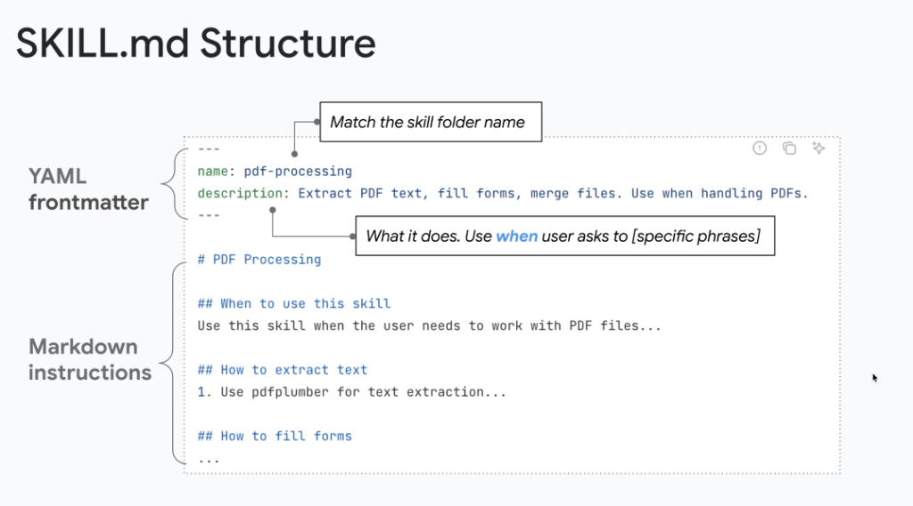
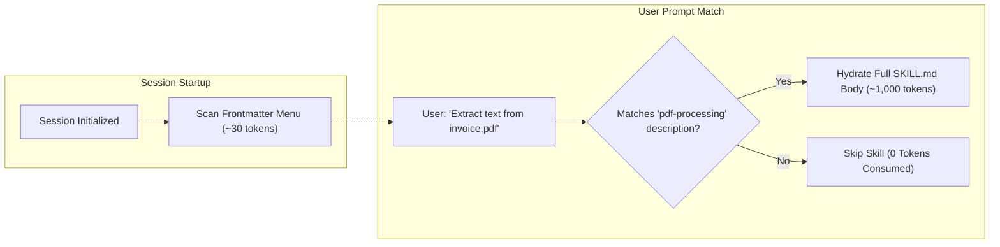

# Skill Specification: The `SKILL.md` File Structure & Anatomy



## Overview

The `SKILL.md` file is the foundational entry point of any Skill in **Google ADK** and **Google Antigravity**. It is architecturally structured into two distinct sections: **YAML Frontmatter** (Level 1 Metadata for discovery) and **Markdown Instructions** (Level 2 Detailed Guidance for execution).

---

## Anatomical Structure of `SKILL.md`

```mermaid
graph TD
    subgraph SKILL.md Document
        subgraph Top Half: YAML Frontmatter (Level 1)
            Y1["<code>---</code>"]
            Y2["<b>name</b>: pdf-processing<br/><i>(Matches skill folder name)</i>"]
            Y3["<b>description</b>: What it does + Use when trigger phrases<br/><i>(Scanned at agent startup)</i>"]
            Y4["<code>---</code>"]
        end

        subgraph Bottom Half: Markdown Body (Level 2)
            M1["<b># Title & Overview</b>"]
            M2["<b>## When to Use This Skill</b><br/><i>(Trigger conditions & intent mapping)</i>"]
            M3["<b>## Step-by-Step Procedures</b><br/><i>(Tool calls, Python scripts & runbooks)</i>"]
            M4["<b>## Error Handling & Guardrails</b>"]
        end
    end

    Y1 --> Y2 --> Y3 --> Y4
    Y4 --> M1 --> M2 --> M3 --> M4
```

---

## 1. YAML Frontmatter (The Level 1 Discovery Contract)

The frontmatter is defined between triple dashes (`---`) at the very top of `SKILL.md`. It is the only portion ingested during initial session startup (~30 tokens).

### Frontmatter Schema & Fields

| Field | Rule / Requirement | Description & Best Practice |
| :--- | :--- | :--- |
| `name` | **Must match folder name** | Lowercase kebab-case identifier (e.g., `pdf-processing`, `cloud-sql-diagnostics`). |
| `description` | **Trigger Formula** | **[What it does]** + **[Use when user asks to <specific phrases>]**. The model directly evaluates this string during intent routing. |

### Canonical Frontmatter Example
```yaml
---
name: pdf-processing
description: Extract PDF text, fill forms, merge files. Use when handling PDFs, reading scanned documents, or manipulating PDF form fields.
---
```

> [!TIP]
> **Trigger Formula**: Always include explicit trigger keywords in `description` (e.g., *"Use when the user asks to extract text from PDFs, merge files, or fill form fields"*). The orchestrator relies on semantic vector matching against this string to activate the skill.

---

## 2. Markdown Instructions (The Level 2 Execution Contract)

The Markdown body provides comprehensive operational guidance, loaded into the agent's context *only* after the skill is activated by user intent.

### Standard Section Layout

```markdown
# PDF Processing

## When to use this skill
Use this skill when the user needs to work with PDF files, parse form fields, convert PDF pages to text, or combine multiple PDF documents.

## How to extract text
1. Inspect the target PDF file using the `pdfplumber` helper script located in `scripts/extract_text.py`.
2. For OCR on scanned documents, invoke the `scripts/ocr_processor.py` utility.

## How to fill forms
1. Read existing form field keys using `scripts/inspect_fields.py`.
2. Map JSON input data to target form fields.
3. Validate output integrity before writing to final destination.

## Safety & Guardrails
* Never modify source PDF files directly; always create output files with `_processed` suffix.
* Ensure password-protected files prompt the user for decryption credentials.
```

---

## The Two-Half Attention Economics



---

## Key Authoring Best Practices

1. **Exact Name Matching**: Always name the folder and `name` frontmatter field identically (`skills/pdf-processing/` $\rightarrow$ `name: pdf-processing`).
2. **Deterministic Scripts First**: Reference helper scripts in `scripts/` rather than asking the LLM to write one-off code for math, parsing, or binary manipulation.
3. **Structured Sub-Headings**: Use action-oriented headers (`## How to extract text`, `## How to fill forms`) so the model can navigate sections logically.
4. **Explicit Negative Boundaries**: State when *not* to use the skill to prevent false-positive activations (e.g., *"Don't use for image OCR without PDF wrappers"*).
