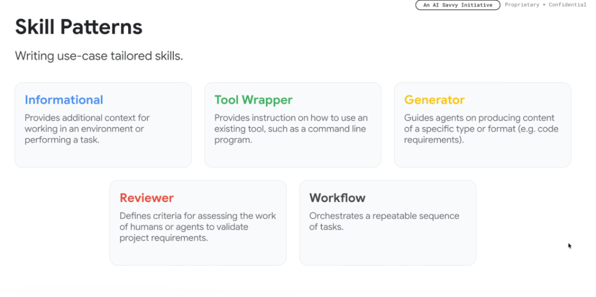
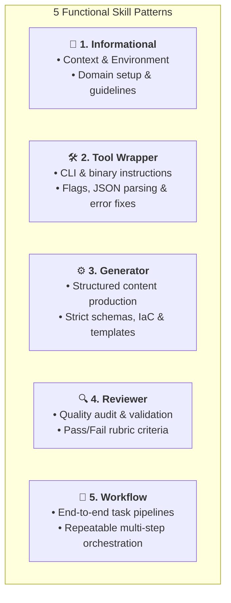

# Skill Design Patterns: The 5 Functional Archetypes

## Overview

When engineering custom skills for autonomous agents in **Google ADK** and **Google Antigravity**, skills should be tailored around specific functional responsibilities. 

Rather than authoring monolithic, kitchen-sink skills, production architectures leverage **5 core skill patterns**: **Informational**, **Tool Wrapper**, **Generator**, **Reviewer**, and **Workflow**.

---

## The 5 Skill Archetypes Map

---

## Deep Dive into the 5 Patterns

### 1. Informational Pattern
* **Core Purpose**: Provides additional background context, environment configuration, and domain knowledge for working in a system.
* **What It Contains**: Architectural diagrams, environment variable setups, directory layouts, and company policies.
* **When It Triggers**: When the agent begins working in a specialized codebase, remote host, or domain with proprietary conventions.
* **Real-World Examples**:
  * `cloudtop-environment`: Details SSH ControlMaster configuration, gLinux file paths, and environment constraints.
  * `brand-guidelines`: Ingests company tone-of-voice, color palettes, and copywriting rules.

---

### 2. Tool Wrapper Pattern
* **Core Purpose**: Instructs the agent on how to correctly invoke and interpret existing tools, command-line utilities, or APIs.
* **What It Contains**: CLI flag references, input syntax formatting, JSON response parsing rules, and recovery steps for common exit codes.
* **When It Triggers**: When the agent must interact with a complex CLI binary (e.g. `gcloud`, `bq`, `gh`, `terraform`).
* **Real-World Examples**:
  * `slack-cli-wrapper`: Details Python CLI commands to search channels, fetch thread replies, and download files.
  * `f1-query-guide`: Guides the model on constructing valid GoogleSQL queries against internal distributed databases.

---

### 3. Generator Pattern
* **Core Purpose**: Guides agents on producing content, code, or documentation adhering to strict structural and syntactical specifications.
* **What It Contains**: Output skeletons, schema validation rules, boilerplate templates, and few-shot exemplars.
* **When It Triggers**: When generating code artifacts (Terraform IaC, protobufs, React components) or structured customer reports.
* **Real-World Examples**:
  * `terraform-generator`: Enforces Google Cloud provider conventions, remote GCS backends, and least-privilege IAM rules.
  * `api-spec-generator`: Generates OpenAPI 3.0 YAML documents matching enterprise REST guidelines.

---

### 4. Reviewer Pattern
* **Core Purpose**: Defines explicit evaluation criteria, rubrics, and checklists for assessing the work of humans or peer subagents.
* **What It Contains**: Multi-point scoring rubrics, security audit checklists, performance benchmarks, and linting rules.
* **When It Triggers**: During validation gates, pre-commit pipelines, or verification turns before declaring a task complete.
* **Real-World Examples**:
  * `critique-code-reviewer`: Evaluates changelists for Google3 style, readability, test coverage, and documentation integrity.
  * `a11y-auditor`: Validates web frontend code against WCAG 2.1 AA accessibility standards.

---

### 5. Workflow Pattern
* **Core Purpose**: Orchestrates a repeatable, multi-step sequence of interdependent operations to complete an end-to-end task.
* **What It Contains**: Ordered execution checklists, rollback triggers, state checkpoints, and handoff rules between sub-tasks.
* **When It Triggers**: When executing end-to-end automation pipelines that require deterministic sequencing.
* **Real-World Examples**:
  * `cl-creation-and-autoreview`: Formats code $\rightarrow$ Creates Git/jj commit $\rightarrow$ Triggers Critique analysis $\rightarrow$ Fixes analyzer findings.
  * `dailyup`: Scans email, calendar, Chat, and Slack $\rightarrow$ Synthesizes priority items $\rightarrow$ Produces daily standup briefing.

---

## Pattern Selection Matrix

| Pattern | Primary Goal | Core Contents | Ingestion Strategy | Key Metric |
| :--- | :--- | :--- | :--- | :--- |
| **Informational** | Contextual grounding | Architecture docs, domain rules | Loaded on project initialization | Zero hallucinated assumptions |
| **Tool Wrapper** | Tool execution mastery | CLI flags, error recovery, JSON syntax | Loaded when calling specific binaries | 0% malformed tool calls |
| **Generator** | High-fidelity asset creation | Code templates, schemas, exemplars | Loaded during drafting phase | 100% schema compliance |
| **Reviewer** | Quality & security gating | Rubrics, test criteria, checklists | Loaded during verification phase | High defect detection rate |
| **Workflow** | End-to-end orchestration | Sequential checklists, state machines | Loaded for multi-step jobs | Repeatable pipeline completion |
