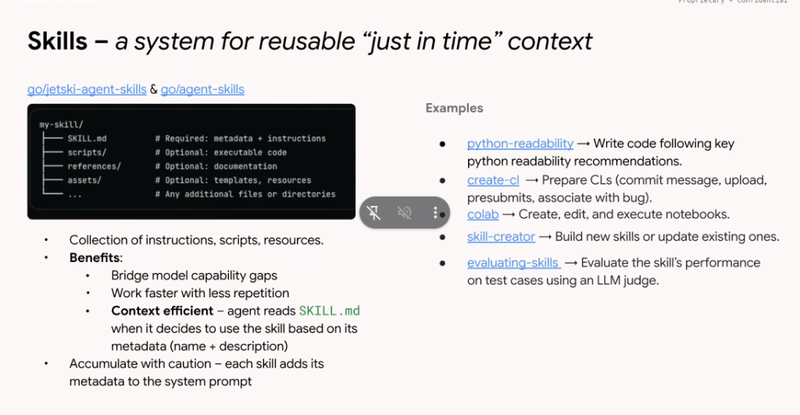

# Skills: A System for Reusable "Just in Time" Context



## Overview

In **Google Antigravity** and **Google ADK**, **Skills** serve as a **"Just-in-Time" (JIT) context system** (`go/jetski-agent-skills` & `go/agent-skills`). Instead of hardcoding all potential instructions into an agent's root prompt, skills package instructions, executables, and reference resources on disk, hydrating them into context *only when specifically needed*.

---

## The Just-in-Time (JIT) Context Hydration Flow

```mermaid
graph TD
    subgraph Agent Startup (Static Overhead: ~30 tokens per skill)
        Meta["🏷️ <b>Metadata Ingestion</b><br/><code>name</code> + <code>description</code> of all active skills"]
    end

    subgraph Runtime Intent Matching
        Prompt["User Prompt"] --> Match{"Does prompt match<br/>skill description?"}
    end

    subgraph Just-In-Time (JIT) Context Hydration
        Match -- Yes --> Hydrate["📖 <b>JIT Hydration</b><br/>Agent reads <code>SKILL.md</code> instructions into working memory"]
        Hydrate --> Exec["⚙️ <b>Execution & Resource Access</b><br/>Runs <code>scripts/</code> or inspects <code>references/</code>"]
        Match -- No --> Ignore["⏭️ <b>Bypassed</b><br/>0 tokens consumed for unneeded skills"]
    end

    Meta --> Match
```

---

## The 3 Core Architectural Benefits

### 1. Bridge Model Capability Gaps
* Foundational frontier models (e.g. Gemini 1.5/2.0) are powerful generalists, but they do not possess proprietary knowledge of internal Google infrastructures, private APIs, or company-specific coding guidelines.
* Skills inject exact domain rules, binary paths, and troubleshooting runbooks directly into the model's working memory at runtime.

### 2. Work Faster with Less Repetition
* Replaces ad-hoc, repetitive prompt engineering with standardized, version-controlled capability packages.
* When a team updates a skill, all developers and automated agents immediately benefit from the updated workflow.

### 3. Context Efficiency
* Because full `SKILL.md` documents are read on demand, baseline prompt overhead remains near zero.
* Massive documentation sets (e.g. 50-page API specifications) live on disk in `references/` and are queried only for specific edge cases.

---

## Critical Operational Warning: "Accumulate with Caution"

> [!WARNING]
> **Every skill adds its metadata (`name` + `description`) to the system prompt.**
> 
> Loading 200 unvetted skills into an agent's global scope adds ~6,000+ tokens to every single turn. This:
> 1. Increases Time-to-First-Token (TTFT) latency.
> 2. Dilutes the LLM's attention across too many options (decision space confusion).
> 3. Increases the risk of false-positive skill activations.
> 
> **Best Practice**: Keep **Global Scope** (`~/.gemini/config/skills/`) lean (5–15 essential utilities) and place domain-specific skills in **Project Scope** (`.gemini/skills/`).

---

## Canonical Internal Skills Suite

The slide highlights the standard fleet of foundational Google skills:

| Skill Name | Primary Responsibility & Description | Typical Use Case |
| :--- | :--- | :--- |
| **`python-readability`** | Writes code adhering to Google Python style, type annotations, and readability standards. | Refactoring Python files, preparing code for readability review |
| **`create-cl`** | Prepares changelists (CLs), writes structured commit messages, uploads to Critique, runs presubmits, and links Buganizer IDs (`b/<ID>`). | Committing code changes in `google3` |
| **`colab`** | Creates, edits, and programmatically executes Jupyter / Google Colab notebook cells. | Data science workflows, ML model exploration, data visualization |
| **`skill-creator`** | Guides engineers and agents in scaffolding, structuring, and authoring new skills. | Building new domain packages and adding tests |
| **`evaluating-skills`** | Evaluates a skill's accuracy and task completion rate against test datasets using an LLM judge. | Skill quality validation and benchmark regression testing |

---

## Summary Matrix

| Dimension | Monolithic Prompt Approach | JIT Skills Architecture |
| :--- | :--- | :--- |
| **Context Consumption** | Linear growth with every added feature (50k+ tokens) | Constant low baseline (~30 tokens/skill), JIT hydrated (~1k tokens) |
| **Maintainability** | Fragile copy-pasted prompts across multiple repos | Single source of truth managed via Git (`go/agent-skills`) |
| **Model Focus** | High attention dilution & frequent hallucinated actions | Sharp, focused reasoning directed by active skill playbook |
| **Extensibility** | Requires prompt rewrites and full redeployment | Drop-in folder additions (`SKILL.md` + `scripts/`) |
