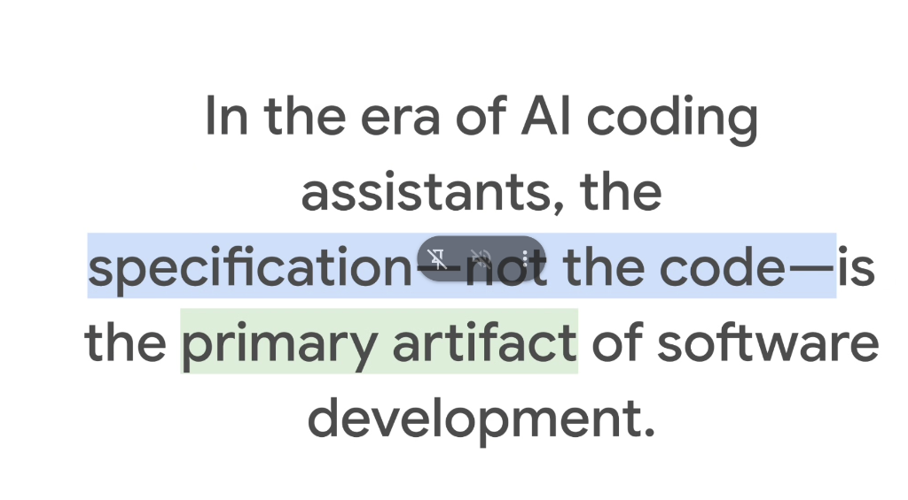
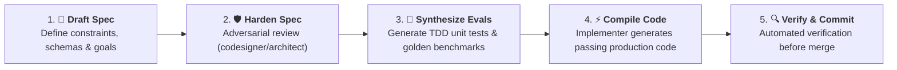

# Specification-Driven Development: The Spec Is the Primary Artifact of Software Engineering



## Overview

The advent of frontier AI coding agents has catalyzed a historic paradigm shift in software engineering:

> **"In the era of AI coding assistants, the specification—not the code—is the primary artifact of software development."**

Writing raw boilerplate syntax, loops, and glue code is increasingly commoditized. The core intellectual property and durable value of software engineering has shifted upstream to **Specification Engineering**: precisely defining system boundaries, data schemas, behavioral invariants, and acceptance criteria.

---

## The Spec-as-Source Paradigm

In modern agentic development, the developer's relationship with code is inverted:

```mermaid
graph TD
    subgraph 📜 The Primary Artifact (Durable & Immutable)
        Spec["📐 <b>The Specification (SPEC.md / PLAN.md)</b><br/>• System invariants & boundary conditions<br/>• API schemas & data contracts<br/>• Acceptance criteria & golden evals"]
    end

    subgraph ⚙️ The Compiler & Reasoning Engine
        Agent["🤖 <b>Autonomous Agent Harness (Antigravity)</b><br/>• Multi-agent swarm (Architect · Implementer · Verifier)<br/>• Test-Driven Development (TDD)"]
    end

    subgraph 📦 The Target Output (Ephemeral & Regenerable)
        Code["💻 <b>Generated Source Code & Tests</b><br/>• Python / Go / TypeScript implementations<br/>• Compiles, executes, and passes tests"]
    end

    Spec ==> Agent ==> Code
```

---

## Why the Specification Outlives the Code

| Dimension | Traditional Code-Centric Mindset | Modern Specification-Driven Mindset |
| :--- | :--- | :--- |
| **Primary Deliverable** | Source code files (`.py`, `.go`, `.cc`) | Declarative specifications & invariants (`SPEC.md`) |
| **Code Permanence** | Sacred, painstakingly handwritten line-by-line | Ephemeral, easily refactored, or regenerated on demand |
| **Role of the Engineer** | Manual syntax typist and debugger | System architect, spec author, and verification judge |
| **Refactoring Cost** | High friction; manual rewrites across files | Low friction; update specification and recompile via agent |
| **Truth Source** | Codebase comments and memory of original author | Version-controlled, path-addressed specification documents |

---

## The Specification-Driven Development (SDD) Lifecycle



### 1. Draft the Specification (`SPEC.md` / `PLAN.md`)
* The human engineer defines the system requirements, API contracts, domain entities, and non-negotiable operational invariants.

### 2. Adversarial Specification Hardening
* Specialized subagents (e.g. `codesigner`, `architect`) inspect the spec, probing for edge cases, missing error branches, performance bottlenecks, and security vulnerabilities.

### 3. Synthesize Evaluation Suites (`EVAL.txtpb` / Pytest)
* Before writing application logic, the spec is translated into deterministic unit and integration test fixtures (strict **Test-Driven Development**).

### 4. Autonomous Code Compilation
* The `implementer` agent acts as a compiler, consuming the specification and generating the exact code needed to satisfy the test suites.

### 5. Automated Verification & Quality Gates
* The `verifier` executes compiler passes, lint audits, and regression tests. If tests fail, the agent iterates autonomously until all invariants hold true.

---

## Core Principles of Writing Specifications for AI Agents

1. **Be Declarative, Not Imperative**: Specify *what* the system must achieve and *what rules it must obey*, not every line of procedural code.
2. **Explicit Edge Cases**: Clearly document error behaviors, timeout thresholds, retry backoffs, and null states.
3. **Path-as-Identity Grounding**: Reference concrete files, schema tables, and protocol buffers directly.
4. **Machine-Verifiable Acceptance Criteria**: Every clause in a specification should correspond to an automated test assertion.
