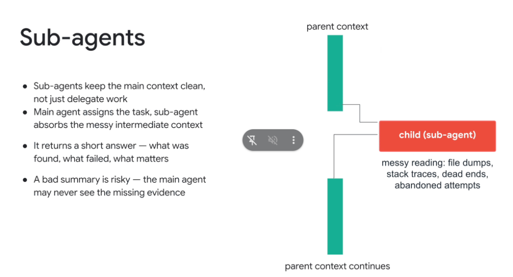
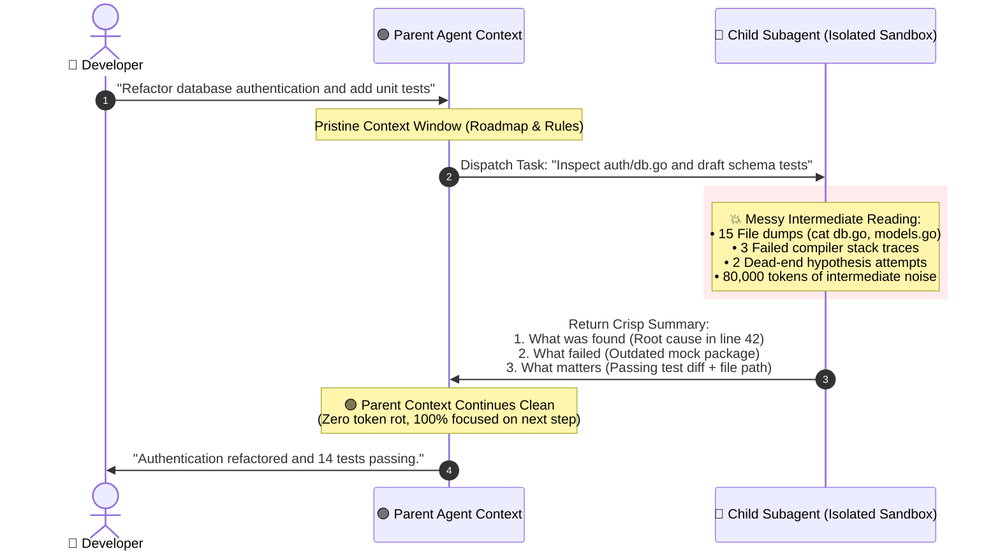

# Subagent Architecture: Context Isolation & Clean Delegation

## Overview

In multi-agent systems, subagents are frequently described as a way to parallelize labor. While true, their most critical architectural function is **Context Isolation**:

> **"Sub-agents keep the main context clean, not just delegate work. The main agent assigns the task, and the sub-agent absorbs the messy intermediate context."**

By acting as a **cognitive shock absorber**, a child subagent handles massive file reads, speculative debugging, noisy stack traces, and dead-end attempts in an isolated sandbox, returning only a high-density summary to the parent.

---

## The Subagent Context Isolation Topology

---

## The 4 Principles of Subagent Context Management

### 1. Context Cleanliness Over Mere Delegation
* If a single monolithic agent investigates 10 different files and runs 5 failing compiler builds, its context window rapidly drowns in **Observation Flooding**.
* Subagents absorb this token bloat entirely within child processes, throwing away transient noise upon completion.

---

### 2. Absorbing Messy Exploration
* Software development is non-linear: agents explore false leads, grep for nonexistent symbols, and inspect irrelevant imports.
* Isolating this "messy reading" in child sessions ensures the parent agent's reasoning trajectory remains laser-focused on the primary user spec.

---

### 3. The 3-Part High-Density Return Contract
When a child subagent finishes its task, it must return a strictly formatted synthesis:
* **What Was Found**: Exact ground truth findings (e.g. root cause, active schema).
* **What Failed**: Blockers, rejected approaches, and why alternative paths were abandoned.
* **What Matters**: Actionable artifacts, clean diffs, and test exit codes (`0`).

---

### 4. Mitigating the Bad Summary Risk (The Evidence Blindspot)
* **The Danger**: 
  > **"A bad summary is risky — the main agent may never see the missing evidence."**
  If a child subagent hallucinates or omits a critical compiler error in its summary, the parent agent will build on false assumptions.
* **The Antidotes**:
  * **Evidence-Based Reporting**: Require child subagents to include raw proof snippets (e.g. test output lines, exit code 0).
  * **Disk Artifact Offloading**: Mandate that child agents write detailed logs to disk (`test_output.log`, `diff.patch`) so the parent can inspect raw data if an assertion fails.

---

## Monolithic Single-Agent vs. Subagent Swarm Architecture

| Dimension | Monolithic Single Agent | Subagent Swarm (Isolated Contexts) |
| :--- | :--- | :--- |
| **Context Window State** | Saturated with 100k+ tokens of raw logs | Pristine; only structured milestones retained |
| **Susceptibility to Context Rot** | 🚨 Extreme (Forgets early constraints) | 🛡️ Minimal (Parent holds core roadmap only) |
| **Handling Dead Ends** | Clutters chat transcript permanently | Discarded automatically when child terminates |
| **Parallelism** | Sequential only | Highly parallelized concurrent sub-tasks |
| **Failure Blast Radius** | Fails entire conversation | Isolated to individual sub-task retry |
