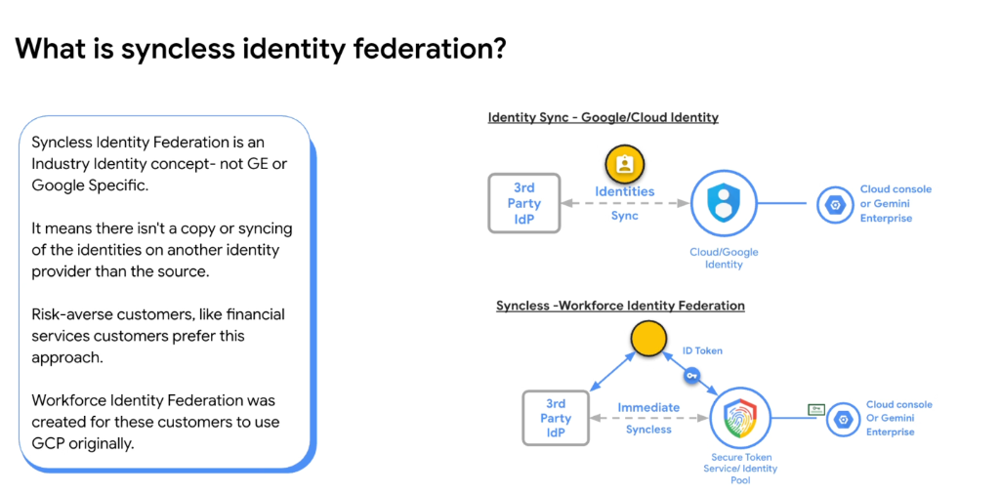

# Syncless Identity Federation: Workforce Identity Federation for Gemini Enterprise & Google Cloud



## Overview

In enterprise security and identity architecture, **Syncless Identity Federation** is an industry-wide design pattern where users authenticate directly through their primary Identity Provider (IdP) without copying, syncing, or replicating directory objects into a secondary cloud identity store.

Originally engineered for risk-averse industries such as **Financial Services**, **Healthcare**, and **Public Sector**, Google Cloud implements this via **Workforce Identity Federation (WIF)** to grant secure access to the Google Cloud Console, Google Cloud APIs, and **Gemini Enterprise**.

---

## Architectural Comparison: Identity Sync vs. Syncless Federation

```mermaid
graph TD
    subgraph Traditional["❌ Traditional Identity Sync (Cloud Identity / GCDS)"]
        direction LR
        IdP1["3rd Party IdP<br/>(Okta / Entra ID / Ping)"]
        Sync["🔄 Identity Sync Agent<br/><i>(User Object &amp; Group Replication)</i>"]
        GCI["Cloud / Google Identity<br/>(Shadow Directory)"]
        Target1["Cloud Console /<br/>Gemini Enterprise"]
        
        IdP1 <== Sync ==> GCI --> Target1
    end

    subgraph Syncless["✅ Syncless Federation (Workforce Identity Federation)"]
        direction LR
        IdP2["3rd Party IdP<br/>(Okta / Entra ID / Ping)"]
        User["👤 User / Agent"]
        STS["🛡️ Secure Token Service<br/>(Workforce Identity Pool)"]
        Target2["Cloud Console /<br/>Gemini Enterprise"]
        
        IdP2 -- "1. Authenticate" --> User
        User -- "2. Signed ID Token" --> STS
        STS -- "3. Short-Lived Federated Token" --> Target2
        IdP2 <.- "Immediate Syncless Trust" -.> STS
    end
```

---

## Traditional Identity Sync vs. Syncless Federation

### 1. Traditional Identity Sync (Cloud / Google Identity)
* **Mechanics**: An external directory sync tool (e.g. Google Cloud Directory Sync - GCDS) polls the enterprise IdP (Active Directory, Okta, Azure AD / Microsoft Entra ID) and creates matching shadow user and group accounts inside Google Cloud Identity.
* **Limitations & Risks**:
  * **Synchronization Lag**: Terminated employees retain cloud access until the next scheduled batch sync cycle executes.
  * **Credential Sprawl**: User metadata and identities reside across multiple distinct directory databases.
  * **Compliance & Governance Friction**: Highly regulated financial and defense organizations often prohibit user metadata replication to third-party databases.

---

### 2. Syncless Workforce Identity Federation (WIF)
* **Mechanics**:
  1. The user or agent authenticates directly with their enterprise 3rd-party IdP using OpenID Connect (OIDC) or SAML 2.0.
  2. The enterprise IdP issues a cryptographically signed **ID Token**.
  3. The client presents this token to Google's **Secure Token Service (STS)** within a configured **Workforce Identity Pool**.
  4. Google validates the token's signature, applies attribute mappings (e.g., Department, Roles), and issues short-lived, federated Google credentials.
  5. The federated credentials grant immediate access to the **Google Cloud Console**, **Gemini Enterprise**, or Google Cloud APIs.
* **Key Enterprise Benefits**:
  * **Immediate Revocation**: Disabling a user in the central IdP immediately blocks authentication across Google Cloud with zero sync delay.
  * **Zero Shadow Accounts**: No Google Cloud Identity accounts are provisioned or stored.
  * **Strict Data Residency**: Eliminates unauthorized directory data replication.

---

## Technical Comparison Matrix

| Architectural Dimension | 🔄 Identity Sync (Google/Cloud Identity) | ⚡ Syncless (Workforce Identity Federation) |
| :--- | :--- | :--- |
| **Directory Replication** | Full user & group copy replicated to Google | **Zero copying or syncing of identities** |
| **Identity Source of Truth** | Split between 3rd Party IdP & Cloud Identity | Single centralized 3rd Party IdP |
| **User Deprovisioning** | Delayed until next sync batch cycle | **Instantaneous upon IdP account suspension** |
| **Protocol Standards** | SCIM / GCDS periodic batch sync | OIDC / SAML 2.0 + Secure Token Service (STS) |
| **Credential Lifetime** | Long-lived directory accounts | Ephemeral, short-lived STS federated tokens |
| **Target Workloads** | Standard Workspace & Google Cloud accounts | High-security FSI, Gemini Enterprise, GCP Console |
