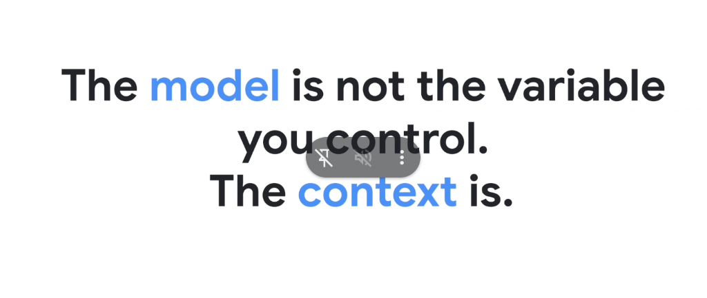

# The First Law of Agent Engineering: The Model Is Not the Variable You Control — The Context Is



## Overview

The cornerstone axiom of modern AI Agent Engineering at Google is simple and definitive:

> **"The model is not the variable you control. The context is."**

In production software engineering, waiting for the "next model checkpoint" or endlessly rewording informal prompts (*vibe engineering*) does not produce reliable systems. Frontier foundation models (e.g. Gemini 1.5/2.0 Pro) provide the raw reasoning horsepower, but **the agent engineer controls the context window**—its structure, grounding, timing, rules, and constraints.

---

## Model vs. Context: The Controllable Architecture

```mermaid
graph TD
    subgraph 🚫 The Fixed Commodity (The Model)
        Model["🧠 <b>Foundation LLM (Gemini)</b><br/>• Generalist parametric weights<br/>• Fixed reasoning capabilities<br/>• Non-deterministic sampling<br/><i>(You cannot modify its weights at runtime)</i>"]
    end

    subgraph 🎛️ The Controllable Variable (The Context)
        C1["📐 <b>Operational Invariants</b><br/><code>AGENTS.md</code> rules, read-before-edit, TDD"]
        C2["⚡ <b>Progressive Disclosure</b><br/>When · How · What tiering (Skills)"]
        C3["📚 <b>Ground Truth Knowledge</b><br/>Open Knowledge Format (OKF) & RAG"]
        C4["🛠️ <b>Tool Wrappers & Protocols</b><br/>MCP, fixed paths, output filters (<code>-max_results</code>)"]
        C5["👥 <b>Multi-Agent Swarm Topologies</b><br/>Context isolation per subagent role"]
    end

    C1 & C2 & C3 & C4 & C5 ==> Engine["⚙️ <b>High-Reliability Agent Runtime</b>"]
    Engine --> Model
```

---

## The Paradigm Shift: Passenger vs. Engineer

| Dimension | Model-Centric Mindset (The Passenger) | Context-Centric Mindset (The Engineer) |
| :--- | :--- | :--- |
| **Core Belief** | *"The model is too dumb to do this task."* | *"The context was too noisy, ambiguous, or ungrounded."* |
| **Reaction to Failure** | Re-prompts casually or waits for GPT-X / Gemini Next. | Inspects trajectory, identifies the missing invariant, and encodes a rule. |
| **Context Strategy** | Stuff everything into one giant prompt (Monolith). | Staged hydration via Progressive Disclosure (JIT). |
| **Verification** | Eyeballs the answer and hopes it works. | Enforces deterministic test execution (`verify.py`) before completion. |
| **Reliability** | Fragile, flaky, non-reproducible. | Deterministic, test-verified, enterprise-grade. |

---

## The 5 Levers of Context Engineering

To transform generalist models into deterministic enterprise systems, engineers manipulate five precise context levers:

### 1. Operational Invariants (`AGENTS.md`)
* Enforces behavioral laws that the model must obey on every turn:
  * Never edit a file without viewing it first.
  * Never declare victory without passing tests.
  * Always provide evidence before assertions.

### 2. Progressive Disclosure (Skills)
* Prevents context rot and attention dilution by loading information tier-by-tier:
  * **Level 1 (WHEN)**: Metadata menu (~30 tokens) at startup.
  * **Level 2 (HOW)**: Actionable instructions (~1k tokens) on activation.
  * **Level 3 (WHAT)**: Deterministic scripts and references (0 baseline tokens) on demand.

### 3. Ground Truth Knowledge (OKF & Closed-Book RAG)
* Replaces hazy parametric memory with explicit, path-addressed Markdown concepts (`tables/orders.md`, `metrics/revenue.md`).

### 4. Tool Protocol Constraints (MCP & Tool Wrappers)
* Constrains tool outputs using strict flags (`-max_results=50`), quiet modes, and structured JSON schemas to prevent context blowout.

### 5. Multi-Agent Context Isolation
* Uses subagent swarms (`architect`, `implementer`, `reviewer`, `verifier`) where each specialist maintains an independent, pristine context window dedicated solely to its sub-task.

---

## The Engineer's Manifesto

1. **Do not blame the model for context rot**; prune unnecessary history and structure state.
2. **Do not blame the model for hallucinations**; provide explicit ground truth and read tools.
3. **Do not blame the model for broken code**; enforce automated verification before completion.
4. **Master the context, and you master the agent.**
