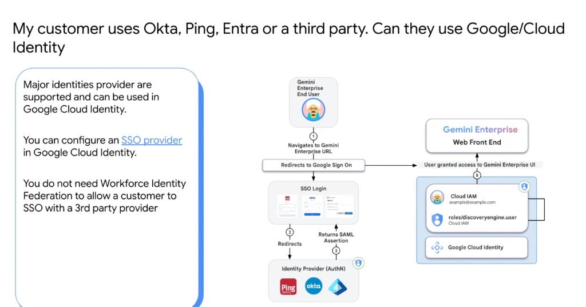
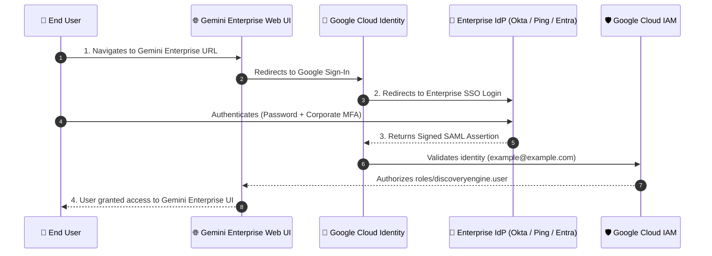

# 3rd-Party IdP SSO with Google Cloud Identity (Okta, Ping, Entra ID)

## Overview

A common misconception among enterprise architects is that using a third-party Identity Provider (IdP) such as **Okta**, **Ping Identity**, or **Microsoft Entra ID (Azure AD)** necessitates **Workforce Identity Federation (WIF)**.

**You do NOT need Workforce Identity Federation simply to enable Single Sign-On (SSO) with a third-party provider.** Standard **Google Cloud Identity** natively supports configuring 3rd-party SAML 2.0 and OpenID Connect (OIDC) identity providers as the primary SSO authentication authority for **Gemini Enterprise** and Google Cloud.

---

## SAML 2.0 SSO Authentication Lifecycle

---

## Architectural Mechanics

### 1. Delegated Authentication (AuthN)
* **Primary Authority**: The enterprise IdP (Okta, Ping, Entra ID) remains the exclusive source of truth for passwords, Multi-Factor Authentication (MFA), FIDO2 security keys, and conditional access policies (e.g., trusted device checks, IP geo-fencing).
* **Zero Credential Sharing**: Google never sees, validates, or stores corporate user passwords.

---

### 2. Authorization & Role Binding (AuthZ)
* **Cloud IAM Governance**: Once Google Cloud Identity verifies the SAML assertion, the user's session inherits granular Google Cloud IAM roles (such as `roles/discoveryengine.user` for Gemini Enterprise search and agent interactions).
* **Full Feature Parity**: Because users exist as identities within Google Cloud Identity, all native features—including **custom agent sharing**, **user autocompletion**, **NotebookLM collaboration**, and **Google Workspace data grounding**—function out-of-the-box with zero limitations.

---

## Strategic Decision Matrix: Cloud Identity SSO vs. Workforce Identity Federation

| Architectural Dimension | 🏢 Cloud Identity + 3rd-Party SSO (Recommended) | ⚡ Workforce Identity Federation (WIF) |
| :--- | :--- | :--- |
| **Authentication Source** | Enterprise IdP (Okta, Ping, Entra ID) | Enterprise IdP (Okta, Ping, Entra ID) |
| **Directory Object in Google** | Yes (User metadata synced via SCIM/GCDS) | **No (Zero directory sync / Syncless)** |
| **Password Storage** | **Never stored in Google** | **Never stored in Google** |
| **Agent & NBLM Autocomplete** | ✅ Native Out-of-the-Box | ❌ Requires WIF + SCIM |
| **Google Workspace Grounding** | ✅ Native Support | ❌ Unsupported |
| **Setup Complexity** | Low (Standard SAML SSO metadata upload) | High (WIF Pools, STS, Provider mappings) |
| **Primary Use Case** | Standard Enterprise AI & Cloud Deployments | Regulated FSI requiring Zero Replicated Objects |
