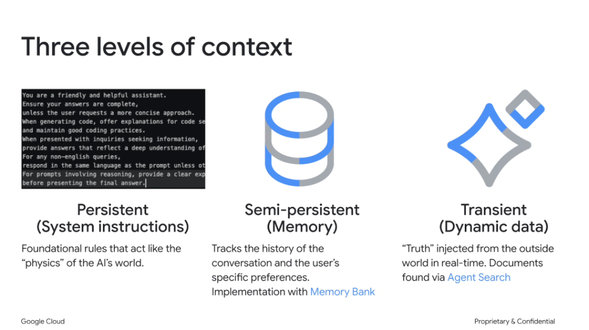
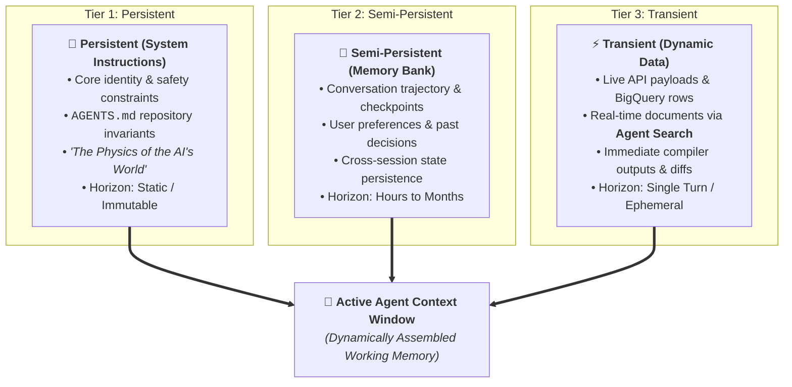

# Working Memory Taxonomy: The Three Levels of Context

## Overview

To engineer reliable, stateful AI agents without blowing token budgets, Google ADK and Antigravity categorize working information into **three distinct architectural levels of persistence**:

1. **Persistent (System Instructions)**: The immutable "physics" of the agent's world.
2. **Semi-Persistent (Memory)**: Episodic history, preferences, and long-term state (**Memory Bank**).
3. **Transient (Dynamic Data)**: Real-time ground truth injected on-the-fly (**Agent Search**).

---

## The 3 Context Persistence Tiers Architecture

---

## Deep Breakdown of the 3 Levels

### 1. Persistent Context (System Instructions)
* **Definition**: Foundational, immutable rules that govern how the agent behaves regardless of user input.
* **Metaphor**: The **"Physics"** of the AI's universe—laws that cannot be bent or violated.
* **What It Contains**:
  * Base system prompt instructions.
  * Non-negotiable repository invariants (`AGENTS.md`, `rules/`).
  * Safety perimeters and permission boundaries.
* **Update Frequency**: Fixed at deployment / session boot; never modified by runtime turns.

---

### 2. Semi-Persistent Context (Memory & Memory Bank)
* **Definition**: Structured working memory that tracks conversational progress, user preferences, and evolving project state over time.
* **Implementation**: Managed via **Memory Bank**, Smith Long-Term Memory Service, or cloud state backends (Firestore / Spanner).
* **What It Contains**:
  * Multi-turn chat history summaries and key decision milestones.
  * User-specific preferences (e.g. preferred testing frameworks, language versions).
  * Project-level architectural decisions and unresolved task checklists.
* **Update Frequency**: Updated incrementally at the end of each turn or session.

---

### 3. Transient Context (Dynamic Data & Agent Search)
* **Definition**: Ephemeral, real-time "ground truth" retrieved dynamically from external systems to answer the immediate prompt.
* **Implementation**: Ingested via **Agent Search**, MCP tool executions, BigQuery SQL queries, and filesystem read tools (`view_file`).
* **What It Contains**:
  * Real-time documentation retrieved from Google Search or internal knowledge bases.
  * Live BigQuery metrics, log streams, and database records.
  * Active source file snippets and compiler error traces.
* **Update Frequency**: Ephemeral; discarded or pruned as soon as the active sub-task completes.

---

## Persistence & Storage Matrix

| Level | Persistence Horizon | Storage Subsystem | Ingestion Trigger | Primary Failure Mode if Mismanaged |
| :--- | :--- | :--- | :--- | :--- |
| **Persistent** | Static / Permanent | Root Prompts, `rules/`, `AGENTS.md` | Session Initialization | Conflicting rules, prompt bloat, lost persona |
| **Semi-Persistent** | Cross-turn / Cross-session | **Memory Bank**, Firestore, Spanner | Turn Completion / Compaction | Context Rot, forgotten user preferences |
| **Transient** | Single Turn / Ephemeral | Active Tool Outputs, **Agent Search** | Immediate Task Step | Hallucinated assumptions, stale external data |

---

## Best Practices for Context Tiering

1. **Keep Persistent Lean**: Don't put domain manuals in Persistent instructions; keep it strictly for behavioral invariants (~500–1,500 tokens).
2. **Compact Semi-Persistent**: Periodically summarize multi-turn debugging banter into concise Memory Bank milestones.
3. **Flush Transient Aggressively**: When moving to the next task step, do not retain 5,000 lines of past tool stdout in working memory.
