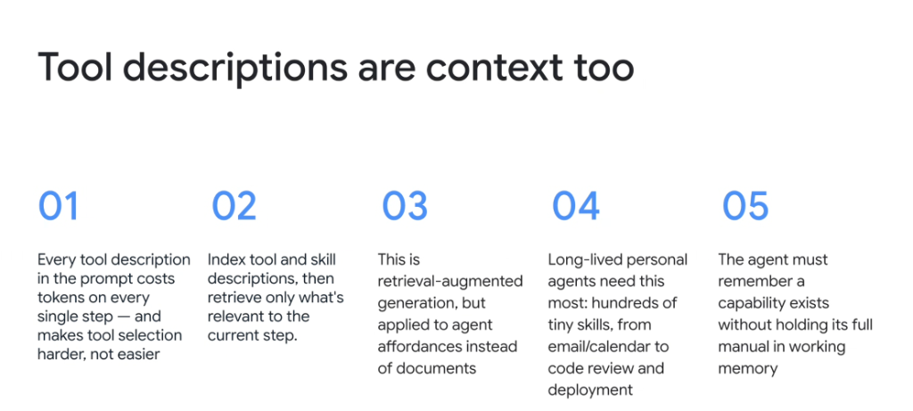

# Affordance RAG: Tool & Skill Descriptions Are Context Too



## Overview

A critical blind spot in agent development is assuming that tool definitions, MCP schemas, and skill manuals are "free" system overhead. 

In reality:

> **"Tool descriptions are context too. Every tool description in the prompt costs tokens on every single step — and makes tool selection harder, not easier."**

To support hundreds of enterprise capabilities without degrading inference speed or reasoning accuracy, modern agent harnesses implement **Affordance Retrieval-Augmented Generation (Affordance RAG)**.

---

## Static Tool Stuffing vs. Affordance RAG Architecture

```mermaid
graph TD
    subgraph ❌ Anti-Pattern: Static Tool Ingestion
        T_All["50+ MCP Tools & Skills Permanently Loaded<br/><i>(15,000+ tokens per turn)</i>"]
        T_All --> S1["💸 Continuous Token Burn on Every Turn"]
        T_All --> S2["😵 <b>Tool Confusion</b> (Hallucinated parameters & wrong tool picks)"]
    end

    subgraph ✅ Best Practice: Affordance RAG (Progressive Disclosure)
        Registry["📚 <b>Indexed Capability Registry</b><br/><i>(Hundreds of tiny tool & skill signatures)</i>"]
        Registry --> Match["🔍 <b>Dynamic Affordance Retrieval</b><br/>Match intent to active step"]
        Match --> Ingest["⚡ <b>Inject Only 1-2 Relevant Tool Schemas</b><br/><i>(Save 90%+ token overhead)</i>"]
    end
```

---

## The 5 Core Principles of Tool Context Management

### 01. The Token Cost & Decision Penalty
* Every single tool definition registered in the system prompt burns input tokens on **every conversational turn**.
* More dangerously, as tool counts scale from 5 to 50+, the model's decision space expands quadratically, increasing parameter hallucinations and wrong tool choices.

---

### 02. Dynamic Affordance Retrieval
* Instead of statically declaring all tools at boot, index tool and skill descriptions in an external metadata catalog.
* Dynamically retrieve and inject only the exact tool definitions relevant to the active sub-goal.

---

### 03. RAG Applied to Agent Affordances
* Traditional RAG is applied to static text documents.
* **Affordance RAG** applies the same mathematical principles to **agent capabilities and actions**—retrieving tool schemas, parameter contracts, and executable scripts on demand.

---

### 04. The Scale of Long-Lived Personal Agents
* Long-lived enterprise agents manage hundreds of specialized micro-skills:
  * Communication (`gmail`, `gchat`, `slack`)
  * Work management (`calendar`, `buganizer`, `case-management`)
  * Engineering (`blaze`, `critique-review`, `citc`, `spanner`, `bigquery`)
* Statically stuffing all of these into every prompt would leave zero token budget for actual reasoning.

---

### 05. Capability Awareness Without Manual Bloat
* The foundational law of Progressive Disclosure:
  > **"The agent must remember a capability exists without holding its full manual in working memory."**
* The agent retains a lightweight ~30-token metadata signature at boot, loading the full 2,000-token operational manual only when the skill is explicitly activated.

---

## Tool Context Economics Matrix

| Dimension | Static Monolithic Tool Loading | Affordance RAG (Progressive Disclosure) |
| :--- | :--- | :--- |
| **Startup Token Cost** | 10,000–30,000+ tokens | **~300–800 tokens** (Metadata index only) |
| **Per-Turn Cost Overhead** | Incurred for every tool on every turn | Incurred only for active step tools |
| **Tool Selection Accuracy** | Degrades as tool count increases | Consistently high (laser-focused decision space) |
| **Supported Tool Fleet** | Limited to ~10–15 tools | **Hundreds of micro-skills and MCP servers** |
| **Working Memory Impact** | Saturated with unused parameter schemas | Pristine headroom reserved for reasoning |
