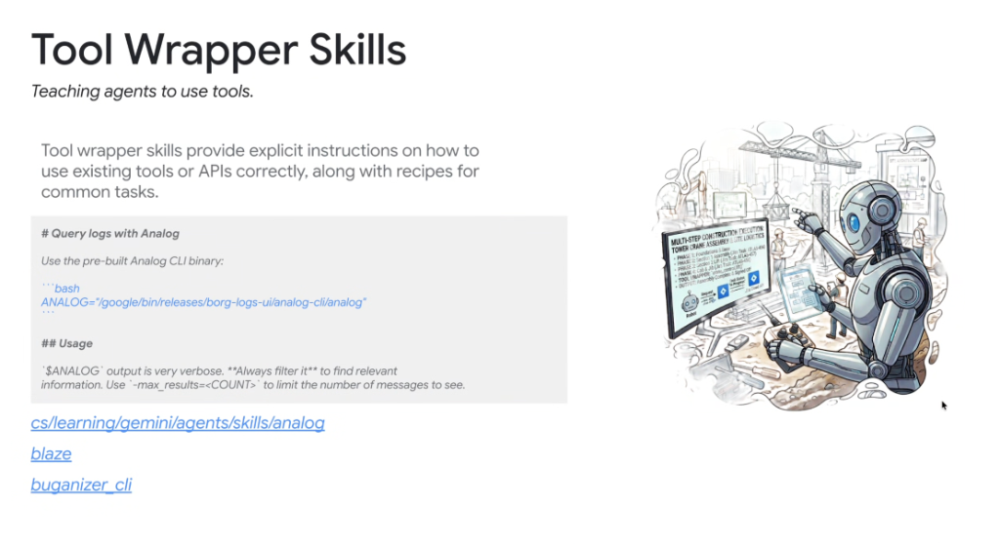

# Skill Pattern Deep Dive: Tool Wrapper Skills



## Overview

**Tool Wrapper Skills** provide agents with explicit operational instructions, flag conventions, output filtering rules, and task recipes for invoking existing command-line executables, external binaries, or REST/RPC APIs.

> **"Tool wrapper skills provide explicit instructions on how to use existing tools or APIs correctly, along with recipes for common tasks."**

Without a tool wrapper, agents frequently struggle with raw CLI tools: they hallucinate nonexistent flags, invoke unverified binary paths, or dump megabytes of verbose terminal logs into the context window.

---

## Tool Wrapper Architectural Flow

```mermaid
graph TD
    subgraph User Prompt
        P["User: 'Check the Borg logs for recent 500 errors'"]
    end

    subgraph Tool Wrapper Skill (analog)
        TW["🛠️ <b>Analog Tool Wrapper Skill</b><br/>• Binary: <code>/google/bin/releases/.../analog</code><br/>• Mandatory Rule: <b>Always filter output</b><br/>• Enforce Flag: <code>-max_results=50</code><br/>• Common Recipes: Error query patterns"]
    end

    subgraph Constrained CLI Execution
        CLI["💻 <b>Deterministic Shell Execution</b><br/><code>$ANALOG -max_results=50 'status:500'</code>"]
    end

    subgraph Clean Context Output
        Out["📄 <b>Compact, Filtered Results</b><br/><i>(Zero context bloat, sub-second parsing)</i>"]
    end

    P --> TW --> CLI --> Out
```

---

## The 4 Core Responsibilities of Tool Wrappers

### 1. Anchoring Fixed Binary Paths
* Resolves exact paths to pre-built, versioned executables on remote workstations or host environments:
  ```bash
  ANALOG="/google/bin/releases/borg-logs-ui/analog-cli/analog"
  ```
* Prevents the agent from attempting to re-download, compile, or guess nonexistent executable names in `$PATH`.

### 2. Enforcing Context-Safe Output Filtering
* Raw terminal utilities often output tens of thousands of lines. Tool wrappers make output limits mandatory:
  * *"Analog output is very verbose. **Always filter it** using `-max_results=<COUNT>`."*
  * Enforcing `--format=json` or piping through `jq` / `grep` before returning to context.

### 3. Providing Task Recipes for Common Operations
* Supplies the agent with battle-tested command templates for recurring operations (e.g. searching by cell, filtering by timestamp, querying by component ID).

### 4. Error Diagnostics & Recovery Logic
* Documents common exit codes, credential expiry states (e.g. `gcloud auth login` or Corp LOAS tickets), and retry backoff strategies.

---

## Canonical Internal Examples

### 1. `analog` (Borg Logs Query Utility)
* **Location**: `cs/learning/gemini/agents/skills/analog`
* **Key Guidance**: Instructs agents how to query Borg production logs, apply cell-level filters, and limit result sets to prevent context blowout.

### 2. `blaze` (Build & Test System)
* **Location**: `cs/learning/gemini/agents/skills/blaze`
* **Key Guidance**: Provides exact target syntax, compilation flags (`--test_output=errors`), dependency graphs, and test filtering rules.

### 3. `buganizer_cli` (Issue Tracker CLI)
* **Location**: `cs/learning/gemini/agents/skills/buganizer_cli`
* **Key Guidance**: Teaches the agent how to query issues by hotlist/component, update bug status, add structured comments, and parse JSON issue metadata.

---

## Anatomy of a Production Tool Wrapper Skill

```markdown
---
name: analog
description: Query Borg production logs with the Analog CLI. Use when searching error logs, investigating microservice crashes, or debugging backend jobs.
---

# Query Logs with Analog

## Binary Location
Use the pre-built Analog CLI binary:
```bash
ANALOG="/google/bin/releases/borg-logs-ui/analog-cli/analog"
```

## Critical Usage Rules
* `$ANALOG` output is very verbose. **Always filter it** to find relevant information.
* Always specify `-max_results=<COUNT>` (recommended: `20` to `50`).
* Always scope queries to a specific service or Borg task name.

## Common Task Recipes

### Find Recent Crash Logs
```bash
$ANALOG -service="checkout-service" -level=FATAL -max_results=20
```

### Search by Error Substring
```bash
$ANALOG -query="NullPointerException" -since="1h" -max_results=30
```
```

---

## Best Practices for Authoring Tool Wrapper Skills

| Best Practice | Rationale | Anti-Pattern |
| :--- | :--- | :--- |
| **Strict Output Limits** | Protects the agent's context window from token exhaustion | Running unrestricted `cat` or unbounded log queries |
| **Fixed Binary Paths** | Guarantees deterministic execution across environments | Assuming binaries are installed globally in `$PATH` |
| **Structured Output Formats** | Enables reliable parsing by downstream reasoning steps | Parsing unstructured, colorized terminal outputs |
| **Explicit Recipes** | Speeds up execution by providing exact copy-paste syntax | Forcing the agent to discover flags via `--help` |
