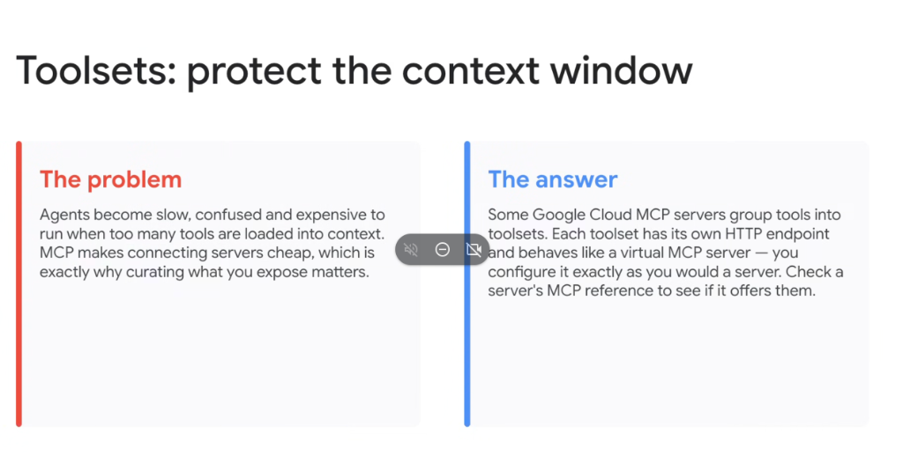
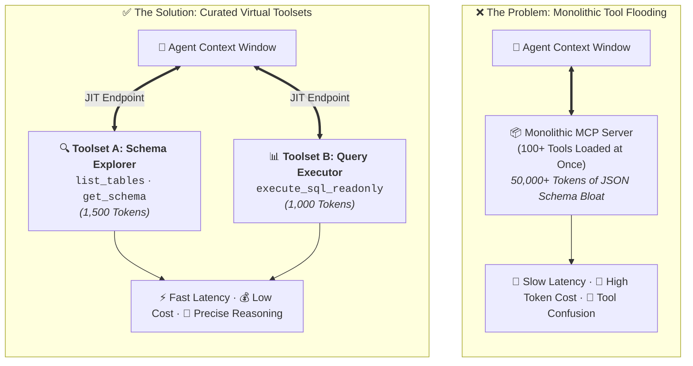

# MCP Toolsets: Protecting the Context Window via Virtual MCP Server Subsets



## Overview

As the **Model Context Protocol (MCP)** standardizes and simplifies tool integrations, connecting dozens of servers becomes trivial. However, this ease of connectivity introduces a critical engineering hazard: **Context Window Bloat & Affordance Saturation**.

When too many tools are injected into an agent's context window simultaneously, the agent becomes **slow, confused, and expensive to run**.

Google Cloud solves this with **MCP Toolsets**—grouping granular tools into curated, virtual MCP server endpoints that protect the agent's context window.

---

## The Problem vs. The Architectural Solution



---

## The Root Problem: Why Curating Tools Matters

1. **Context Window Inflation**:
   * Every MCP tool definition injects extensive JSON schemas (`name`, `description`, nested parameter types, enum values, and validation rules).
   * Exposing 50–100 tools can consume $30\text{k}\text{--}80\text{k}+$ tokens on **every single LLM turn**, wasting context capacity and driving up token expenditure.
2. **Model Confusion & Tool Selection Errors**:
   * High tool density increases the probability of parameter hallucinations, selecting the wrong tool archetype, or missing edge-case validation constraints.
3. **Execution Latency**:
   * Larger prompt token payloads increase Time-to-First-Token (TTFT) and inference latency across multi-turn reasoning loops.

---

## The Architectural Answer: Google Cloud MCP Toolsets

* **Virtual MCP Server Subsets**:
  * Google Cloud MCP servers partition large tool catalogs into domain-specific **Toolsets**.
  * Each toolset contains only the minimal, coherent set of tools required for a specific task persona.
* **Dedicated HTTP/SSE Endpoints**:
  * Each toolset is exposed via its own dedicated HTTP endpoint.
  * To the agent host (Antigravity, JetSki, IDE extension), a toolset behaves identically to a standalone virtual MCP server.
* **Client-Side Configuration**:
  * Developers configure only the necessary toolsets in their `mcp_config.json`, isolating the agent's working memory.

---

## Example: Google Cloud BigQuery MCP Toolsets

Instead of loading the entire BigQuery administrative and data-plane catalog, an agent is configured with only the required virtual toolset:

```json
{
  "mcpServers": {
    "bigquery-read-only": {
      "url": "https://mcp.googleapis.com/v1/projects/my-project/locations/global/toolsets/bigquery_sql_readonly",
      "transport": "sse"
    }
  }
}
```

```text
┌────────────────────────────────────────────────────────────────────────┐
│                      BigQuery Monolithic Server                        │
├──────────────────────────┬───────────────────────┬─────────────────────┤
│   📊 Read-Only Toolset   │  🛠️ Schema Toolset    │ ⚙️ Admin Toolset    │
│   • execute_sql_readonly │  • list_datasets      │ • create_table      │
│   • get_query_results    │  • list_tables        │ • delete_dataset    │
│                          │  • get_table_info     │ • update_iam_policy │
└──────────────────────────┴───────────────────────┴─────────────────────┘
```

---

## Context Protection Comparison Matrix

| Engineering Metric | ❌ Monolithic Server Exposure | ✅ Curated Virtual Toolsets |
| :--- | :--- | :--- |
| **Token Overhead per Turn** | $30\text{k}\text{--}80\text{k}+$ tokens | $1\text{k}\text{--}4\text{k}$ tokens |
| **Tool Selection Accuracy** | Decreases as tool count increases | High (focused affordance space) |
| **Inference Latency (TTFT)**| High (large input payload) | Fast & responsive |
| **Security Risk Profile** | Broad attack surface | Principle of Least Privilege |
| **Configuration Model** | All-or-nothing binding | Granular endpoint composition |
