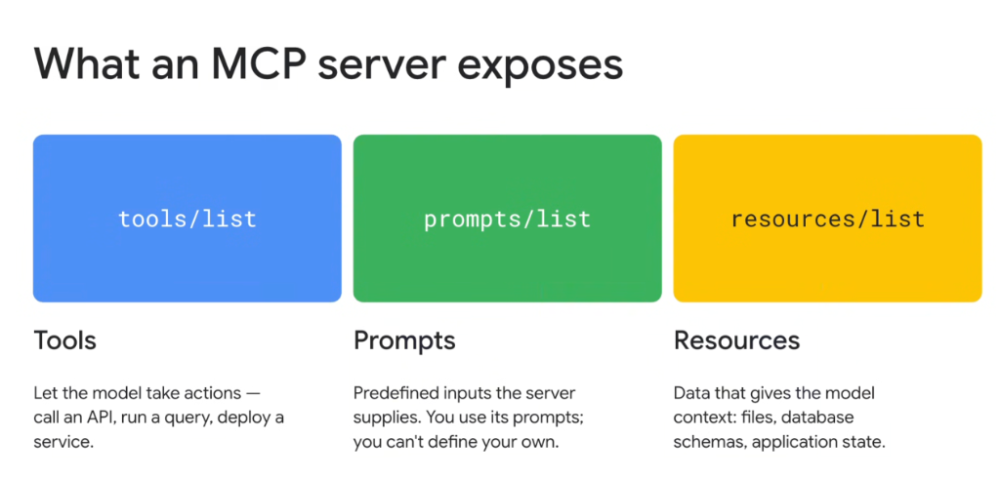

# The 3 Core Primitives of MCP: Tools, Prompts, and Resources



## Overview

A **Model Context Protocol (MCP) Server** exposes three distinct, standardized capability primitives over JSON-RPC: **Tools (`tools/list`)**, **Prompts (`prompts/list`)**, and **Resources (`resources/list`)**.

Each primitive addresses a different dimension of the agent's interaction model—spanning **active execution**, **guided prompt workflows**, and **passive context grounding**.

---

## The 3 MCP Server Primitives at a Glance

```mermaid
graph TD
    subgraph ⚙️ MCP Server Capabilities
        T["🟦 <b>tools/list</b><br/><b>Tools (Active Actions)</b><br/>• Call APIs & run queries<br/>• Deploy services & mutate state<br/>• <i>Model-controlled execution</i>"]
        
        P["🟩 <b>prompts/list</b><br/><b>Prompts (Guided Templates)</b><br/>• Predefined server inputs<br/>• Parameterized workflows<br/>• <i>User/Server-controlled</i>"]
        
        R["🟨 <b>resources/list</b><br/><b>Resources (Passive Context)</b><br/>• Files, schemas, app state<br/>• Read-only URI data streams<br/>• <i>Application-controlled grounding</i>"]
    end
```

---

## Deep Dive into the 3 Primitives

### 1. Tools (`tools/list` & `tools/call`) — Active Action & Mutation
* **What They Do**: Allow the model to take actions in the external world—invoking APIs, executing SQL queries, triggering builds, or mutating cloud infrastructure.
* **Execution Control**: **Model-Controlled**. The LLM decides *autonomously* when and which tool to call based on user intent and JSON Schema parameters.
* **Protocol Flow**:
  1. `tools/list`: Server returns list of tool names, descriptions, and JSON Schemas for input arguments.
  2. `tools/call`: Client dispatches tool name and argument values (`{ "name": "execute_query", "arguments": { "sql": "SELECT..." } }`).
* **Real-World Examples**: `bigquery_execute_sql`, `cloud_run_deploy_service`, `github_create_pull_request`.

---

### 2. Prompts (`prompts/list` & `prompts/get`) — Predefined Workflows
* **What They Do**: Predefined, server-authored prompt templates that guide the user and model through structured, domain-specific tasks.
* **Execution Control**: **User / Server-Steered**. The server defines the prompt structure and required parameters; the user selects and supplies parameter values.
* **Protocol Flow**:
  1. `prompts/list`: Server advertises available prompt templates (e.g. `code_review`, `generate_migration_plan`).
  2. `prompts/get`: Client requests a populated prompt by passing argument values (`{ "name": "code_review", "arguments": { "pr_number": "123" } }`).
  3. Server returns structured prompt messages inserted directly into the conversation context.
* **Real-World Examples**: Standardized security auditing templates, architectural design questionnaires, database migration plans.

---

### 3. Resources (`resources/list` & `resources/read`) — Passive Context Grounding
* **What They Do**: Read-only data payloads that provide the model with background context (files, logs, database table schemas, configuration trees).
* **Execution Control**: **Application / Context-Controlled**. Resources act like file attachments or read-only document streams.
* **Protocol Flow**:
  1. `resources/list`: Server lists available resource URIs (e.g. `schema://bigquery/datasets`, `file:///repo/README.md`).
  2. `resources/read`: Client fetches the contents of a specific URI (`{ "uri": "schema://bigquery/datasets/orders" }`).
  3. Server returns raw text or binary bytes with designated MIME types (`text/plain`, `application/json`, `image/png`).
* **Real-World Examples**: Database DDL schemas, live Kubernetes cluster state, application logs.

---

## JSON-RPC Endpoint Mapping Matrix

| Primitive | Discovery Method | Execution / Retrieval Method | Invocation Initiator | Primary Purpose |
| :--- | :--- | :--- | :--- | :--- |
| **Tools** | `tools/list` | `tools/call` | **LLM (Model-driven)** | State mutation, external actions, data fetching |
| **Prompts** | `prompts/list` | `prompts/get` | **User / UI Selection** | Structured task framing & standard operating procedures |
| **Resources** | `resources/list` | `resources/read` / `subscribe` | **Host / Client Application**| Background grounding, schemas, and live context |
