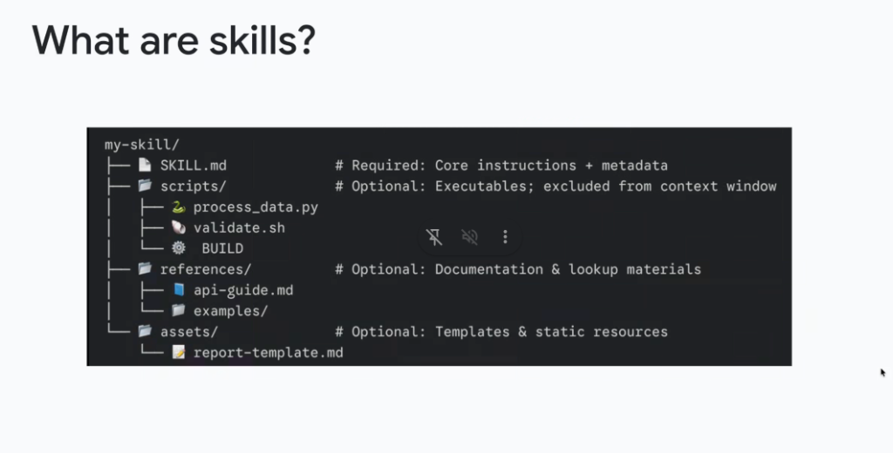

# Skill Architecture: Directory Structure & File Roles



## Overview

A **Skill** is structured as a self-contained directory containing one mandatory root manifest (`SKILL.md`) and optional supporting folders for executables (`scripts/`), reference documentation (`references/`), and static templates (`assets/` or `resources/`).

The architecture strictly separates **instructions ingested into context** from **executable code and reference material executed or read on demand**.

---

## Canonical Skill Directory Layout

```text
my-skill/
├── SKILL.md                 # Required: Core instructions + metadata
├── scripts/                 # Optional: Executables; excluded from context window
│   ├── process_data.py      # Python data transformation script
│   ├── validate.sh          # Bash validation wrapper
│   └── BUILD                # Bazel target definitions (google3 / monorepo)
├── references/              # Optional: Documentation & lookup materials
│   ├── api-guide.md         # In-depth API specification & limits
│   └── examples/            # Complex multi-step reference examples
└── assets/                  # Optional: Templates & static resources
    └── report-template.md   # Markdown / JSON report output templates
```

---

## Context Window vs. Execution Disk Boundaries

A key performance optimization of the Skills architecture is that **supporting files are excluded from the initial context window**:

```mermaid
graph TD
    subgraph Context Window (Prompt Ingestion)
        Meta["🏷️ YAML Frontmatter<br/><i>(Always scanned at startup: ~30 tokens)</i>"]
        Inst["📜 SKILL.md Markdown Body<br/><i>(Ingested on activation: ~1,000 tokens)</i>"]
    end

    subgraph On-Disk Execution & Selective Reading (0 Baseline Tokens)
        Scripts["⚙️ <b>scripts/</b><br/>• process_data.py<br/>• validate.sh<br/><i>(Executed deterministically via bash)</i>"]
        Refs["📚 <b>references/</b><br/>• api-guide.md<br/>• examples/<br/><i>(Read via file tools on demand)</i>"]
        Assets["📄 <b>assets/</b><br/>• report-template.md<br/><i>(Read when generating output artifacts)</i>"]
    end

    Meta -.->|Activates| Inst
    Inst -->|Executes via Tool| Scripts
    Inst -->|Queries for Deep Info| Refs
    Inst -->|Injects Template| Assets
```

---

## Component Deep Dive

### 1. `SKILL.md` (Required: Core Instructions + Metadata)
* **Status**: **Mandatory** (Every skill must have a valid `SKILL.md` in its root).
* **Role**: Houses the YAML frontmatter (`name`, `description`) and the step-by-step operating rules.
* **Context Behavior**: Loaded into the agent's prompt context when the skill is active.

### 2. `scripts/` (Optional: Deterministic Executables)
* **Status**: **Optional**.
* **Role**: Contains executable scripts (`process_data.py`, `validate.sh`, `BUILD`).
* **Context Behavior**: **Excluded from the context window**. The agent does not read the code into prompt tokens; instead, it executes the script via terminal tools and receives only the stdout/stderr output.
* **Why Exclude**: Keeps prompt tokens low, prevents hallucinated script edits, and ensures deterministic mathematical/data processing.

### 3. `references/` (Optional: Documentation & Lookup Materials)
* **Status**: **Optional**.
* **Role**: Detailed API references (`api-guide.md`), architectural specifications, and complex examples (`examples/`).
* **Context Behavior**: Resides on disk. The agent uses file-reading tools (e.g. `view_file`) to inspect specific pages only when encountering an ambiguous edge case.

### 4. `assets/` / `resources/` (Optional: Templates & Static Resources)
* **Status**: **Optional**.
* **Role**: Output skeletons, markdown templates (`report-template.md`), schema validators, and sample datasets.
* **Context Behavior**: Read on demand when constructing formatted artifacts, user reports, or structured JSON responses.

---

## Directory Component Summary Matrix

| Directory / File | Status | Context Window Behavior | Primary Purpose |
| :--- | :--- | :--- | :--- |
| `SKILL.md` | **Required** | **Ingested into context** on activation | Metadata, trigger definitions, and core operating guidelines |
| `scripts/` | Optional | **Excluded from context**; executed on disk | Deterministic computation, data parsing, and test validation |
| `references/` | Optional | **Read on demand** via file tools | In-depth API manuals, schema docs, and domain runbooks |
| `assets/` | Optional | **Read on demand** during output generation | Static templates, output skeletons, and golden exemplars |
