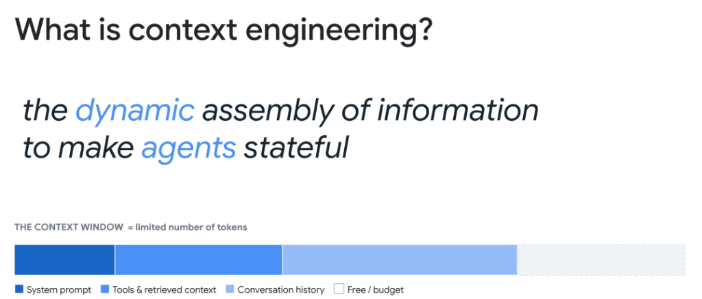
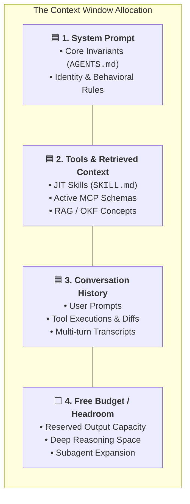

# Context Engineering: Dynamic Information Assembly & Token Budgeting



## The Canonical Definition

> **"Context Engineering is the dynamic assembly of information to make agents stateful."**

In production agent systems, context is not a static block of text copy-pasted into a prompt. It is a **dynamically orchestrated working memory** assembled at runtime on every single turn to give the model exact situational awareness without saturating its finite token budget.

---

## The Anatomy of the Context Window Budget

Regardless of nominal context window limits, token space is a finite, performance-sensitive computational resource:



---

## The 4 Context Partitions Detailed

### 1. System Prompt (Base Invariants)
* **What It Contains**: Foundational operational rules, persona constraints, security boundaries, and repository invariants (`AGENTS.md`).
* **Characteristics**: Relatively static across conversation turns; should be authored concisely (~500–1,500 tokens).

### 2. Tools & Retrieved Context (Dynamic Capabilities)
* **What It Contains**: Active Model Context Protocol (MCP) tool schemas, JIT-hydrated `SKILL.md` instructions, and RAG/OKF grounded concept docs.
* **Characteristics**: **Dynamically assembled** per turn based on the active intent. Unused tools and skills are left on disk to save space.

### 3. Conversation History (Episodic Trajectory)
* **What It Contains**: Multi-turn dialogue, raw CLI command outputs, compiler feedback, and intermediate agent reasoning steps.
* **Characteristics**: Grows monotonically with each turn; requires active pruning, truncation, and compaction to avoid **Context Rot**.

### 4. Free Budget / Headroom (Generation Space)
* **What It Contains**: Unallocated token capacity reserved for model output generation, deep thinking/scratchpads, and unexpected payload spikes.
* **Characteristics**: Must never hit 0%. Exhausting headroom causes abrupt token cutoff errors or severe reasoning degradation.

---

## Static Ingestion vs. Dynamic Context Assembly

```mermaid
graph TD
    subgraph ❌ Anti-Pattern: Static Monolithic Ingestion
        S_All["Load All 50 Tools + 20 Runbooks + Full Chat History"]
        S_All --> S_Blowout["💥 <b>Saturates 95% of Context Window</b><br/>• High TTFT Latency<br/>• Massive Inference Costs<br/>• High Attention Dilution & Hallucinations"]
    end

    subgraph ✅ Best Practice: Dynamic Assembly (Context Engineering)
        D_Intent["1. Identify User Intent"] --> D_Select["2. Hydrate Only Active Skill & Target Tool"]
        D_Select --> D_Ground["3. Fetch Specific OKF Concept"]
        D_Ground --> D_Prune["4. Prune Stale Chat History"]
        D_Prune --> D_Result["🏆 <b>Sleek Working Memory with 60% Free Headroom</b><br/>• Sub-Second Latency<br/>• Sharp Focus & Deterministic Code Execution"]
    end
```

---

## The Core Levers of Dynamic Context Assembly

1. **Just-in-Time (JIT) Skill Ingestion**: Only the frontmatter metadata menu is loaded at startup; full operational playbooks load strictly upon task activation.
2. **Deterministic Output Capping**: CLI tools enforce pagination (`-max_results=50`) and structured JSON parsing before injecting stdout into history.
3. **Artifact Offloading**: Large outputs (e.g. 500-line implementation plans, complete code files) are written directly to local disk artifacts rather than echoed into conversation transcripts.
4. **Episodic Compaction**: Periodically summarizing multi-turn debugging steps into concise checkpoint summaries.

---

## Context Window Partition Summary Matrix

| Partition | Share of Budget | Volatility | Management Strategy | Risk of Mismanagement |
| :--- | :--- | :--- | :--- | :--- |
| **System Prompt** | ~5–10% | Fixed | Keep rules strict and concise | Prompt bloat & instruction conflict |
| **Tools & Retrieved Context** | ~20–30% | Highly Dynamic | JIT Progressive Disclosure & OKF | Tool confusion & hallucinated parameters |
| **Conversation History** | ~20–40% | Monotonic Growth | Active truncation, compaction & artifacts | Context Rot & forgotten requirements |
| **Free Headroom / Budget** | ~30–50% | Buffer | Preserve generous generation margin | Out-of-token truncation errors |
