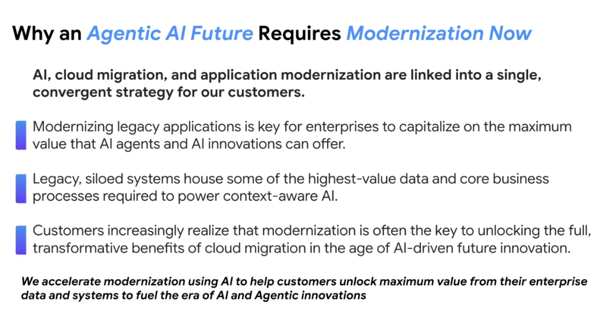
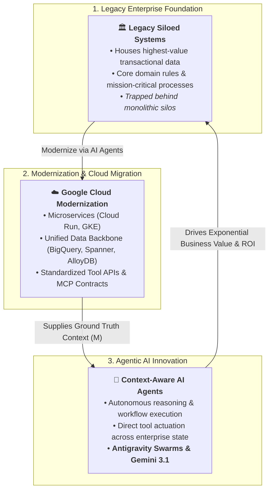

# Enterprise Strategy: Why an Agentic AI Future Requires Modernization Now

## Overview

For enterprise customers, artificial intelligence cannot succeed as an isolated experiment. To unlock the transformative power of autonomous agents, **AI, Cloud Migration, and Application Modernization** must be linked into a **single, convergent strategy**:

> **"AI, cloud migration, and application modernization are linked into a single, convergent strategy for our customers. We accelerate modernization using AI to help customers unlock maximum value from their enterprise data and systems to fuel the era of AI and Agentic innovations."**

---

## The Convergent Enterprise Flywheel

---

## The 3 Strategic Pillars Connecting Modernization & AI Agents

### 1. Modernizing Legacy Applications Unlocks Maximum Agent Value
* **The Reality**: AI agents cannot easily invoke brittle on-prem SOAP endpoints, closed mainframe screens, or undocumented stored procedures.
* **The Strategic Need**: Modernizing applications into cloud-native APIs, standardized schemas, and event-driven architectures allows agents to interact with systems via **Model Context Protocol (MCP)** and structured tool wrappers.

---

### 2. Legacy Silos House the Highest-Value Enterprise Context
* **The Reality**: The richest business intelligence, client transaction histories, and specialized operational playbooks reside in legacy on-prem databases and enterprise ERPs.
* **The Strategic Need**: To power **context-aware AI**, this high-value data must be liberated from silos into Google Cloud's unified data ecosystem (BigQuery, Spanner, AlloyDB), providing the external context universe ($M$) necessary for accurate model reasoning.

---

### 3. Modernization Unlocks the Full ROI of Cloud Migration
* **The Reality**: Simple "lift-and-shift" migrations (re-hosting VMs) fail to deliver transformative value.
* **The Strategic Need**: Enterprise customers increasingly recognize that true modernization—refactoring applications into modular, document-driven, and API-first services—is the essential catalyst for capitalizing on generative and agentic AI.

---

## The Dual Acceleration Engine

Google Cloud approaches modernization through a self-reinforcing dual motion:

1. **AI for Modernization**: Using **Antigravity** coding agents to rapidly analyze legacy codebases, decompose monoliths, generate tests, and migrate legacy logic to modern Go, Java, or Python cloud microservices.
2. **Modernization for AI**: Exposing the modernized services and curated data pipelines to autonomous agent swarms, enabling automated customer support, predictive operations, and autonomous business workflows.

---

## Strategic Summary Matrix

| Strategic Vector | Legacy Constraint | Modernized Cloud State | Agentic AI Capability Unlocked |
| :--- | :--- | :--- | :--- |
| **Application Architecture** | Monolithic, tightly coupled, unversioned | Modular microservices, Cloud Run, GKE | Dynamic tool actuation & MCP server integration |
| **Data Accessibility** | Siloed on-prem databases, flat files | BigQuery streams, AlloyDB, Spanner | Real-time ground truth context ($M$) for agents |
| **Documentation & Rules** | Tribal knowledge, stale wikis | `AGENTS.md`, `SPEC.md`, OKF concepts | High-fidelity steering & zero-hallucination execution |
| **Business Agility** | Months per feature release | Continuous CI/CD with agentic TDD | Autonomous, verified feature compilation |
