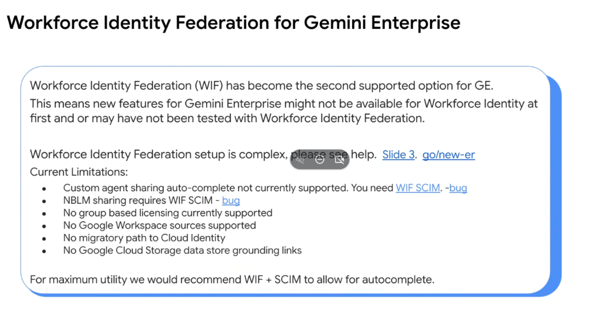
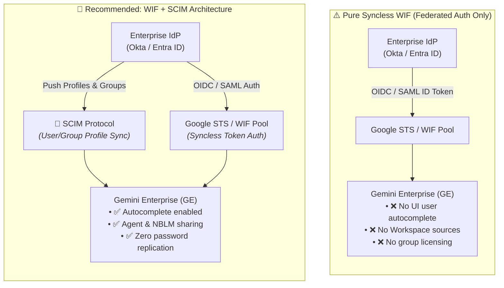

# Workforce Identity Federation (WIF) for Gemini Enterprise

## Overview

**Workforce Identity Federation (WIF)** is the second officially supported authentication and identity model for **Gemini Enterprise (GE)** (alongside Google Cloud Identity).

While WIF provides risk-averse enterprises (e.g. Financial Services, Healthcare) with strict **syncless federation** and zero credential replication, adopting WIF introduces architectural nuances, feature lags, and specific operational constraints that enterprise architects must evaluate.

---

## Architectural Topologies: Pure WIF vs. WIF + SCIM

---

## Current Technical Limitations of Pure WIF in Gemini Enterprise

1. **Custom Agent Sharing Autocomplete Not Supported (Requires WIF SCIM)**:
   * Because pure WIF does not synchronize user directory metadata into Google, user search and autocomplete dropdowns fail when sharing custom agents.
2. **NotebookLM (NBLM) Sharing Requires WIF SCIM**:
   * Collaborative notebook sharing across team members requires user identity discovery, which is unavailable without SCIM profile pushing.
3. **No Group-Based Licensing**:
   * Enterprise license seats cannot be assigned dynamically based on IdP security groups; licensing must be managed individually or via admin APIs.
4. **No Google Workspace Sources Supported**:
   * Federated WIF identities cannot directly link or ground models against Google Workspace data sources (Google Drive, Gmail, Docs, Sheets).
5. **No Migratory Path to Cloud Identity**:
   * A Gemini Enterprise environment provisioned on Workforce Identity Federation cannot be migrated to Google Cloud Identity post-setup. Architecture selection is permanent.
6. **No Google Cloud Storage (GCS) Data Store Grounding Links**:
   * Grounding links pointing directly to GCS data stores are not supported for pure WIF user sessions.

---

## The Strategic Recommendation: WIF + SCIM

To achieve maximum enterprise utility while maintaining the security benefits of syncless authentication, Google Cloud recommends the **WIF + SCIM** deployment pattern:

* **Authentication (Syncless WIF)**: Users authenticate strictly via their enterprise IdP (Okta, Entra ID) using OpenID Connect (OIDC) or SAML 2.0. Passwords and credentials never enter Google.
* **Directory Metadata (SCIM)**: The enterprise IdP uses the **System for Cross-domain Identity Management (SCIM 2.0)** protocol to push read-only user profiles, email addresses, and group memberships to Google.
* **Outcome**: Re-enables custom agent sharing, NotebookLM collaboration, autocompletion in UI surfaces, and group-based access control.

---

## Identity Architecture Comparison Matrix for Gemini Enterprise

| Feature / Capability | 🏢 Google Cloud Identity | ⚡ Pure Syncless WIF | 🌟 Recommended WIF + SCIM |
| :--- | :--- | :--- | :--- |
| **Credential Synchronization** | Replicated to Google | **Zero replication (Syncless)** | **Zero replication (Syncless)** |
| **Agent Sharing Autocomplete** | Native | ❌ Unsupported | ✅ Fully Supported |
| **NotebookLM Sharing** | Native | ❌ Unsupported | ✅ Fully Supported |
| **Workspace Sources (Drive)** | Native | ❌ Unsupported | ❌ Unsupported |
| **Group-Based Licensing** | Native | ❌ Unsupported | ⚠️ Partial / Evolving |
| **Feature Release Velocity** | Day-1 Immediate Support | May lag initial release | High compatibility |
| **Best Fit For** | Workspace & Cloud customers | Strict zero-copy compliance | High security + Collaboration |
