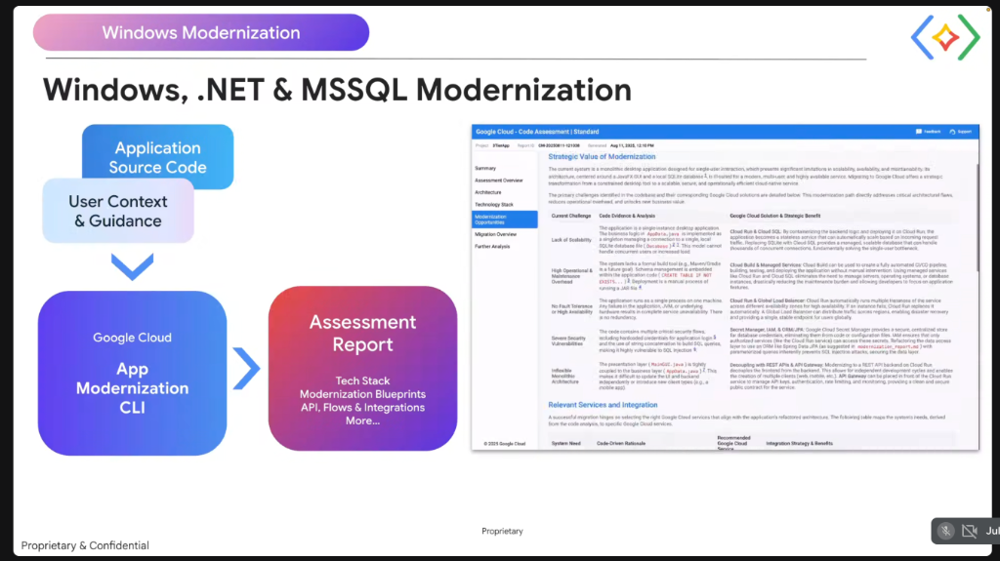

# Google Cloud App Modernization CLI: Windows, .NET & MSSQL Code Assessment



## Overview

Modernizing legacy enterprise Windows, .NET, and MS SQL Server estates requires moving beyond guesswork. The **Google Cloud App Modernization CLI** (powered by the CodMod engine) ingests raw source code and user architectural context to generate comprehensive, interactive **Code Assessment Reports**.

The tool inspects codebases for architectural debt, security vulnerabilities (e.g. SQL injection, hardcoded secrets), operational overhead, and scalability blockers, mapping concrete code evidence directly to Google Cloud target solutions.

---

## App Modernization CLI Assessment Pipeline

```mermaid
graph LR
    subgraph 📥 Inputs
        Src["📁 <b>Application Source Code</b><br/>.NET, C#, Java, C++, MSSQL"]
        Ctx["📝 <b>User Context & Guidance</b><br/>Architecture goals, SLAs, constraints"]
    end

    subgraph ⚙️ Assessment Engine
        CLI["⚡ <b>Google Cloud App Modernization CLI</b><br/>(CodMod Analysis Engine)<br/>• AST code parsing<br/>• Dependency & security audits"]
    end

    subgraph 📊 Output Deliverable
        Rep["📑 <b>Assessment Report</b><br/>• Tech Stack Inventory<br/>• Modernization Blueprints<br/>• API, Flows & Integrations"]
    end

    Src & Ctx ==> CLI ==> Rep
```

---

## The 7 Core Report Dimensions (Navigation Taxonomy)

The interactive assessment report organizes findings across seven specialized tabs:

1. **Summary**: Executive overview, modernization readiness index, and high-level business value.
2. **Assessment Overview**: Codebase metrics, lines of code, language breakdown, and compiled binary artifacts.
3. **Architecture**: Presentation, business, and data tier boundaries; component coupling metrics.
4. **Technology Stack**: Framework versions (.NET Framework, IIS, Java, MSSQL, SQLite), third-party NuGet/Maven dependencies, and deprecated APIs.
5. **Modernization Opportunities**: Detailed findings mapping code evidence to Google Cloud solutions.
6. **Migration Overview**: Phased, task-ordered migration blueprints and effort estimates.
7. **Further Analysis**: Deep-dive inspection into stored procedures, transaction scopes, and security anti-patterns.

---

## The 5 Strategic Modernization Opportunities

```mermaid
graph TD
    subgraph 🚨 Legacy Code Anti-Patterns & Blockers
        C1["❌ <b>Lack of Scalability</b><br/>Single-instance logic, local SQLite/file bottlenecks"]
        C2["❌ <b>Operational Overhead</b><br/>Embedded DDL, manual build & deployment steps"]
        C3["❌ <b>Zero Fault Tolerance</b><br/>Single process on single VM; zero HA"]
        C4["❌ <b>Security Vulnerabilities</b><br/>Hardcoded credentials, string-concatenated SQL queries"]
        C5["❌ <b>Inflexible Monolith</b><br/>UI presentation tightly coupled to business logic"]
    end

    subgraph ☁️ Google Cloud Solution & Strategic Benefit
        S1["🚀 <b>Cloud Run & Cloud SQL</b><br/>Stateless auto-scaling + managed high-concurrency DB"]
        S2["🛠️ <b>Cloud Build & Managed CI/CD</b><br/>Automated build, test & continuous deployment"]
        S3["🌐 <b>Global Load Balancer & Multi-Zone Run</b><br/>Automatic multi-region failover & disaster recovery"]
        S4["🔒 <b>Secret Manager, IAM & EF Core</b><br/>Centralized secret storage & parameterized queries"]
        S5["🔌 <b>REST APIs & API Gateway</b><br/>Decoupled presentation, auth rate-limiting & OpenAPI contract"]
    end

    C1 ==> S1
    C2 ==> S2
    C3 ==> S3
    C4 ==> S4
    C5 ==> S5
```

---

## Code Evidence vs. Google Cloud Solution Matrix

| Identified Challenge | Code Evidence & Analysis | Google Cloud Solution & Strategic Benefit |
| :--- | :--- | :--- |
| **Lack of Scalability** | Logic implemented as singletons managing local SQLite/flat files; unable to handle concurrent traffic | **Cloud Run & Cloud SQL**: Containerize backend into stateless Cloud Run services; replace local DB with managed Cloud SQL / AlloyDB |
| **High Operational Overhead** | Lack of build tools (Maven/Gradle/MSBuild); schema DDL embedded in application code (`CREATE TABLE IF NOT EXISTS`) | **Cloud Build & Managed Services**: Automated CI/CD pipelines; managed database migrations eliminate manual server maintenance |
| **No Fault Tolerance / HA** | Runs as single process on one server; hardware or JVM/CLR failure causes total downtime | **Cloud Run & Global External Load Balancer**: Multi-zone auto-healing and instant traffic re-routing |
| **Severe Security Flaws** | Hardcoded database passwords; string-concatenated SQL queries vulnerable to SQL Injection | **Secret Manager & ORM (EF Core / JPA)**: Secrets injected via IAM; parameterized queries eliminate injection vectors |
| **Inflexible Monolith** | Presentation layer (UI) tightly bound to backend data models; cannot support mobile or web clients | **Decoupled REST APIs & API Gateway**: Clean API contracts; independent frontend and backend release cycles |
