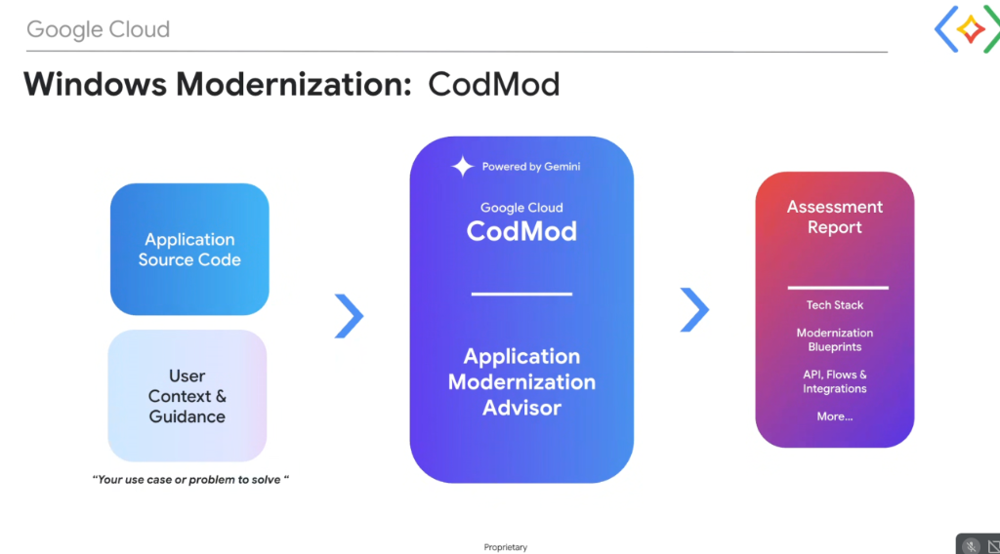

# Google Cloud CodMod: Windows Application Modernization Advisor



## Overview

Monolithic Windows Server applications (.NET Framework 3.5/4.x, VB.NET, WCF, ASP.NET WebForms) often suffer from decades of undocumented dependencies, Windows Registry couplings, and GAC (Global Assembly Cache) locks.

**Google Cloud CodMod** (operating as the **Application Modernization Advisor**) is a Gemini-powered assessment engine that ingests raw application source code and user problem statements to automatically generate structured, data-driven **Assessment Reports**.

---

## The CodMod Assessment Pipeline

```mermaid
graph LR
    subgraph 📥 1. Inputs
        Src["📁 <b>Application Source Code</b><br/>• .sln solutions & .csproj manifests<br/>• Web.config & C# / VB.NET source"]
        
        Ctx["💡 <b>User Context & Guidance</b><br/><i>'Your use case or problem to solve'</i><br/>• Target SLAs, Cloud Run goal, TCO"]
    end

    subgraph ⚙️ 2. The CodMod Engine (Powered by Gemini)
        Engine["✦ <b>Google Cloud CodMod</b><br/><b>Application Modernization Advisor</b><br/>• Semantic AST parsing & API mapping<br/>• Windows-dependency detection<br/>• Linux containerization scoring"]
    end

    subgraph 📑 3. Assessment Report Output
        Rep["📊 <b>Assessment Report</b><br/>• <b>Tech Stack</b> inventory<br/>• <b>Modernization Blueprints</b><br/>• <b>API, Flows & Integrations</b><br/>• Automated task backlog"]
    end

    Src & Ctx ==> Engine ==> Rep
```

---

## Detailed Breakdown of the CodMod Pipeline

### 1. Ingestion: Source Code & User Context
* **Application Source Code**:
  * Ingests full solution trees including solution files (`.sln`), project files (`.csproj`, `.vbproj`), configuration files (`Web.config`, `App.config`), and database interaction layers (ADO.NET, EF6).
* **User Context & Guidance**:
  * Captures the customer's specific business goals (*"Eliminate Windows Server licenses"*, *"Migrate WCF to gRPC with $<50\text{ms}$ latency"*, *"Containerize to Cloud Run"*).
  * Guides the AI engine to prioritize target cloud architectures aligned with corporate constraints.

---

### 2. The CodMod Processing Engine (Powered by Gemini)
* **Static Syntax & Dependency Analysis**:
  * Parses Abstract Syntax Trees (AST) to identify proprietary Windows APIs (e.g. `System.Web.SessionState`, `System.EnterpriseServices`, `Microsoft.Win32.Registry`).
  * Maps third-party NuGet packages to modern .NET 8 cross-platform equivalents.
* **Architecture Reconstruction**:
  * Analyzes data flows to uncover database schemas, stored procedure calls, and external REST/SOAP endpoints.
* **Modernization Scoping**:
  * Calculates code refactoring complexity and estimates migration velocity.

---

### 3. Deliverable: The Comprehensive Assessment Report
* **Tech Stack Inventory**: Framework version audit, library lifecycle status, and security vulnerability mapping.
* **Modernization Blueprints**: Target architectural diagrams specifying .NET 8 microservices, OCI container manifests, and Cloud Run / GKE deployment topologies.
* **API, Flows & Integrations**: Concrete REST / gRPC endpoint definitions, message queue adapters (Pub/Sub), and Secret Manager bindings.
* **Decomposed Task Backlog**: Generates task checklists directly consumable by **Gemini CLI** and **.NET Agent Skills** for automated code execution.

---

## CodMod Assessment Output Summary

| Dimension | CodMod Diagnostic Finding | Recommended Cloud-Native Target |
| :--- | :--- | :--- |
| **Framework Target** | .NET Framework 4.5 / 4.8 | **.NET 8 (C# 12)** on Linux OCI Containers |
| **Hosting Environment** | Windows Server IIS Web Farms | **Google Cloud Run** (Serverless) / **GKE** |
| **Service Communication**| Legacy WCF / SOAP (ASMX) | **gRPC** (internal) / **ASP.NET Core Minimal APIs** (public) |
| **Configuration & Secrets**| Hardcoded credentials in `Web.config` | **Google Cloud Secret Manager** & IAM authentication |
| **Database Access** | ADO.NET / Stored Procedures | **Entity Framework Core** / Dapper on **Cloud SQL / AlloyDB** |
