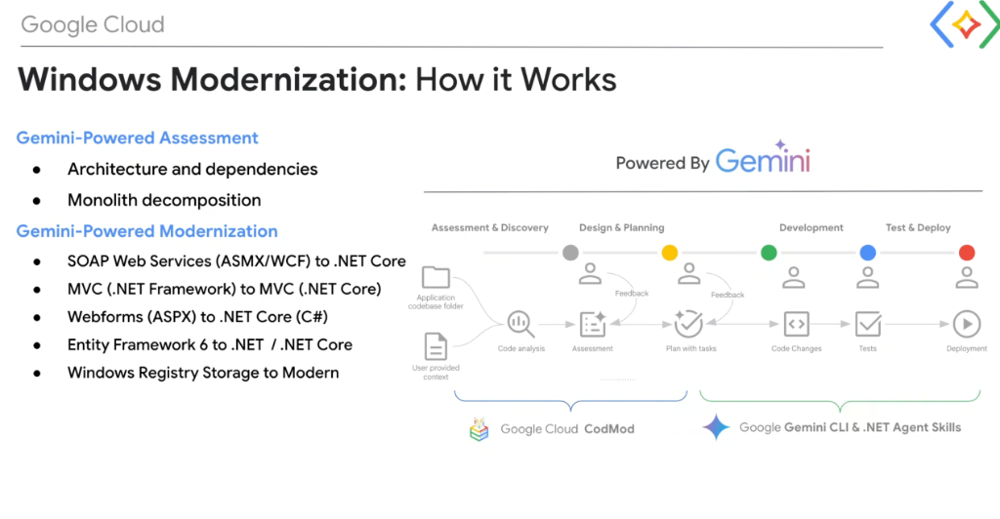

# Windows Modernization: Technical Architecture & Migration Mechanisms



## Overview

Modernizing legacy Windows Server applications to cloud-native Linux environments requires tackling deep syntactic, architectural, and runtime incompatibilities. 

Google Cloud's **Windows Modernization** solution divides this complex challenge into two synchronized phases: **Gemini-Powered Assessment** (discovery and monolith decomposition) and **Gemini-Powered Modernization** (automated refactoring across 5 foundational legacy Windows subsystems).

---

## Architecture: Dual-Phase Assessment & Modernization Pipeline

```mermaid
graph TD
    subgraph 🔍 1. Gemini-Powered Assessment (CodMod)
        A1["📐 <b>Architecture & Dependency Mapping</b><br/>• AST parsing of .sln & .csproj files<br/>• GAC & unmanaged DLL discovery"]
        A2["🧩 <b>Monolith Decomposition</b><br/>• Domain boundary identification<br/>• Task-level refactoring plan (plan.md)"]
        A1 --> A2
    end

    subgraph ⚡ 2. Gemini-Powered Modernization (Gemini CLI & Agent Skills)
        M1["🔌 <b>SOAP / WCF / ASMX</b> ──> <b>gRPC & REST APIs</b>"]
        M2["🌐 <b>MVC (.NET Framework)</b> ──> <b>ASP.NET Core MVC</b>"]
        M3["📑 <b>WebForms (ASPX)</b> ──> <b>.NET Core C# Backend</b>"]
        M4["🗄️ <b>Entity Framework 6</b> ──> <b>EF Core / Dapper</b>"]
        M5["🔒 <b>Windows Registry</b> ──> <b>Secret Manager & JSON Config</b>"]
    end

    subgraph 🚀 3. Target Cloud Runtime
        Target["☁️ <b>.NET 8 on Linux Containers</b><br/>Cloud Run · GKE · Cloud SQL / AlloyDB"]
    end

    A2 ==> M1 & M2 & M3 & M4 & M5
    M1 & M2 & M3 & M4 & M5 ==> Target
```

---

## Detailed Breakdown of the 5 Core Migration Mechanisms

### 1. SOAP Web Services (ASMX/WCF) $\longrightarrow$ .NET Core (REST / gRPC)
* **Legacy Problem**: WCF and ASMX services rely on XML envelopes, heavy SOAP protocol bindings, and IIS hosting models unavailable on Linux.
* **Modernization Mechanism**:
  * Scans `[ServiceContract]` and `[OperationContract]` attributes in C# source.
  * Translates service interfaces into **Protocol Buffers (`.proto`)** for low-latency internal RPCs or **ASP.NET Core Minimal APIs** for external REST endpoints.

---

### 2. ASP.NET MVC (.NET Framework) $\longrightarrow$ ASP.NET Core MVC
* **Legacy Problem**: Coupled to `System.Web.dll`, `Global.asax` lifecycle hooks, and Windows IIS request pipelines (`HttpModules` / `HttpHandlers`).
* **Modernization Mechanism**:
  * Migrates controllers from `System.Web.Mvc.Controller` to `Microsoft.AspNetCore.Mvc.ControllerBase`.
  * Refactors `Global.asax` and `HttpApplication` events into standard **ASP.NET Core Middleware pipelines** and built-in **Dependency Injection (DI)** in `Program.cs`.

---

### 3. ASP.NET WebForms (ASPX) $\longrightarrow$ .NET Core C#
* **Legacy Problem**: WebForms tightly couples presentation HTML, server controls (`<asp:GridView>`), and server-side state (`ViewState`) to backend `.aspx.cs` code-behind files.
* **Modernization Mechanism**:
  * Deconstructs code-behind event handlers (`Page_Load`, `Button_Click`) and extracts core business calculations into clean, stateless C# domain services.
  * Exposes services via RESTful APIs, allowing frontends to transition to modern UI frameworks (Blazor, React, Angular).

---

### 4. Entity Framework 6 (EF6) $\longrightarrow$ Entity Framework Core
* **Legacy Problem**: Heavy `.edmx` XML model files, ObjectContext patterns, and database-first couplings that fail in modern cross-platform pipelines.
* **Modernization Mechanism**:
  * Converts `.edmx` visual models to code-first **EF Core `DbContext`** classes.
  * Updates LINQ query expressions and replaces legacy eager/lazy loading mechanisms with modern EF Core connection resilience patterns optimized for **Cloud SQL** and **AlloyDB**.

---

### 5. Windows Registry Storage $\longrightarrow$ Modern Configuration & Secret Manager
* **Legacy Problem**: Legacy apps store database passwords, license keys, and environment settings in `HKEY_LOCAL_MACHINE` Windows Registry keys or plain-text `Web.config` XML blocks.
* **Modernization Mechanism**:
  * Refactors `Registry.GetValue()` calls to use standard `IConfiguration` reading from `appsettings.json` and environment variables.
  * Binds sensitive connection strings and API keys to **Google Cloud Secret Manager** with Cloud IAM authorization.

---

## Transformation Reference Matrix

| Subsystem | Legacy Windows Implementation | Gemini Modernization Target | Primary Business Value |
| :--- | :--- | :--- | :--- |
| **API Endpoints** | WCF (`.svc`), ASMX (`.asmx`) | gRPC / ASP.NET Core REST | Low-latency binary protocols; universal client support |
| **Web Presentation** | ASPX WebForms with `ViewState` | REST API Backend + Modern UI | Stateless scalability; mobile & web responsiveness |
| **Web Architecture** | ASP.NET MVC on `System.Web` | ASP.NET Core 8 with DI | High-performance middleware; modular pipeline |
| **Data Access** | EF6 with `.edmx` / ADO.NET | EF Core 8 / Dapper | Cross-platform ORM; optimized connection pooling |
| **Config & Secrets** | Windows Registry / `Web.config` | Secret Manager & JSON Settings | Zero hardcoded credentials; centralized secret rotation |
