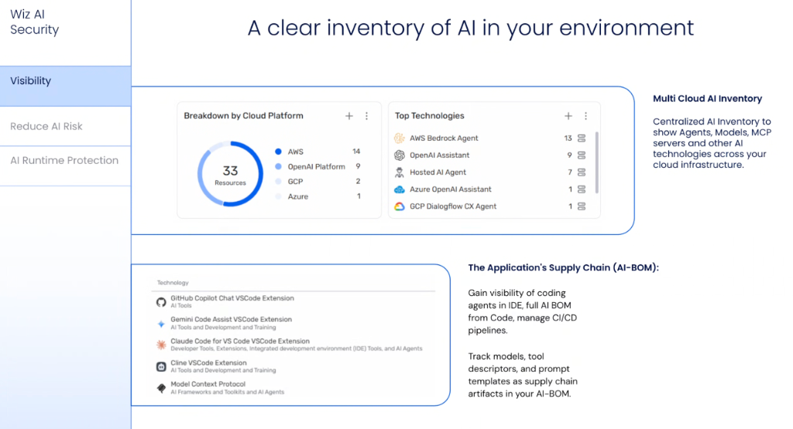
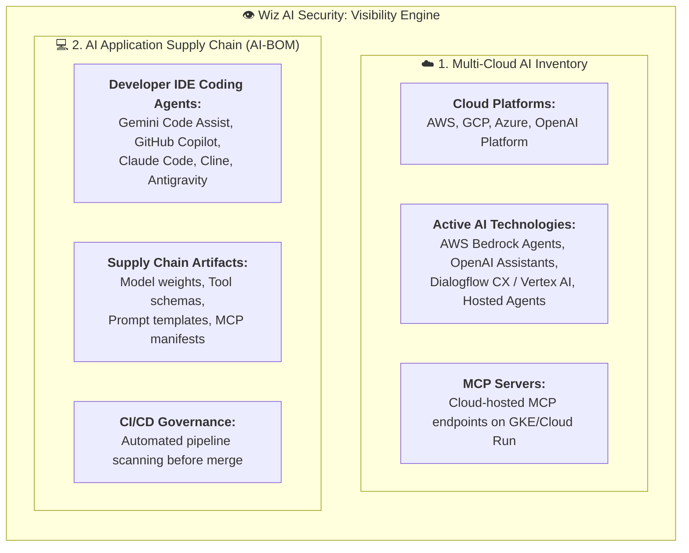

# Wiz AI Visibility: Multi-Cloud AI Inventory & AI-BOM



## Overview

The first pillar of enterprise AI security in **Wiz AI Security** is **Full-Stack Visibility**. You cannot secure or govern what you cannot see.

Wiz provides centralized visibility across the entire enterprise AI footprint by establishing a real-time **Multi-Cloud AI Inventory** across cloud hyperscalers and generating a comprehensive **AI Bill of Materials (AI-BOM)** from source code repositories and developer IDEs.

---

## The 2 Pillars of AI Visibility



---

## 1. Multi-Cloud AI Inventory

The **Multi-Cloud AI Inventory** provides SecOps and platform teams with a continuous census of all deployed AI services across enterprise clouds:

* **Cross-Cloud Ingestion**: Unifies inventory tracking across **AWS**, **Google Cloud (GCP)**, **Microsoft Azure**, and direct **OpenAI Platform** enterprise tenants.
* **Granular Technology Classification**:
  * **Hosted AI Agents & Orchestrators**: Autonomous agents running on Cloud Run, GKE, or ECS.
  * **Managed Assistant Frameworks**: AWS Bedrock Agents, OpenAI Assistants, Azure OpenAI Assistants, GCP Dialogflow CX / Vertex AI Agents.
  * **Model Context Protocol (MCP) Endpoints**: Remote MCP servers exposing database queries, file systems, and enterprise APIs.

```text
Multi-Cloud Breakdown Example:
  • AWS: 14 resources (Bedrock Agents, SageMaker endpoints)
  • OpenAI Platform: 9 resources (Assistants, Fine-tuned GPT models)
  • GCP: 2 resources (Dialogflow CX, Vertex AI Search)
  • Azure: 1 resource (Azure OpenAI Assistant)
```

---

## 2. The Application Supply Chain (AI-BOM)

In modern agentic software engineering, prompts, tool definitions, and model weights are executable supply chain dependencies. The **AI Bill of Materials (AI-BOM)** formalizes and tracks these components:

* **IDE Extension & Coding Agent Tracking**: Discovers active developer extensions across workstations—including **Gemini Code Assist**, **GitHub Copilot Chat**, **Claude Code**, **Cline**, and **Antigravity**.
* **Supply Chain Artifact Identification**:
  * **Base & Fine-Tuned Models**: Hugging Face checkpoints, OpenAI model IDs, Gemini foundation versions.
  * **Tool Descriptors & Schemas**: Declarative JSON schemas for custom function calls and MCP tools.
  * **System Instructions & Prompt Templates**: Version-controlled prompt assets and system directives (`AGENTS.md`, `PLAN.md`).
* **CI/CD Pipeline Enforcement**: Scans pull requests for unverified MCP dependencies, poisoned prompt templates, or vulnerable model weights before code is merged.

---

## AI-BOM Supply Chain Artifact Matrix

| Artifact Category | Monitored Components | Supply Chain Risks Mitigated |
| :--- | :--- | :--- |
| **Developer Agents** | VS Code / JetBrains extensions (Gemini, Claude, Copilot, Cline) | Shadow AI adoption, unmonitored code exfiltration |
| **Model Weights** | Hugging Face checkpoints, PyTorch `.pt` / `.bin` files | Deserialization attacks, poisoned model weights |
| **MCP Tool Schemas** | Model Context Protocol servers, `tools/list` manifests | Over-privileged mutating tools, unauthenticated endpoints |
| **Prompt Templates** | System prompts, few-shot exemplars, `AGENTS.md` | Hidden prompt injection payloads, system rule bypasses |
| **Cloud AI Services** | Bedrock Agents, OpenAI Assistants, Dialogflow CX | Public exposure, unrotated API keys, IAM over-privilege |
