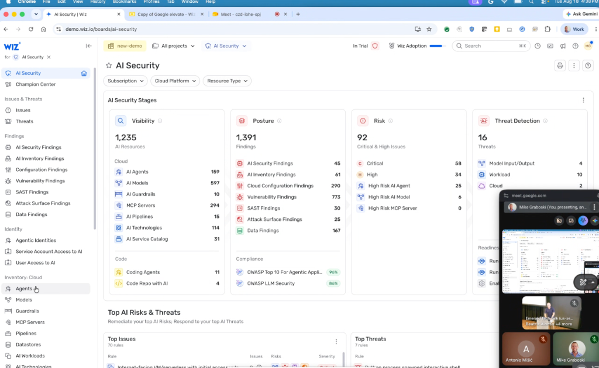
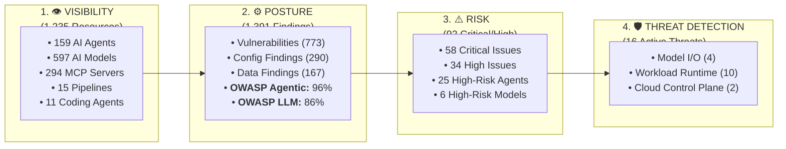

# Wiz AI Security Console: 4-Stage Operating Pipeline & Agentic Governance

## Overview

The **Wiz AI Security Operations Dashboard** provides a centralized control plane for SecOps, Platform, and DevOps teams to discover, audit, prioritize, and defend enterprise AI deployments.

The platform structures enterprise AI security into a **4-Stage Operating Pipeline**: **Visibility** $\rightarrow$ **Posture** $\rightarrow$ **Risk** $\rightarrow$ **Threat Detection**, integrating continuous compliance against the **OWASP Top 10 for Agentic Applications** and **OWASP LLM Security** standards.

---

## The 4-Stage AI Security Operating Pipeline

---

## Detailed Pipeline Stages

### Stage 1: Visibility (Comprehensive Multi-Cloud AI Inventory)
* **Cloud Infrastructure (1,220 Resources)**:
  * **AI Agents (159)**: Autonomous task agents deployed on Cloud Run, GKE, and ECS.
  * **AI Models (597)**: Foundation, fine-tuned, and proprietary model endpoints across Vertex AI, Bedrock, and Azure OpenAI.
  * **MCP Servers (294)**: Active Model Context Protocol tool servers exposed to agents.
  * **AI Guardrails (10)**: Floor settings, Model Armor rules, and content moderation filters.
  * **AI Pipelines (15)** & **Service Catalog (31)**: Managed inference endpoints and training pipelines.
* **Code & Developer Surfaces (15 Resources)**:
  * **Coding Agents (11)**: Active IDE developer plugins (Antigravity, Gemini Code Assist, Copilot, Cline).
  * **Code Repositories with AI (4)**: Repositories housing prompt assets and agentic pipelines.

---

### Stage 2: Posture & Compliance Benchmarking
* **Holistic Vulnerability & Config Audit (1,391 Findings)**:
  * Scans base container images, CVE vulnerabilities (773), cloud configuration drift (290), data exposure risks (167), and static application security (SAST - 30).
* **AI Industry Compliance Frameworks**:
  * **OWASP Top 10 for Agentic Applications**: Evaluates agent autonomy risks, authorization guardrails, and tool permission boundaries (e.g. **96% score**).
  * **OWASP Top 10 for LLM Applications**: Audits against prompt injection, insecure output handling, training data poisoning, and model theft (e.g. **86% score**).

---

### Stage 3: Risk Prioritization (Toxic Combinations)
* **Contextual Risk Filtering (92 Toxic Combinations)**:
  * Eliminates noise by evaluating graph-connected attack paths rather than isolated vulnerabilities:
    * **58 Critical** & **34 High** priority issues.
    * **25 High-Risk AI Agents**: Agents possessing excessive Cloud IAM permissions connected to internet-facing triggers.
    * **6 High-Risk AI Models**: Unauthenticated or publicly reachable inference endpoints containing sensitive embeddings.

---

### Stage 4: Real-Time Threat Detection & Response
* **Active Runtime Threat Interception (16 Live Threats)**:
  * **Model Input / Output (4 Threats)**: Real-time detection of jailbreak payloads and indirect prompt injection attempts.
  * **Workload & Container Runtime (10 Threats)**: Detection of rogue agent behavior—such as unexpected interactive shell spawns (`/bin/sh`), unauthorized socket connections, or container escapes.
  * **Cloud Control Plane (2 Threats)**: Rogue API token harvesting and service account impersonation.

---

## Agentic Identity & Access Governance

Wiz includes dedicated IAM auditing modules for agentic architectures:
1. **Agentic Identities**: Manages cryptographic credentials assigned to autonomous agents.
2. **Service Account Access to AI**: Verifies least-privilege access for microservices calling Vertex AI, BigQuery, and MCP servers.
3. **User Access to AI**: Audits employee and developer permissions to sensitive LLM endpoints.

---

## 4-Stage Operations Summary Matrix

| Stage | Focus Area | Monitored Metrics | Primary Output |
| :--- | :--- | :--- | :--- |
| **1. Visibility** | Discovery & Census | 1,235 AI resources (Agents, Models, MCPs, IDEs) | Complete Multi-Cloud AI Inventory & AI-BOM |
| **2. Posture** | Configuration & Auditing | 1,391 findings, OWASP Agentic/LLM benchmarks | Posture scores, config drift remediation |
| **3. Risk** | Contextual Attack Paths | 92 Critical/High issues, 25 High-Risk Agents | Prioritized toxic combinations for immediate fix |
| **4. Threats** | Active Runtime Defense | 16 live threats (Model I/O, Workload, Cloud) | Real-time rogue agent containment & blocking |
