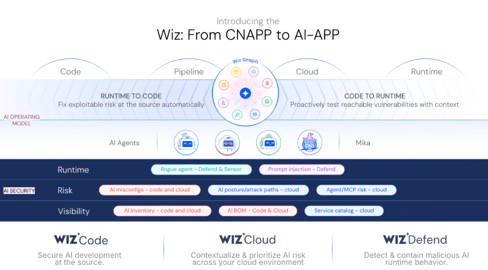
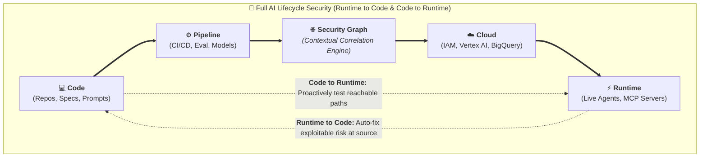
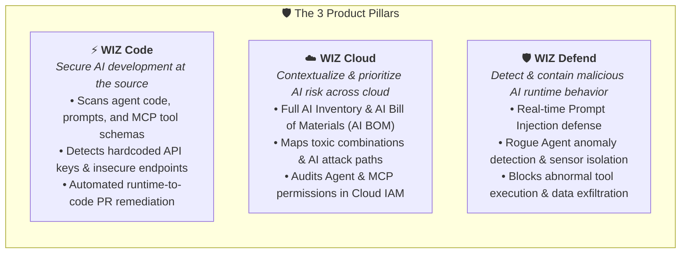

# Wiz: From CNAPP to AI-APP — Google's Flagship AI Security Platform

## Overview

**Wiz** represents Google Cloud's landmark cybersecurity platform integration, fundamentally expanding Google Cloud's enterprise security portfolio by bridging traditional **Cloud-Native Application Protection Platforms (CNAPP)** into modern **AI Application Protection Platforms (AI-APP)**.

As enterprise customers deploy autonomous agents, Model Context Protocol (MCP) servers, Vertex AI models, and Gemini Enterprise pipelines across multi-cloud environments, Wiz provides the end-to-end security fabric. Centered on the **Wiz Graph**, it correlates risk from source code and CI/CD pipelines to cloud infrastructure and live agent runtime execution.

---

## The AI Operating Model & Mika

Wiz introduces a dedicated **AI Operating Model** that secures both human developer workflows and autonomous agent swarms:
* **Mika (Wiz AI Companion)**: An embedded AI security partner that contextualizes complex graph findings, generates automated remediation code, and triages multi-cloud risks.
* **Autonomous AI Agents & Swarms**: Real-time inspection and guardrail enforcement for developer agents (Antigravity, JetSki, ADK agents) and operational systems.
* **Bidirectional Correlation**:
  * **Runtime to Code**: Automatically traces exploitable runtime anomalies back to the exact source repository and line of code, opening pull requests / fix CLs automatically.
  * **Code to Runtime**: Proactively simulates reachable attack paths in the cloud before vulnerable code or tool schemas are deployed to production.

---

## The AI-APP End-to-End Operating Model

---

## The 3 Pillars of AI-APP Security

---

## The 3 Horizontal AI Security Layers

### 1. Visibility (Know What You Run)
* **AI Inventory (Code & Cloud)**: Discovers all models (proprietary, fine-tuned, third-party APIs), agent harnesses, MCP servers, and vector databases across multi-cloud environments.
* **AI Bill of Materials (AI BOM)**: Tracks model provenance, base weights, training datasets, licenses, dependencies, and attached toolsets.
* **AI Service Catalog**: Centralizes discovery of verified, internal enterprise AI endpoints.

---

### 2. Risk & Posture (AI-SPM)
* **AI Misconfigurations**: Identifies publicly exposed Vertex AI endpoints, unauthenticated MCP servers, overly permissive Cloud Storage buckets, and missing VPC Service Controls.
* **AI Posture & Attack Paths**: Correlates vulnerabilities, excessive IAM privileges, and reachable network paths to identify true exploitable attack chains targeting AI systems.
* **Agent & MCP Risk**: Detects overly permissive tool definitions (e.g. mutating tools granted read-only scopes) and unmonitored tool endpoints.

---

### 3. Runtime Protection (Defend Live Agents)
* **Rogue Agent Defense & Sensors**: Monitors autonomous agents for abnormal behavior (e.g., unexpected token spikes, out-of-bounds file system scans, anomalous SQL queries) and halts execution in real time.
* **Prompt Injection Defense**: In-line threat inspection mitigating Direct Prompt Injections (jailbreaks) and Indirect Prompt Injections (IPI) hidden inside web content or retrieved documents.

---

## Comprehensive AI-APP Capability Matrix

| Lifecycle Stage | Security Layer | Core Capabilities | Mitigated Threats |
| :--- | :--- | :--- | :--- |
| **Code & Build** | **Wiz Code** | Static code analysis, prompt scanning, hardcoded secret detection, automated PR fixes | Leaked API credentials, vulnerable base model dependencies |
| **Cloud & Posture** | **Wiz Cloud** | AI BOM generation, toxic combination graph, IAM privilege analysis for agents | Publicly exposed models, unauthenticated MCP servers, data poisoning |
| **Runtime & Ops** | **Wiz Defend** | Rogue agent behavioral sensors, prompt injection filters, dynamic tool execution guardrails | Indirect prompt injection, rogue agent data exfiltration, tool abuse |
