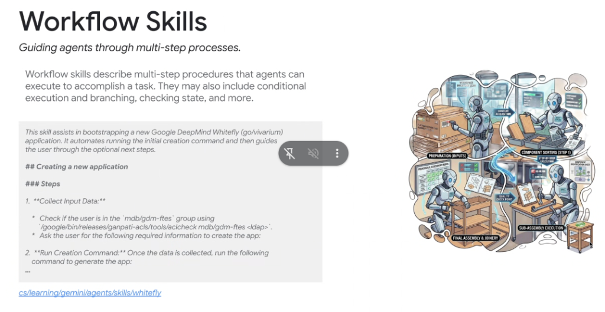
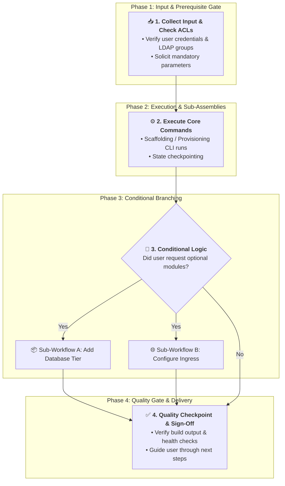

# Skill Pattern Deep Dive: Workflow Skills



## Overview

**Workflow Skills** guide agents through complex, multi-step operational procedures. They define explicit execution sequences, state validation checkpoints, prerequisite permission checks, and conditional branching logic.

> **"Workflow skills describe multi-step procedures that agents can execute to accomplish a task. They may also include conditional execution and branching, checking state, and more."**

While LLMs can struggle with procedural drift (skipping steps or acting before prerequisites are met), Workflow Skills provide an unshakeable procedural spine, turning non-deterministic reasoning into an orderly, step-by-step assembly line.

---

## The Procedural Assembly Line Architecture



---

## Core Characteristics of Workflow Skills

### 1. Mandatory Prerequisite & Permission Checking
* Guards against failed execution by validating authorizations *first*:
  ```bash
  # Check if the user has required group access before proceeding
  /google/bin/releases/ganpati-acls/tools/aclcheck mdb/gdm-ftes <ldap>
  ```
* Gathers all mandatory parameters upfront before mutating files or calling infrastructure APIs.

### 2. Ordered Step-by-Step Sequences
* Prevents the agent from hallucinating shortcuts or jumping ahead.
* Each numbered step specifies:
  * **Input requirements**
  * **Command to execute**
  * **Expected success output**
  * **Failure recovery / retry actions**

### 3. Conditional Branching & State Inspections
* Dynamically routes the agent based on runtime state (e.g. *"If project already exists, run migration instead of bootstrap"*).

### 4. Quality Checkpoints & Clean Handoffs
* Evaluates intermediate state before moving to subsequent stages (e.g. verifying compilation before creating a CL).

---

## Canonical Internal Example: `whitefly` (Google DeepMind)

* **Location**: `cs/learning/gemini/agents/skills/whitefly`
* **Purpose**: Assists engineers in bootstrapping and scaffolding a new Google DeepMind Whitefly (`go/vivarium`) application.

```markdown
---
name: whitefly
description: Bootstraps and configures new Google DeepMind Whitefly (go/vivarium) applications. Use when creating a new Whitefly app or initializing vivarium environments.
---

# DeepMind Whitefly Application Bootstrapper

This skill assists in bootstrapping a new Google DeepMind Whitefly (`go/vivarium`) application. It automates running the initial creation command and then guides the user through the optional next steps.

## Creating a New Application

### Steps

1. **Collect Input Data & Validate Permissions:**
   * Check if the user is in the `mdb/gdm-ftes` group:
     ```bash
     /google/bin/releases/ganpati-acls/tools/aclcheck mdb/gdm-ftes <ldap>
     ```
   * Ask the user for the following required parameters:
     * App Name
     * Target Google Cloud Project ID
     * Primary Serving Region

2. **Run Creation Command:**
   Once parameters are verified, execute the initialization binary:
   ```bash
   /google/bin/releases/deepmind/whitefly/cli create --name=$APP_NAME --project=$PROJECT_ID
   ```

3. **Post-Creation Verification:**
   * Verify directory structure exists in `//third_party/whitefly/apps/...`
   * Run local dry-run tests:
     ```bash
     blaze test //third_party/whitefly/apps/$APP_NAME:all
     ```
```

---

## Best Practices for Authoring Workflow Skills

| Principle | Engineering Value | Anti-Pattern |
| :--- | :--- | :--- |
| **Fail-Fast Prerequisite Gates** | Prevents wasted compute and partial half-configured states | Running provisioning scripts before checking user ACLs |
| **Numbered, Atomic Steps** | Eliminates step skipping and ensures repeatable execution | Vague bullet points with multiple hidden sub-tasks |
| **Explicit State Checkpoints** | Ensures intermediate health before initiating destructive actions | Assuming previous command succeeded without checking exit code |
| **Post-Run Guidance** | Gives the user clear next steps and command links | Terminating abruptly after running the initial CLI command |
