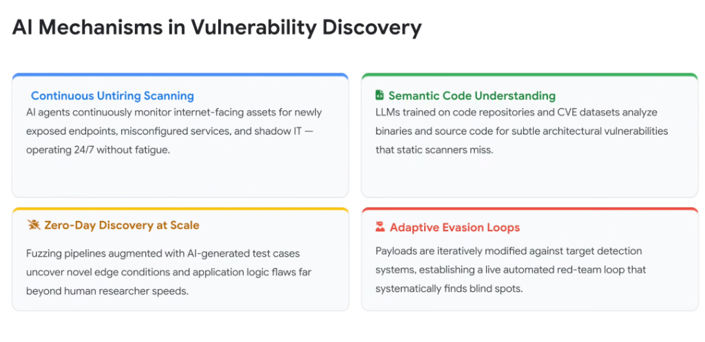
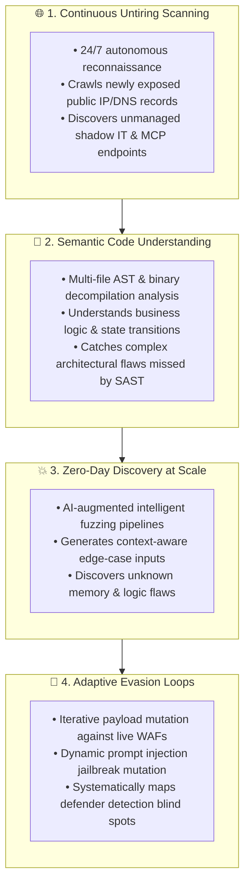

# AI Mechanisms in Vulnerability Discovery: The 4 Attack Pillars

## Overview

Adversarial exploitation has evolved from blunt, brute-force script scanning into sophisticated, **AI-native vulnerability discovery engines**.

Modern AI attackers leverage deep semantic language models, generative test harnesses, and automated feedback loops to discover subtle architectural flaws, synthesize novel zero-day exploits, and systematically evade enterprise detection mechanisms.

---

## The 4 Vulnerability Discovery Pillars

---

## Detailed Technical Examination

### 1. Continuous Untiring Scanning
* **The Mechanism**: Autonomous recon agents continuously ingest global BGP routing updates, Certificate Transparency logs, public DNS changes, and cloud IP ranges.
* **The Attack Surface**: Instantly flags ephemeral staging environments, developer test endpoints, exposed Model Context Protocol (MCP) servers (`/tools`), and misconfigured Google Cloud Storage / S3 buckets the moment they appear online.

---

### 2. Semantic Code Understanding
* **The Mechanism**: Frontier LLMs trained on millions of repositories, CVE databases, and compiler intermediate representations (IR) evaluate code semantically rather than relying on rigid regex pattern matching.
* **The Advantage**: Traditional SAST flags simple string concatenations. Semantic AI models analyze inter-procedural data flows, cross-module authorization checks, and object lifecycles, identifying subtle logic bugs (e.g. confused deputy tool execution or improper state deserialization).

---

### 3. Zero-Day Discovery at Scale (Intelligent AI Fuzzing)
* **The Mechanism**: Traditional fuzzing generates pseudo-random mutated byte streams, spending millions of CPU cycles on invalid syntax. AI-guided fuzzers understand protocol specifications (e.g., protobuf, gRPC, JSON-RPC, HTTP/2) and generate syntactically valid yet semantically pathological inputs.
* **The Advantage**: Rapidly uncovers deep edge cases, race conditions, memory corruptions, and parsing flaws in proprietary APIs and cloud services.

---

### 4. Adaptive Evasion Loops (Live Red-Team Mutation)
* **The Mechanism**: Autonomous attack agents establish an active feedback loop against target defenses. When a request is blocked by a Web Application Firewall (WAF), Cloud Armor rule, or Model Armor filter:
  1. The agent parses the rejection response code and error headers.
  2. The LLM mutates encoding, alters token delimiters, or injects semantic framing obfuscation.
  3. The agent re-tests the modified payload until the detection filter is bypassed.

---

## AI Discovery Mechanisms vs. Google Cloud Defense Matrix

| Discovery Mechanism | Adversarial Tactic | Google Cloud Defensive Countermeasure |
| :--- | :--- | :--- |
| **Continuous Scanning** | Rapid enumeration of shadow cloud endpoints | **VPC Service Controls** + Cloud Asset Inventory drift alerts. |
| **Semantic Code Analysis** | Deep multi-file logic flaw discovery | **Code Mender** automated semantic AST remediation. |
| **Intelligent Fuzzing** | Synthesizing valid but malicious payloads | **Binary Authorization** + strict Protobuf/gRPC schema enforcement. |
| **Adaptive Evasion** | Iterative prompt &amp; payload mutation | **Google Model Armor** multi-layered inline semantic defense. |
