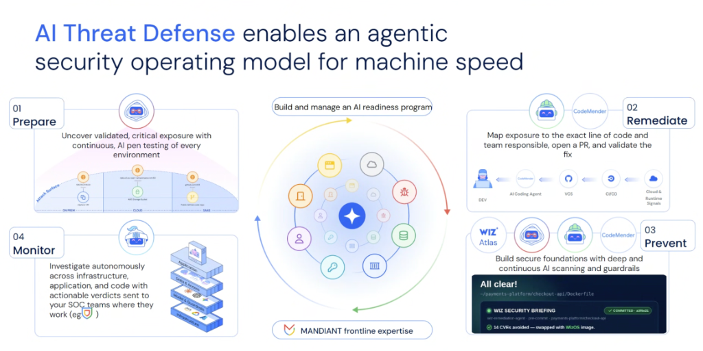

# AI Threat Defense: The Agentic Security Operating Model



## Overview

Modern cloud security requires transitioning from disjointed, human-bottlenecked ticket queues into an **Agentic Security Operating Model for Machine Speed**.

By uniting Google Cloud technology, Wiz security graph intelligence, and **Mandiant frontline threat expertise**, this operating model deploys specialized autonomous AI agents across the entire four-stage lifecycle: **Red Agents (Offensive Pen-Testing)**, **Green Agents & CodeMender (Autonomous Remediation)**, **Wiz Atlas (Continuous Prevention)**, and **Defender Agents (Autonomous SOC Investigation)**.

---

## The Agentic Security Operating Architecture

```mermaid
flowchart TD
    subgraph Core["🌐 Central Living Architecture Graph + Mandiant Expertise"]
        direction TB
        G1["• Real-time graph of multi-cloud assets, IAM &amp; models<br/>• Infused with Mandiant frontline threat intelligence &amp; TTPs"]
    end

    subgraph Q1["01. 🤖 Prepare: Autonomous Red Agent"]
        direction TB
        P1["<b>Continuous AI Penetration Testing</b><br/>• Probes On-Prem (vSphere), Cloud (GCP/AWS) &amp; SaaS (GitHub)<br/>• Uncovers empirically validated critical attack paths"]
    end

    subgraph Q2["02. 👷 Remediate: CodeMender &amp; Green Agent"]
        direction TB
        R1["<b>Closed-Loop Code Patching</b><br/>• Maps exposure to exact line of code &amp; repo owner<br/>• Opens automated PR with sandbox-verified fixes"]
    end

    subgraph Q3["03. 🛡️ Prevent: Wiz Atlas &amp; Guardrails"]
        direction TB
        V1["<b>AI-Native SDLC Foundations</b><br/>• In-line developer guidance (e.g. Dockerfile CVE swaps)<br/>• Model Armor prompt defense &amp; pre-commit linting"]
    end

    subgraph Q4["04. ⚔️ Monitor: Autonomous SOC Agent"]
        direction TB
        M1["<b>Multi-Layer Runtime Investigation</b><br/>• 4-Layer Stack: App → Data/Access → Models → Infra<br/>• Actionable verdicts delivered to SecOps consoles"]
    end

    Q1 --> Q2 --> Q3 --> Q4 --> Q1
    Core -. "Context &amp; Threat Feeds" .-> Q1 &amp; Q2 &amp; Q3 &amp; Q4
```

---

## Detailed Examination of the 4 Operating Quadrants

### 01: Prepare — Continuous AI Penetration Testing (Red Agent)
* **The Agent**: Autonomous **Red Agent** operating 24/7/365.
* **Scope of Exposure**:
  * **On-Premises**: Legacy vSphere VMs and internal networks.
  * **Multi-Cloud**: AWS/GCP storage buckets, serverless functions, and Cloud IAM bindings.
  * **SaaS & Repositories**: Public GitHub repos, leaked credentials, and third-party APIs.
* **The Value**: Replaces hypothetical vulnerability lists with **empirically validated critical exploits** that prove real-world risk.

---

### 02: Remediate — Closed-Loop Code Patching (CodeMender)
* **The Agent**: **CodeMender** orchestrated by the **Wiz Code Green Agent**.
* **The Pipeline**:
  $$\text{Cloud \& Runtime Signals} \longrightarrow \text{CI/CD} \longrightarrow \text{VCS (GitHub)} \longrightarrow \text{AI Coding Agent (CodeMender)} \longrightarrow \text{Developer}$$
* **The Action**:
  * Traces runtime cloud exposure back to the exact file, line of code, and git blame author.
  * Automatically creates a GitHub pull request with verified patches and regression tests.

---

### 03: Prevent — Continuous Guardrails & Wiz Atlas
* **The Agent**: **Wiz Atlas** + Pre-Commit IDE Agents.
* **The Developer Experience**:
  * Embeds ambient security intelligence directly into the developer workflow.
  * Example: When a developer edits a `Dockerfile`, the assistant automatically intercepts insecure dependencies and suggests clean base images (*"✓ 14 CVEs avoided — swapped with WizOS image"*).

---

### 04: Monitor — Multi-Layer Autonomous SOC Investigation (Defender Agent)
* **The Agent**: Autonomous **Defender / SecOps Agent**.
* **4-Layer Cross-Stack Investigation**:
  1. **Application Layer**: Business logic, API payloads, and web routes.
  2. **Data & Access Layer**: IAM roles, service accounts, and database access logs.
  3. **Model & Guardrails Layer**: Prompt injection attempts, Model Armor filters, and LLM output drift.
  4. **Infrastructure Layer**: GKE nodes, VPC networks, and Cloud KMS keys.
* **The Action**: Investigates telemetry autonomously and routes high-confidence verdicts directly to Security Operations (Google SecOps / Chronicle / Slack).

---

## The Role of Mandiant Frontline Expertise

The entire agentic operating model is continuously updated with **Mandiant frontline threat intelligence**:
* Real-world incident response observations from active nation-state and cybercrime campaigns.
* Dynamic detection playbooks and attacker Tactics, Techniques, and Procedures (TTPs).
* Threat actor profiling informing the Red Agent's exploit simulation algorithms.

---

## Agentic Security Operating Model Summary Matrix

| Stage | Specialized Agent | Primary Technology | Input Trigger | Output Artifact |
| :--- | :--- | :--- | :--- | :--- |
| **01. Prepare** | **Red Agent** | Autonomous AI DAST | Public Attack Surface | Validated exploit PoC reports |
| **02. Remediate** | **Green Agent** | **CodeMender** | Verified vulnerability finding | Automated Pull Request with passing tests |
| **03. Prevent** | **Wiz Atlas Agent** | IDE Extensions &amp; Model Armor | Local developer keystrokes / commits | In-line base image &amp; AST fixes |
| **04. Monitor** | **Defender Agent** | Wiz Defend &amp; Google SecOps | 4-layer runtime telemetry | Actionable incident verdict &amp; auto-containment |
