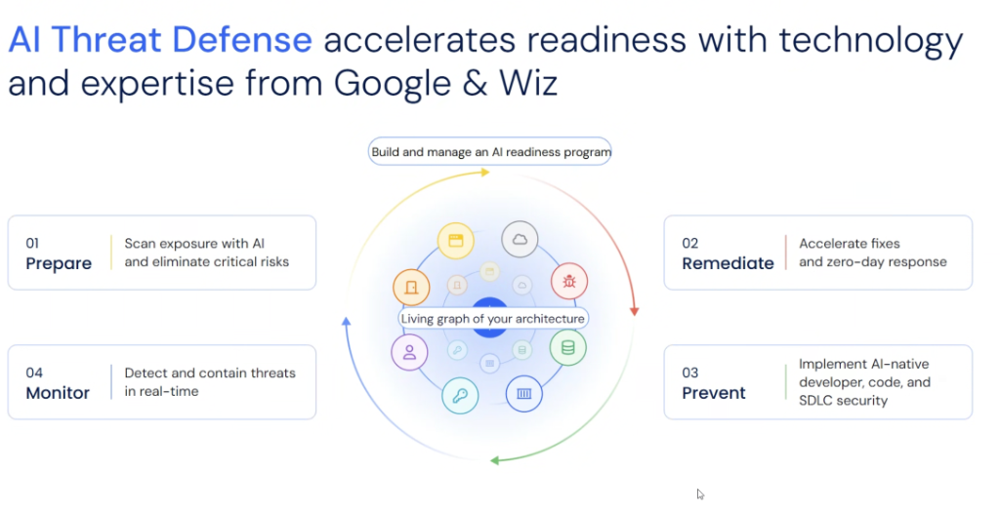

# AI Threat Defense: The 4-Stage Readiness Lifecycle (Google & Wiz)



## Overview

Enterprise AI readiness requires a unified defensive strategy that pairs Google Cloud infrastructure and AI engineering with Wiz security graph intelligence.

At the core of this joint framework is a **Living Graph of Your Architecture**—a dynamic, real-time map correlating cloud identities, compute containers, databases, encryption keys, and AI models. Around this living graph, organizations build and manage an **AI Readiness Program** operating across a continuous four-stage lifecycle: **Prepare**, **Remediate**, **Prevent**, and **Monitor**.

---

## Architecture: The 4-Stage Continuous Lifecycle

```mermaid
flowchart TD
    subgraph Core["🌐 Living Graph of Your Architecture<br/><i>(Correlates Cloud, Identities, Containers, DBs, Keys &amp; AI Models)</i>"]
        direction TB
        G1["• Real-time graph correlation of all attack surfaces<br/>• Maps reachability, IAM permissions &amp; data access paths"]
    end

    subgraph S1["01. 🎯 Prepare"]
        direction TB
        P1["<b>Scan Exposure with AI</b><br/>• Discover shadow AI &amp; public endpoints<br/>• Eliminate critical toxic combinations"]
    end

    subgraph S2["02. 🔧 Remediate"]
        direction TB
        R1["<b>Accelerate Fixes &amp; Zero-Day Response</b><br/>• Autonomous patch PR synthesis (CodeMender)<br/>• Sandbox exploit verification"]
    end

    subgraph S3["03. 🛡️ Prevent"]
        direction TB
        V1["<b>Implement AI-Native SDLC Security</b><br/>• Inline IDE developer co-pilots<br/>• Pre-commit AST &amp; prompt guardrails"]
    end

    subgraph S4["04. ⚡ Monitor"]
        direction TB
        M1["<b>Detect &amp; Contain in Real-Time</b><br/>• Runtime kernel &amp; agent sensors (Wiz Defend)<br/>• Sub-second session &amp; credential quarantine"]
    end

    S1 --> S2 --> S3 --> S4 --> S1
    Core -. "Informs All Stages" .-> S1 &amp; S2 &amp; S3 &amp; S4
```

---

## Detailed Breakdown of the 4 Readiness Stages

### 01: Prepare — *Scan Exposure with AI & Eliminate Critical Risks*
* **Core Objective**: Establish complete visibility across multi-cloud infrastructure, AI models, and software supply chains.
* **Key Mechanisms**:
  * **AI-BOM & Inventory**: Catalogs all foundational models (Vertex AI, Bedrock, OpenAI), fine-tuned weights, and vector databases.
  * **Exposure Mapping**: Continuously scans for unauthenticated Model Context Protocol (MCP) gateways, open cloud storage buckets, and public API endpoints.
  * **Toxic Combination Triage**: Identifies critical multi-layer attack paths (e.g. Code Vulnerability + Over-Privileged IAM Role + Exposed Vertex Endpoint).

---

### 02: Remediate — *Accelerate Fixes & Zero-Day Response*
* **Core Objective**: Collapse Mean Time to Remediate (MTTR) from weeks of ticket lag to minutes of automated execution.
* **Key Mechanisms**:
  * **CodeMender Integration**: Ingests Wiz findings and synthesizes validated, compiler-tested code and IaC patches.
  * **Sandbox Exploit Verification**: Validates exploitability in isolated containers, eliminating 100% of false positives before developer review.
  * **Green Agent PR Delivery**: Automatically submits pull requests with detailed rationale descriptions and newly generated unit test assertions.

---

### 03: Prevent — *Implement AI-Native Developer, Code & SDLC Security*
* **Core Objective**: Stop insecure code and malicious prompts from ever reaching shared repositories or production branches.
* **Key Mechanisms**:
  * **Ambient IDE Co-Pilots**: Inline assistance in Antigravity, VS Code, and JetBrains flagging unsafe deserialization, prompt injection, and hardcoded secrets as code is typed.
  * **Policy-as-Code CI/CD Gates**: Google Cloud Build and Binary Authorization enforcing strict provenance and cryptographic signing.
  * **Model Armor**: Inline prompt filtering intercepting jailbreaks and sensitive PII before reaching LLM context windows.

---

### 04: Monitor — *Detect & Contain Threats in Real Time*
* **Core Objective**: Close the remaining protection gap with autonomous machine-speed runtime response.
* **Key Mechanisms**:
  * **Runtime Behavioral Sensors (Wiz Defend)**: Monitors container processes for anomalous shell spawns (`/bin/sh`) or rogue socket connections.
  * **Autonomous Containment**: Sub-second session freezing, ephemeral token revocation, and dynamic VPC Service Controls fencing.
  * **Continuous Posture Drift Tracking**: Alerts immediately when administrative configurations deviate from security baselines.

---

## Google & Wiz AI Threat Defense Summary Matrix

| Lifecycle Stage | Primary Goal | Key Technology | Operational Outcome |
| :--- | :--- | :--- | :--- |
| **01. Prepare** | Exposure &amp; Risk Discovery | Wiz Security Graph &amp; Cloud Asset Inventory | Eliminates critical toxic combinations |
| **02. Remediate** | Machine-Speed Fixes | **CodeMender** &amp; Green Agent PRs | Validated patches generated in minutes |
| **03. Prevent** | Inner-Loop SDLC Guardrails | Antigravity IDE Companion &amp; Model Armor | 1-click inline fixes before git commit |
| **04. Monitor** | Real-Time Threat Containment | Wiz Defend &amp; Cloud IAM Token Revocation | Sub-second anomaly isolation |
