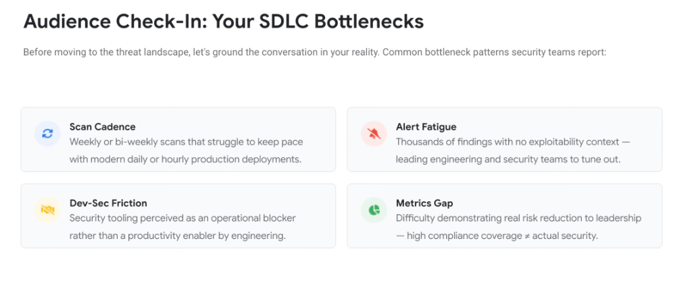
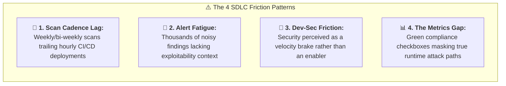

# SDLC Bottlenecks Check-In: The 4 Enterprise Friction Patterns

## Overview

Before evaluating advanced adversarial threat landscapes, enterprise security architectures must be grounded in the day-to-day operational reality of software engineering and SecOps teams.

Enterprise organizations consistently report **Four Core SDLC Bottleneck Patterns** that undermine application security posture and developer velocity:

1. **Scan Cadence Lag**: Batch scans trailing rapid deployment frequencies.
2. **Alert Fatigue**: Noise without reachability or exploitability context.
3. **Dev-Sec Friction**: Security perceived as an operational blocker.
4. **The Metrics Gap**: High compliance coverage failing to deliver real security.

---

## The 4 SDLC Bottleneck Patterns

---

## Detailed Analysis of the 4 Bottlenecks

### 1. Scan Cadence Lag
* **The Reality**: Modern agile and DevOps teams push code to production daily or hourly. However, traditional security scans execute weekly, bi-weekly, or during manual release gates.
* **The Business Impact**: Software ships to production before security scans ever execute, creating persistent, unmonitored windows of vulnerability exposure.

---

### 2. Alert Fatigue & Context Blindness
* **The Reality**: Conventional SAST scanners generate thousands of alerts based on crude syntax matching without verifying if the vulnerable function is actually reachable by external traffic.
* **The Business Impact**: Developers and security engineers become overwhelmed by alert noise and simply tune out notifications, missing the 1% of findings that represent true critical exploits.

---

### 3. Dev-Sec Friction & Cultural Disconnect
* **The Reality**: Security tooling is integrated as late-stage blocking gates that reject pull requests or freeze builds without providing actionable, compilable code remedies.
* **The Business Impact**: Engineering teams perceive AppSec as an adversary that slows roadmap delivery. This incentivizes developers to bypass security reviews or adopt unmonitored shadow AI tools.

---

### 4. The Metrics Gap (Compliance $\neq$ Security)
* **The Reality**: Executive dashboards often track superficial vanity metrics (e.g., "100% of repos have SAST enabled" or "Zero open Critical CVEs").
* **The Business Impact**: Passing compliance audits creates a dangerous false sense of safety. Attackers do not attack single CVEs; they chain together multiple low-severity misconfigurations that compliance checklists ignore.

---

## Transforming Bottlenecks into Machine-Speed Enablers

| Bottleneck Pattern | Traditional Failure Mode | Google Cloud &amp; Antigravity Solution |
| :--- | :--- | :--- |
| **Scan Cadence** | Batch scans lagging behind CI/CD | **Continuous streaming AST analysis** embedded in inner dev loops. |
| **Alert Fatigue** | Thousands of contextless alerts | **Wiz Security Graph reachability filtering** prioritizing true toxic combinations. |
| **Dev-Sec Friction** | Late-stage blocking ticket gates | **Proactive inline editor hints + automated PR patches via Code Mender**. |
| **Metrics Gap** | Audit checkboxes $\neq$ real security | **Red Agent attack simulation &amp; live runtime exploit containment**. |
