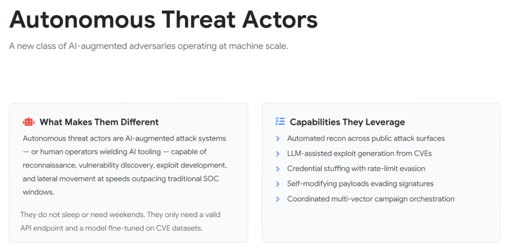
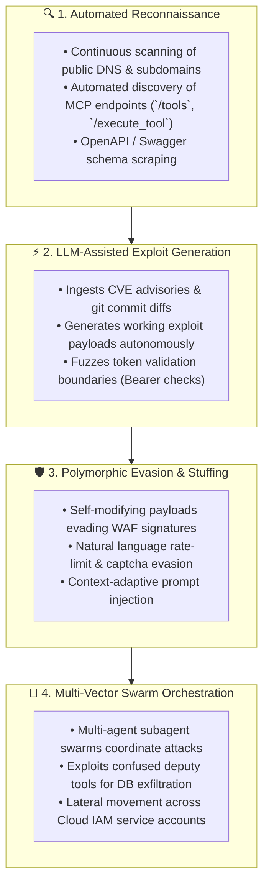

# Autonomous Threat Actors: AI-Augmented Adversaries at Machine Scale

## Overview

The enterprise cybersecurity threat landscape has shifted from human-driven manual intrusions to **Autonomous Threat Actors**—a new class of AI-augmented adversarial systems (and human operators wielding autonomous agent tooling) capable of end-to-end reconnaissance, zero-day vulnerability synthesis, and lateral movement at machine speed.

> **"They do not sleep or need weekends. They only need a valid API endpoint and a model fine-tuned on CVE datasets."**

Traditional Security Operations Centers (SOCs) operate on human shifts with response windows measured in hours or days. Autonomous threat actors operate in **seconds**, rendering legacy reactive defenses structurally obsolete.

---

## The Autonomous Attack Lifecycle

---

## What Makes Autonomous Threat Actors Different

1. **Continuous 24/7/365 Machine-Speed Execution**:
   - Attacks are no longer bounded by human working hours or manual script authoring. Adversarial loops probe thousands of cloud assets continuously.
2. **Dynamic In-Loop Adaptation**:
   - If an initial exploit payload receives a `401 Unauthorized` or `403 Forbidden` response, the LLM analyzes the error payload in real time, alters headers or prompt syntax, and re-attacks within seconds.
3. **Near-Zero Marginal Attack Cost**:
   - The economic barrier to executing sophisticated penetration campaigns has collapsed. A threat actor can orchestrate complex multi-vector campaigns for a few dollars in LLM API tokens.

---

## The 5 Core Capabilities Leveraged by Adversaries

### 1. Automated Recon Across Public Attack Surfaces
* Continuously discovers exposed cloud endpoints, serverless functions, Model Context Protocol (MCP) gateways, and unauthenticated developer portals.

---

### 2. LLM-Assisted Exploit Generation from CVEs
* Takes raw security advisories, vulnerability disclosures, and open-source patch diffs, automatically reverse-engineering the root cause and compiling weaponized exploit scripts.

---

### 3. Intelligent Credential Stuffing & Rate-Limit Evasion
* Bypasses traditional behavioral rate limiters by dynamically varying request velocity, injecting natural language variations, and rotating through distributed proxy meshes.

---

### 4. Self-Modifying Polymorphic Payloads
* Continuously mutates exploit payloads, prompt injection jailbreaks, and SQL injection syntax so that no two requests match static WAF signature databases.

---

### 5. Coordinated Multi-Vector Campaign Orchestration
* Deploys hierarchical subagent swarms where specialized worker agents simultaneously probe authentication gates, fuzz tool descriptors, and exfiltrate cloud data stores.

---

## Adversarial Capabilities vs. Google Defense Countermeasures

| Adversarial Capability | Attack Mechanism | Google Cloud &amp; AI Countermeasure |
| :--- | :--- | :--- |
| **Public Surface Recon** | Automated MCP discovery (`/tools`) | **VPC Service Controls** + Cloud Armor perimeter fencing. |
| **LLM Exploit Synthesis** | Rapid weaponization of patch diffs | **Code Mender** automated pre-commit vulnerability patching. |
| **Rate-Limit Evasion** | Intelligent traffic dispersion &amp; stuffing | **reCAPTCHA Enterprise** risk-based behavioral scoring. |
| **Polymorphic Payloads** | Dynamic prompt injection &amp; WAF bypass | **Google Model Armor** inline semantic inspection. |
| **Swarm Orchestration** | Confused deputy tool abuse &amp; exfiltration | **Dual-Gate Cloud IAM** + Wiz Defend runtime isolation sensors. |
