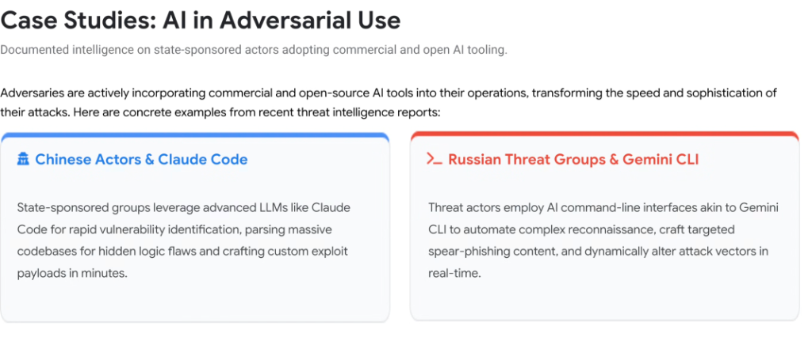
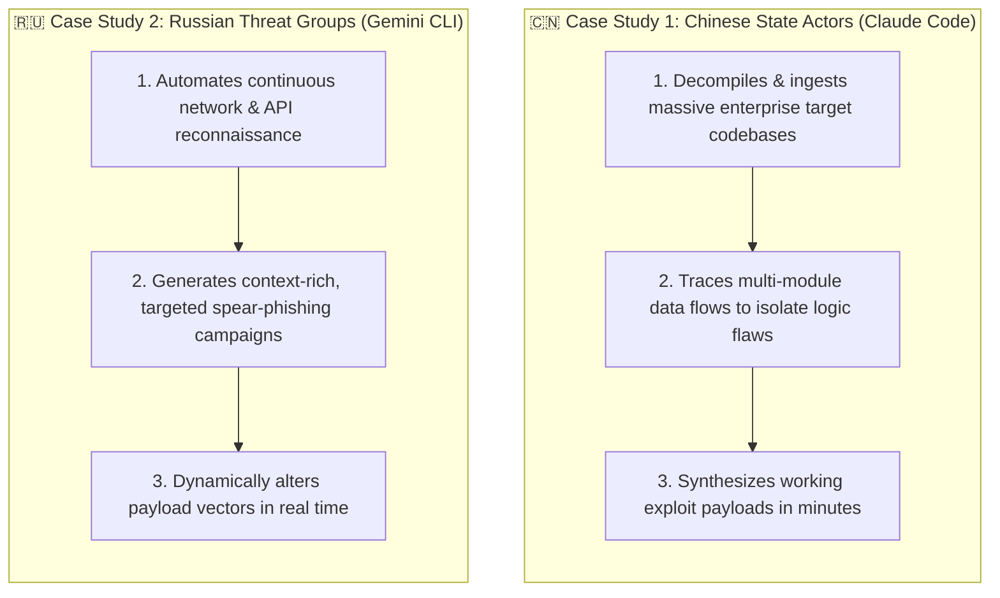

# Case Studies: AI in Adversarial Use & State-Sponsored Weaponization

## Overview

Threat intelligence confirms that advanced adversaries are no longer relying solely on manual exploit development. State-sponsored threat groups and cybercrime syndicates are actively integrating **commercial and open-source AI agent tooling** directly into their operational intrusion pipelines.

By weaponizing agentic developer tools (e.g. **Claude Code**, **Gemini CLI**, and terminal LLM harnesses), adversaries achieve unprecedented speed, precision, and automation across reconnaissance, vulnerability research, and payload delivery.

---

## State-Sponsored Adversary Operational Workflows

---

## Detailed Case Study Breakdown

### 1. Chinese State-Sponsored Actors & Claude Code
* **Target Environment**: Enterprise supply chain software, critical infrastructure firmware, and proprietary cloud platforms.
* **Adversarial Application**:
  * Ingests hundreds of thousands of lines of decompiled binary code and open-source dependencies into large context windows.
  * Uses multi-turn agentic reasoning to uncover subtle architectural logic flaws and memory corruption vulnerabilities that traditional SAST scanners miss.
  * Autonomously compiles and refines tailored exploit payloads, shrinking weaponization timelines from months of human reverse-engineering to minutes.

---

### 2. Russian Threat Groups & AI Command-Line Interfaces (Gemini CLI / Terminal Agents)
* **Target Environment**: Government entities, defense industrial base, and global cloud tenants.
* **Adversarial Application**:
  * Employs automated terminal LLM interfaces to orchestrate mass reconnaissance across public IP spaces and DNS infrastructure.
  * Crafts hyper-personalized spear-phishing lures tailored to specific organizational hierarchies and current corporate events.
  * Implements dynamic in-flight attack adaptation: when an endpoint security control blocks a connection, the CLI agent iteratively re-encodes the shellcode and alters transport protocols in real time.

---

## Threat Actor Tradecraft vs. Google Cloud Countermeasures

| Threat Actor Group | AI Tooling Weaponized | Primary Attack Phase | Defensive Countermeasure |
| :--- | :--- | :--- | :--- |
| **Chinese State Actors** | **Claude Code** / Agentic LLMs | Vulnerability discovery &amp; exploit generation | **Code Mender** automated semantic code remediation + AST patching. |
| **Russian Threat Groups** | **Gemini CLI** / Terminal AI | Mass recon, spear-phishing &amp; dynamic evasion | **Google Model Armor** + Workspace AI Defense + **Wiz Defend** runtime sensors. |
