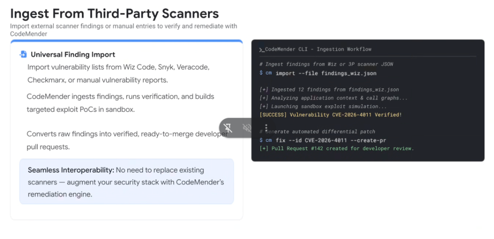
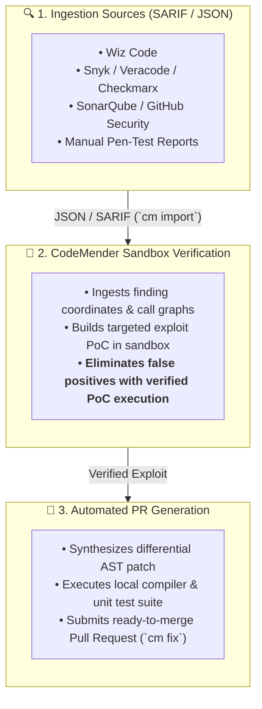

# CodeMender: Ingest From Third-Party Scanners



## Overview

A critical strength of **CodeMender** is its open, non-proprietary ingestion architecture.

Enterprise customers do not need to rip and replace their existing vulnerability scanning investments. CodeMender provides **Universal Finding Import**, ingesting raw alerts from any scanner (Wiz Code, Snyk, Veracode, Checkmarx, SonarQube, or manual pentest reports), verifying exploitability in a sandbox, and generating validated, ready-to-merge developer pull requests.

> **Seamless Interoperability Principle:**
> *"No need to replace existing scanners — augment your security stack with CodeMender's remediation engine."*

---

## Architecture: The Universal Ingestion & Remediation Pipeline



---

## CodeMender CLI (`cm`) Ingestion Workflow

The CodeMender command-line interface provides a simple, scriptable two-step workflow for ingesting findings and creating pull requests:

```bash
# 1. Ingest findings from Wiz or any 3rd-party scanner JSON/SARIF
$ cm import --file findings_wiz.json

[+] Ingested 12 findings from findings_wiz.json
[+] Analyzing application context & call graphs...
[+] Launching sandbox exploit simulation...
[SUCCESS] Vulnerability CVE-2026-4011 Verified!

# 2. Generate automated differential patch and create Pull Request
$ cm fix --id CVE-2026-4011 --create-pr
[+] Analyzing AST and surrounding dependencies...
[+] Synthesizing patch for src/auth/token_validator.py...
[+] Running project test suite: 148 passed, 0 failed.
[+] Pull Request #142 created for developer review.
```

---

## Detailed Technical Capabilities

### 1. Universal Scanner Interoperability
* **Supported Protocols**: Ingests standard **SARIF** (OASIS standard), proprietary JSON schemas (Wiz, Snyk, Veracode), and manual vulnerability spreadsheets (CSV/JSON).
* **Zero Scanner Lock-In**: Organizations can keep their existing contracted security scanners while adding CodeMender as the unified self-healing remediation layer.

---

### 2. Sandbox Exploit Simulation & False-Positive Elimination
* **The Problem**: Traditional SAST generates noisy alerts for theoretical vulnerabilities that cannot be triggered in real execution paths.
* **The CodeMender Solution**:
  * Prior to modifying code, CodeMender provisions a lightweight, isolated sandbox container.
  * Autonomously generates a targeted Proof-of-Concept (PoC) exploit tailored to the finding's AST coordinates.
  * If the PoC fails to trigger a flaw, the alert is deprioritized, guaranteeing that developers only review PRs for **empirically verified vulnerabilities**.

---

### 3. Automated Differential Patch Synthesis (`cm fix`)
* **AST-Aware Patching**: Generates minimal, clean diffs adhering to the repository's coding style and lint rules.
* **Closed-Loop Test Verification**: Executes the project's existing test suite plus new generated regression assertions inside the sandbox before opening the PR.

---

## Third-Party Ingestion Compatibility Matrix

| Scanner / Source | Ingestion Format | Verification Method | Remediation Output |
| :--- | :--- | :--- | :--- |
| **Wiz Code** | Native API / JSON | Security Graph reachability + PoC sandbox | Automated PR with Wiz Graph rationale |
| **Snyk** | Snyk CLI JSON / SARIF | Call graph analysis + sandbox exploit | Automated PR with dependency bump + AST fix |
| **Veracode** | XML / JSON export | AST taint analysis + PoC sandbox | Automated PR with parameterization fix |
| **Checkmarx** | SARIF / REST API | Data-flow trace validation + PoC | Automated PR with input sanitization fix |
| **Manual Pen-Tests** | Markdown / CSV / JSON | Custom LLM prompt ingestion + PoC | Automated PR resolving documented CWE |
