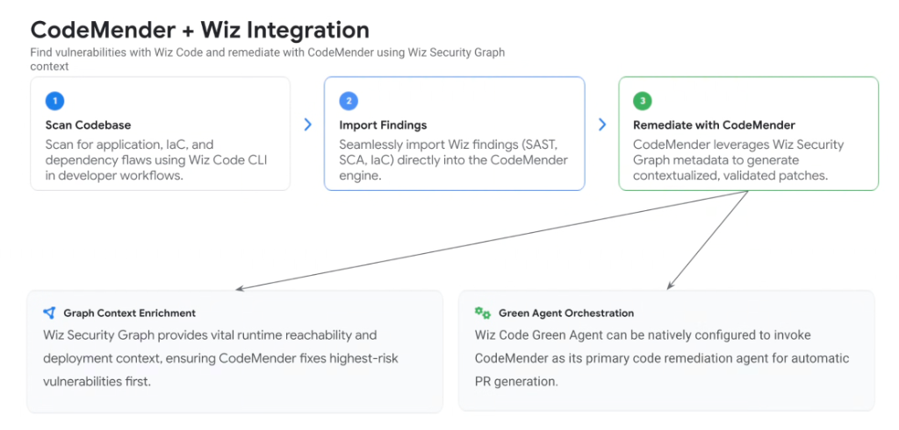
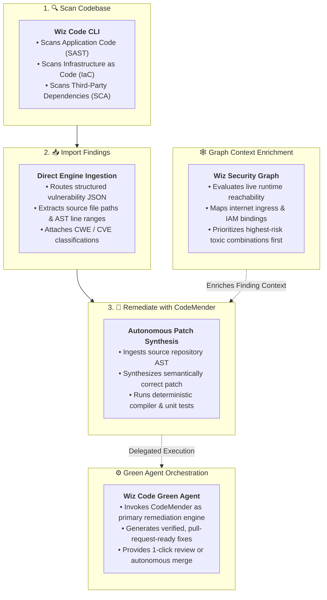

# CodeMender + Wiz Integration: Autonomous Code Remediation

## Overview

The integration between **Wiz Code** and **CodeMender** unites Google's autonomous code remediation engine with Wiz's contextual cloud security intelligence.

By feeding **Wiz Security Graph** metadata (runtime reachability, cloud IAM permissions, and network exposure) directly into **CodeMender**, enterprise development teams transform raw vulnerability alerts into **contextualized, compiler-verified, and regression-tested pull requests**.

---

## Architecture: End-to-End Remediation Pipeline

---

## Detailed Examination of the 3 Pipeline Stages

### Stage 1: Scan Codebase (Wiz Code CLI)
* **Execution Surface**: Local developer workstations (via Antigravity / VS Code / JetBrains) and CI/CD pipelines (Google Cloud Build, GitHub Actions).
* **Coverage Scope**:
  * **SAST**: Application source code logic flaws (SQL injection, unsafe deserialization, prompt injection).
  * **SCA**: Known CVEs and malicious packages in open-source software libraries.
  * **IaC**: Misconfigurations in Terraform files, Helm charts, and Kubernetes manifests (e.g. over-permissive IAM roles, public bucket policies).

---

### Stage 2: Import Findings (Seamless Ingestion)
* **Data Flow**:
  * Structured finding payloads (containing exact file paths, abstract syntax tree line coordinates, and taint-tracking traces) are piped directly into the CodeMender engine without manual ticket handoffs.

---

### Stage 3: Remediate with CodeMender (Context-Aware Patch Synthesis)
* **Execution Mechanics**:
  * CodeMender analyzes the surrounding repository context and language idioms.
  * Autonomously synthesizes a targeted, compilable fix.
  * Runs the project's local unit tests and static linters to guarantee zero functional regressions before submitting the patch.

---

## Advanced Integration Capabilities

### 1. Graph Context Enrichment (Prioritizing True Toxic Combinations)
* **The Problem**: Traditional scanners dump thousands of unprioritized alerts, treating an unreachable test file CVE the same as an internet-facing production exploit.
* **The Solution**:
  * The **Wiz Security Graph** enriches CodeMender findings with live cloud deployment context:
    * Is this container currently running in GKE?
    * Is the endpoint exposed to the public internet via Cloud Load Balancing?
    * Does the associated IAM service account possess write access to production Cloud SQL/BigQuery databases?
  * CodeMender automatically prioritizes fixing **active, reachable toxic combinations** first.

---

### 2. Green Agent Orchestration (Autonomous PR Delivery)
* **The Problem**: Security teams lack the bandwidth to manually author code patches for engineering backlogs.
* **The Solution**:
  * The **Wiz Code Green Agent** (defensive AI orchestrator) natively calls CodeMender as its core remediation worker.
  * Automatically creates a GitHub/GitLab/Critique Pull Request containing:
    * Clean diff resolving the vulnerability.
    * Detailed rationale explaining why the fix works.
    * Newly generated security unit tests validating the patch.

---

## CodeMender + Wiz Capability Matrix

| Operational Capability | Without Integration (Legacy SAST) | With CodeMender + Wiz Integration |
| :--- | :--- | :--- |
| **Vulnerability Discovery** | Disjointed static point tools | **Unified SAST, SCA, and IaC via Wiz Code** |
| **Finding Prioritization** | Coarse CVSS scores (No context) | **Runtime reachability via Wiz Security Graph** |
| **Patch Authoring** | Manual developer research &amp; coding | **Autonomous AST patch synthesis via CodeMender** |
| **Regression Testing** | Manual developer verification | **Automated test suite execution in sandbox** |
| **Delivery Model** | JIRA tickets sitting in backlogs | **Automated PR generation via Green Agent** |
| **Remediation Latency**| Weeks to months | **Minutes from discovery to validated PR** |
