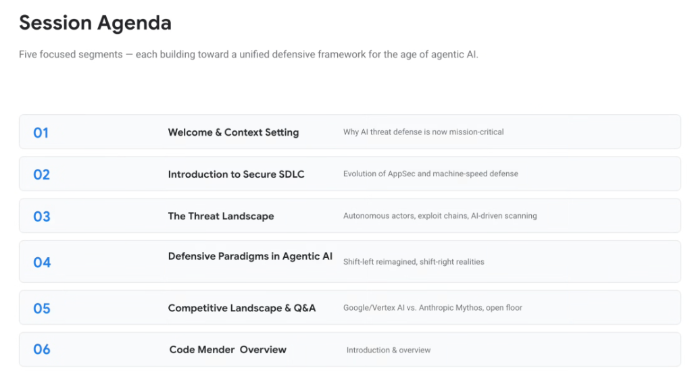
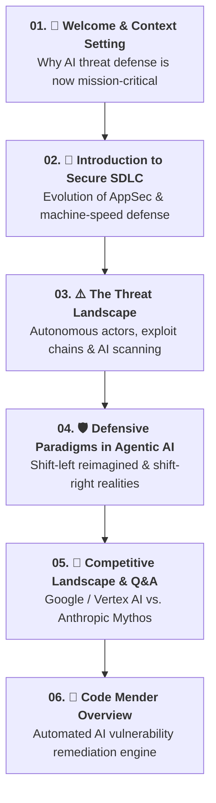

# Day 3 Agenda: Unified Defensive Framework for Agentic AI

## Overview

Day 3 of the Elevate curriculum establishes a comprehensive, end-to-end **Unified Defensive Framework for the Age of Agentic AI**.

As software engineering shifts toward autonomous multi-agent systems, the speed of software development and the velocity of adversarial exploitation have accelerated from human-scale ticket cycles to machine-speed execution. This agenda outlines the six foundational segments designed to equip Google Cloud Customer Engineers with the paradigms, threat intelligence, competitive differentiators, and automated remediation engines required to secure enterprise agentic environments.

---

## Curriculum Roadmap & Segment Structure

---

## Detailed Track Breakdown

### 01: Welcome & Context Setting — *Why AI Threat Defense Is Mission-Critical*
* **Core Focus**: The exponential proliferation of autonomous agents, Model Context Protocol (MCP) toolsets, and dynamic LLM code generation.
* **The Operational Challenge**: Legacy perimeter defenses and annual penetration tests are obsolete when AI agents autonomously generate and deploy software at scale.

---

### 02: Introduction to Secure SDLC — *Evolution of AppSec & Machine-Speed Defense*
* **Core Focus**: How Application Security (AppSec) is shifting from static, periodic human gating into continuous, machine-speed automated analysis embedded across IDEs, PR reviewers, and build pipelines.

---

### 03: The Threat Landscape — *Autonomous Actors, Exploit Chains & AI Scanning*
* **Core Focus**: Dissecting multi-step autonomous exploit chains, AI-driven dynamic API scanning (e.g. Red Agent DAST), and automated exploitation of confused deputy vulnerabilities in agent tool execution.

---

### 04: Defensive Paradigms in Agentic AI — *Shift-Left Reimagined & Shift-Right Realities*
* **Core Focus**: 
  * **Shift-Left Reimagined**: Specification-driven development, deterministic verification before completion, and declarative repo rules (`AGENTS.md`).
  * **Shift-Right Realities**: Runtime anomaly sensors, Model Armor inline prompt injection defense, and automated agent process sandboxing.

---

### 05: Competitive Landscape & Q&A — *Google / Vertex AI vs. Anthropic Mythos*
* **Core Focus**: Head-to-head analysis of enterprise security architectures across Google Cloud (Vertex AI, Model Armor, Wiz AI-APP) and frontier competitors (Anthropic Mythos, commercial ecosystems).

---

### 06: Code Mender Overview — *Introduction & Autonomous Patching*
* **Core Focus**: Deep dive into **Code Mender**, Google's autonomous AI vulnerability remediation system that analyzes code flaws and generates verified, pull-request-ready security fixes at scale.

---

## Day 3 Track Summary Matrix

| Track | Module Title | Primary Theme | Key Technical Concepts |
| :---: | :--- | :--- | :--- |
| **01** | **Welcome & Context Setting** | Mission-Critical AI Defense | Agentic blast radius, machine-speed threats |
| **02** | **Secure SDLC** | AppSec Evolution | Machine-speed scanning, continuous AST audits |
| **03** | **The Threat Landscape** | Adversarial Tactics | Multi-step exploit chains, confused deputy attacks |
| **04** | **Defensive Paradigms** | Shift-Left vs. Shift-Right | Spec verification, runtime sensors, Model Armor |
| **05** | **Competitive Landscape** | Market Evaluation | Google/Vertex AI vs. Anthropic Mythos |
| **06** | **Code Mender Overview** | Autonomous Remediation | Automated vulnerability patching, PR-ready fixes |
